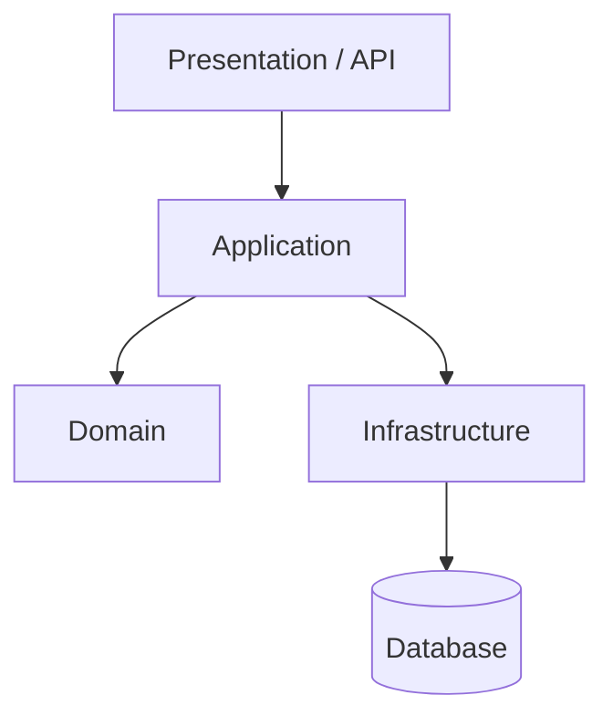
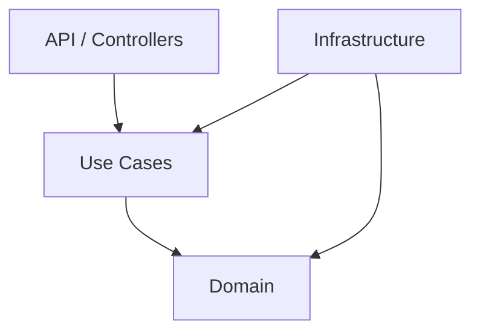
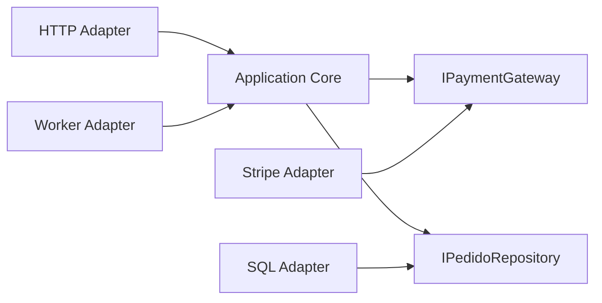
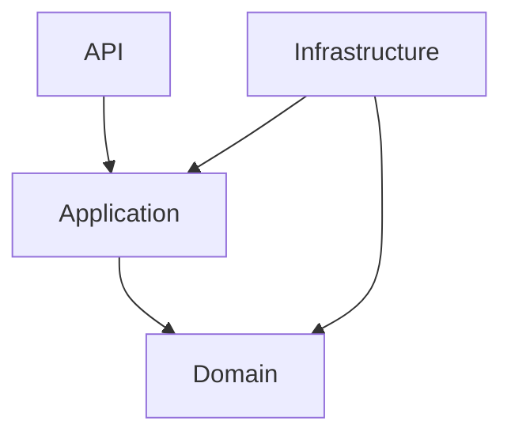
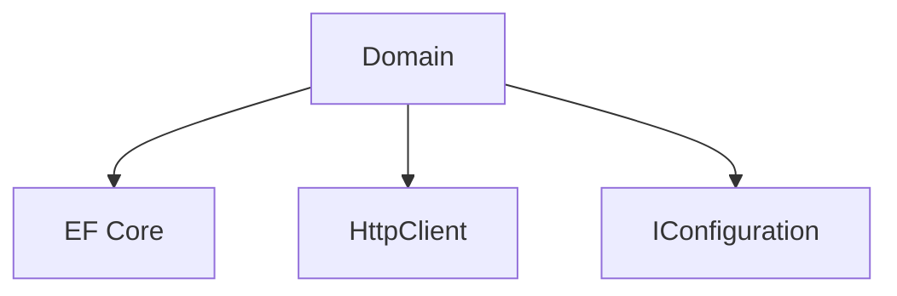

# Arquitetura de Aplicação

> [!abstract] Em uma frase
> Arquitetura de aplicação organiza o código para proteger regra de negócio de detalhes externos como banco, framework, fila, UI e provedores.

A pergunta central não é "qual arquitetura está na moda?", e sim: onde a regra de negócio vive e quanto custa trocar detalhes ao redor dela?

---

## Camadas tradicionais



Essa separação é simples e funciona bem quando as dependências estão claras. O risco é virar uma arquitetura "em camadas de passagem", onde cada camada só repassa DTO sem proteger regra nenhuma.

## Clean Architecture

Clean Architecture coloca o domínio no centro. Dependências apontam para dentro.



Regra prática: domínio não deve depender de EF Core, ASP.NET, RabbitMQ ou Stripe. Essas coisas são importantes, mas são detalhes externos.

## Hexagonal Architecture

Também chamada de Ports and Adapters. O domínio conversa com portas; adapters implementam detalhes.



## Vertical Slice

Vertical Slice organiza por feature/caso de uso, não por tipo técnico.

```text
Features/
  CriarPedido/
    CriarPedidoCommand.cs
    CriarPedidoHandler.cs
    CriarPedidoValidator.cs
    CriarPedidoEndpoint.cs
  CancelarPedido/
    CancelarPedidoCommand.cs
    CancelarPedidoHandler.cs
```

É útil quando o sistema cresce e "pastas por camada" começam a espalhar uma única mudança por muitos lugares.

## Exemplo em C#: caso de uso

```csharp
public sealed record CriarPedido(Guid ClienteId, IReadOnlyList<ItemPedidoInput> Itens);

public sealed class CriarPedidoHandler
{
    private readonly IPedidoRepository _repository;
    private readonly IUnitOfWork _unitOfWork;

    public CriarPedidoHandler(IPedidoRepository repository, IUnitOfWork unitOfWork)
    {
        _repository = repository;
        _unitOfWork = unitOfWork;
    }

    public async Task<Guid> HandleAsync(CriarPedido command, CancellationToken ct)
    {
        var pedido = Pedido.Criar(command.ClienteId, command.Itens);

        await _repository.AddAsync(pedido, ct);
        await _unitOfWork.CommitAsync(ct);

        return pedido.Id;
    }
}
```

O handler representa uma intenção da aplicação. Ele não precisa saber se o banco é SQL Server, PostgreSQL ou MongoDB.

## Fluxo de dependência

Uma regra saudável:



O que você quer evitar:



Quando domínio depende de framework, testar e evoluir regra de negócio fica mais caro.

## Endpoint fino, caso de uso explícito

Controller/endpoint deve adaptar HTTP para caso de uso. Ele não deveria concentrar regra.

```csharp
app.MapPost("/pedidos", async (
    CriarPedidoRequest request,
    CriarPedidoHandler handler,
    CancellationToken ct) =>
{
    var command = new CriarPedido(request.ClienteId, request.Itens);
    var pedidoId = await handler.HandleAsync(command, ct);

    return Results.Created($"/pedidos/{pedidoId}", new { id = pedidoId });
});
```

O endpoint conhece HTTP. O handler conhece o caso de uso. O domínio conhece regras.

## Transação como fronteira de caso de uso

Na maioria dos sistemas transacionais, um caso de uso define uma fronteira natural de transação.

```csharp
public async Task<Guid> HandleAsync(CriarPedido command, CancellationToken ct)
{
    var pedido = Pedido.Criar(command.ClienteId, command.Itens);

    await _repository.AddAsync(pedido, ct);
    await _unitOfWork.CommitAsync(ct);

    return pedido.Id;
}
```

Evite abrir transação em controller e também dentro do repository e também dentro do service. Transação espalhada é difícil de raciocinar.

## Camadas vs slices

Camadas respondem "que tipo técnico é esse arquivo?". Slices respondem "qual mudança de negócio esse arquivo atende?".

| Organização | Boa quando | Risco |
|---|---|---|
| Por camada | Sistema pequeno, padrões simples | Mudança espalhada |
| Por feature/slice | Muitos casos de uso | Duplicação controlada |
| Por módulo/domínio | Domínio com fronteiras claras | Exige maturidade de modelagem |

## Erros comuns

**Arquitetura só de pastas.** Se as dependências não são protegidas, a pasta não garante nada.

**Application service fazendo tudo.** Caso de uso orquestra; regra de domínio deve morar no domínio.

**Repository genérico demais.** `IRepository<T>` pode esconder consultas importantes e forçar abstrações pobres.

**DTO vazando para domínio.** DTO é contrato de entrada/saída. Domínio deve falar linguagem de negócio.

## Checklist

- [ ] O domínio depende de framework?
- [ ] Casos de uso estão explícitos?
- [ ] Infraestrutura implementa contratos ou invade o núcleo?
- [ ] Uma feature fica espalhada demais?
- [ ] Existe arquitetura real ou só pastas com nomes bonitos?
- [ ] A estrutura ajuda novos devs a acharem onde mexer?

## Notas relacionadas

- [[Design de Código]]
- [[DDD e Modelagem]]
- [[Testes]]
- [[Monólito Modular]]
