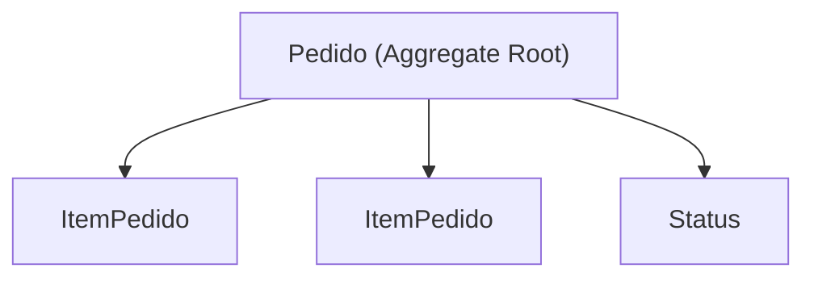
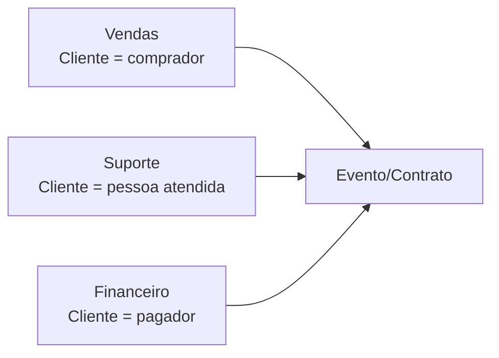
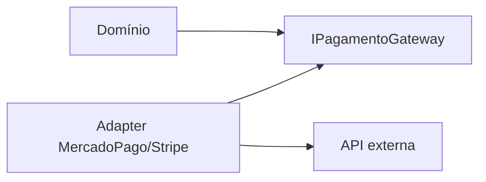

# DDD e Modelagem

> [!abstract] Em uma frase
> DDD ajuda a transformar conhecimento de negócio em modelo de software, com linguagem, regras e fronteiras explícitas.

DDD não é uma pasta chamada `Domain`. É um jeito de reduzir tradução ruim entre negócio e código.

---

## Linguagem ubíqua

Linguagem ubíqua é o vocabulário compartilhado entre pessoas de negócio e tecnologia.

Se o negócio fala "reserva", "captura", "estorno" e "liquidação", o código não deveria chamar tudo de `ProcessarCoisa`.

## Entidade vs Value Object

| Conceito | Identidade importa? | Exemplo |
|---|---|---|
| Entidade | Sim | Pedido, Cliente, Conta |
| Value Object | Não, importa o valor | Email, CPF, Dinheiro, Endereço |

```csharp
public sealed record Email
{
    public string Value { get; }

    public Email(string value)
    {
        if (string.IsNullOrWhiteSpace(value) || !value.Contains('@'))
        {
            throw new ArgumentException("Email inválido.");
        }

        Value = value;
    }
}
```

Value Object carrega regra junto do valor. Isso evita validação espalhada pelo sistema.

## Aggregate

Aggregate é uma fronteira de consistência. Ele protege invariantes.



Exemplo:

```csharp
public sealed class Pedido
{
    private readonly List<ItemPedido> _itens = new();

    public Guid Id { get; private set; }
    public PedidoStatus Status { get; private set; }
    public IReadOnlyCollection<ItemPedido> Itens => _itens;

    public static Pedido Criar(Guid clienteId, IEnumerable<ItemPedidoInput> itens)
    {
        var pedido = new Pedido { Id = Guid.NewGuid(), Status = PedidoStatus.Rascunho };

        foreach (var item in itens)
        {
            pedido.AdicionarItem(item.ProdutoId, item.Quantidade, item.PrecoUnitario);
        }

        return pedido;
    }

    public void Confirmar()
    {
        if (!_itens.Any())
        {
            throw new InvalidOperationException("Pedido sem itens não pode ser confirmado.");
        }

        Status = PedidoStatus.Confirmado;
    }
}
```

## Domain Service

Use domain service quando a regra pertence ao domínio, mas não cabe naturalmente em uma entidade ou value object.

> [!warning]
> `PedidoService` com todas as regras do sistema é sinal de modelo anêmico. Domain service deve ser exceção cuidadosa, não depósito de regra.

## Bounded Context

Mesmo termo pode significar coisas diferentes em contextos diferentes.



Bounded context evita forçar um modelo único para áreas que pensam diferente.

## Repository

Repository deve parecer uma coleção de agregados, não um vazamento do banco.

```csharp
public interface IPedidoRepository
{
    Task<Pedido?> ObterPorIdAsync(Guid id, CancellationToken ct);
    Task AddAsync(Pedido pedido, CancellationToken ct);
}
```

Evite transformar repository em "SQL disfarçado":

```csharp
// Cheiro ruim: cada detalhe de query vira método público
Task<List<Pedido>> GetByStatusAndDateAndCustomerAndTotalAsync(...);
```

Consultas de leitura complexas podem morar em query services/projeções, sem fingir que são parte do modelo de domínio.

## Domain Events

Domain event representa algo importante que aconteceu dentro do domínio.

```csharp
public sealed record PedidoConfirmado(Guid PedidoId, Guid ClienteId, decimal Total);

public sealed class Pedido
{
    private readonly List<object> _events = new();
    public IReadOnlyCollection<object> Events => _events;

    public void Confirmar()
    {
        // valida invariantes...
        Status = PedidoStatus.Confirmado;
        _events.Add(new PedidoConfirmado(Id, ClienteId, Total));
    }
}
```

O aggregate não envia e-mail, não publica no RabbitMQ e não chama API externa. Ele registra o fato. A aplicação decide o que fazer com esse fato.

## Anti-Corruption Layer

Quando seu domínio integra com um sistema externo, não deixe o modelo externo invadir seu núcleo.



```csharp
public interface IPagamentoGateway
{
    Task<AutorizacaoPagamento> AutorizarAsync(Pedido pedido, CancellationToken ct);
}
```

O adapter traduz `status_code`, `payment_intent`, `payer`, `capture` ou qualquer nome externo para conceitos do seu domínio.

## Modelagem na prática

Um bom exercício é perguntar:

1. Que invariantes precisam ser sempre verdade?
2. Quem é dono dessa regra?
3. O que pode mudar independentemente?
4. Que termos têm significado diferente por área?
5. O que é fato passado e o que é comando?

## Erros comuns

**Modelo anêmico.** Entidades sem comportamento e services com todas as regras.

**Aggregate grande demais.** Tentar colocar metade do sistema dentro de um aggregate cria lock, transação pesada e acoplamento.

**Value Object sem regra.** Se é só wrapper de string sem comportamento, talvez ainda não esteja agregando valor.

**Copiar estrutura do banco para o domínio.** Tabela não é necessariamente entidade de domínio.

## Checklist

- [ ] O código usa palavras do negócio?
- [ ] Value Objects protegem valores importantes?
- [ ] Aggregates protegem invariantes?
- [ ] Entidades não estão anêmicas?
- [ ] O contexto tem fronteiras claras?
- [ ] Termos ambíguos foram discutidos com negócio?

## Notas relacionadas

- [[Modelagem de Domínio e Arquitetura Orientada a Negócio]]
- [[Arquitetura de Aplicação]]
- [[Design de Código]]
- [[Monólito Modular]]
