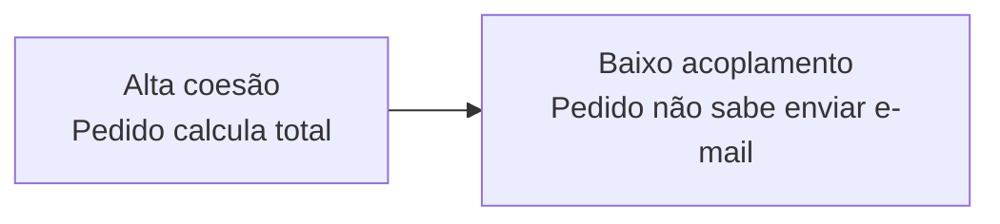
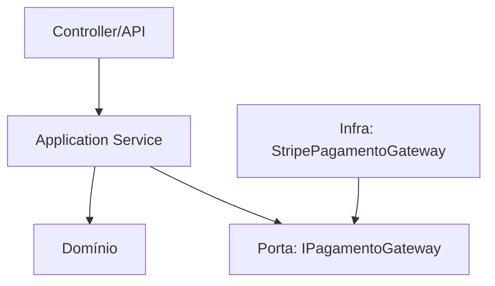
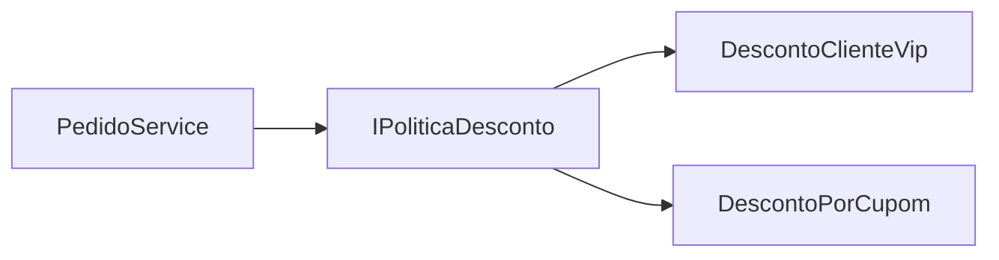

# Design de Código

> [!abstract] Em uma frase
> Design de código é organizar responsabilidades para que uma mudança natural no negócio gere uma mudança pequena e previsível no código.

Código bom não é código "bonito". É código que deixa claro onde uma regra vive, reduz surpresa e permite evoluir sem quebrar metade do sistema.

---

## Coesão e acoplamento

**Coesão** mede o quanto as coisas dentro de um módulo pertencem ao mesmo assunto. **Acoplamento** mede o quanto uma parte depende de detalhes de outra.



Um sinal de baixa coesão: classe `PedidoService` que cria pedido, valida cupom, envia e-mail, chama gateway de pagamento, grava log, calcula frete e atualiza estoque.

## Boundaries

Boundary é uma fronteira. Pode ser entre camadas, módulos, contextos ou integrações externas.



A regra prática: código de negócio deve depender de conceitos estáveis do negócio, não de detalhes acidentais como HTTP, banco ou provedor externo.

## SOLID em linguagem normal

| Princípio | Pergunta útil |
|---|---|
| SRP | Esta classe muda por mais de um motivo? |
| OCP | Consigo adicionar comportamento sem editar um bloco central gigante? |
| LSP | Posso trocar a implementação sem surpresa? |
| ISP | O consumidor depende só do que usa? |
| DIP | O código de alto nível depende de abstração ou detalhe? |

## Exemplo: acoplado demais

```csharp
public sealed class PedidoService
{
    public async Task CriarPedido(CriarPedidoRequest request)
    {
        var total = request.Itens.Sum(i => i.Quantidade * i.Preco);

        using var connection = new SqlConnection("...");
        await connection.ExecuteAsync("INSERT INTO Pedidos ...");

        var client = new HttpClient();
        await client.PostAsJsonAsync("https://payments/api", new { total });

        await File.AppendAllTextAsync("log.txt", "pedido criado");
    }
}
```

Tudo está junto: regra, banco, HTTP e log. Funciona, mas qualquer mudança mexe no mesmo lugar.

## Exemplo: separando intenção de detalhe

```csharp
public sealed class CriarPedidoHandler
{
    private readonly IPedidoRepository _pedidos;
    private readonly IPagamentoGateway _pagamentos;

    public CriarPedidoHandler(IPedidoRepository pedidos, IPagamentoGateway pagamentos)
    {
        _pedidos = pedidos;
        _pagamentos = pagamentos;
    }

    public async Task<Guid> HandleAsync(CriarPedido command, CancellationToken ct)
    {
        var pedido = Pedido.Criar(command.ClienteId, command.Itens);

        await _pedidos.SalvarAsync(pedido, ct);
        await _pagamentos.AutorizarAsync(pedido.Id, pedido.Total, ct);

        return pedido.Id;
    }
}
```

Agora o handler expressa o fluxo. Banco e pagamento continuam existindo, mas como detalhes substituíveis.

## Abstração boa vs abstração ruim

Abstração boa nasce de uma variação real. Abstração ruim nasce de medo do futuro.

> [!warning]
> "Pode ser que um dia precise trocar" não é motivo suficiente para criar cinco interfaces. Mas "temos dois gateways de pagamento com regras diferentes" já é um sinal concreto.

## Tell, Don't Ask

Um cheiro comum é buscar dados de um objeto para tomar decisão fora dele.

```csharp
// Pergunta demais para o objeto e decide fora
if (pedido.Status == PedidoStatus.Criado && pedido.Itens.Any())
{
    pedido.Status = PedidoStatus.Confirmado;
}
```

Melhor: mande o objeto fazer a operação e deixe ele proteger suas regras.

```csharp
pedido.Confirmar();
```

```csharp
public void Confirmar()
{
    if (Status != PedidoStatus.Criado)
    {
        throw new InvalidOperationException("Apenas pedidos criados podem ser confirmados.");
    }

    if (!_itens.Any())
    {
        throw new InvalidOperationException("Pedido sem itens não pode ser confirmado.");
    }

    Status = PedidoStatus.Confirmado;
}
```

Isso não é dogma. DTO, query e tela podem expor dados. A ideia é não deixar regra de negócio importante espalhada em código procedural.

## Composição antes de herança

Herança cria acoplamento forte entre pai e filho. Composição costuma ser mais flexível.



```csharp
public interface IPoliticaDesconto
{
    decimal Calcular(Pedido pedido);
}

public sealed class PedidoService
{
    private readonly IEnumerable<IPoliticaDesconto> _politicas;

    public decimal CalcularTotal(Pedido pedido)
    {
        var desconto = _politicas.Sum(p => p.Calcular(pedido));
        return pedido.Subtotal - desconto;
    }
}
```

## Erros de design que aparecem em manutenção

**Mudança espalhada.** Uma regra simples exige alterar controller, service, repository, DTO, mapper e job.

**Abstração teatral.** Interface com uma implementação só, criada sem variação real e sem facilitar teste.

**Objeto anêmico.** Entidades só têm `get; set;`, e toda regra mora em services gigantes.

**Dependência invertida no discurso, mas não no código.** A classe recebe interface, mas a interface expõe detalhes do banco/provedor.

## Heurística prática

Quando você for mexer em uma regra, observe:

1. Quantos arquivos precisei abrir?
2. Eu sabia onde a regra deveria estar?
3. O teste ficou simples?
4. A mudança afetou código que não tinha relação com o negócio?

Se as respostas forem ruins, o design está cobrando juros.

## Checklist

- [ ] A regra de negócio está misturada com infraestrutura?
- [ ] A classe tem mais de um motivo para mudar?
- [ ] O nome expressa intenção ou detalhe técnico?
- [ ] A abstração remove complexidade real?
- [ ] Uma mudança comum fica localizada?
- [ ] Testar a regra exige banco, HTTP ou arquivo?

## Notas relacionadas

- [[Arquitetura de Aplicação]]
- [[DDD e Modelagem]]
- [[Padrões de Projeto]]
- [[Refatoração]]
