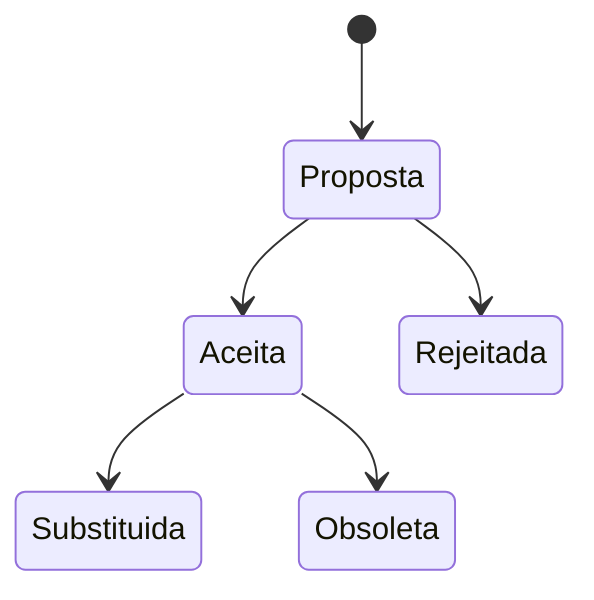
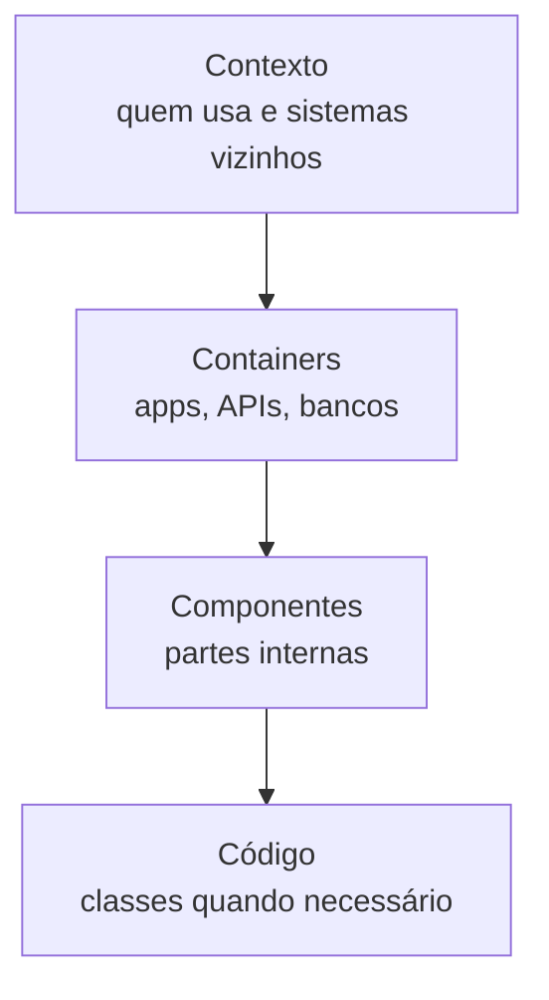
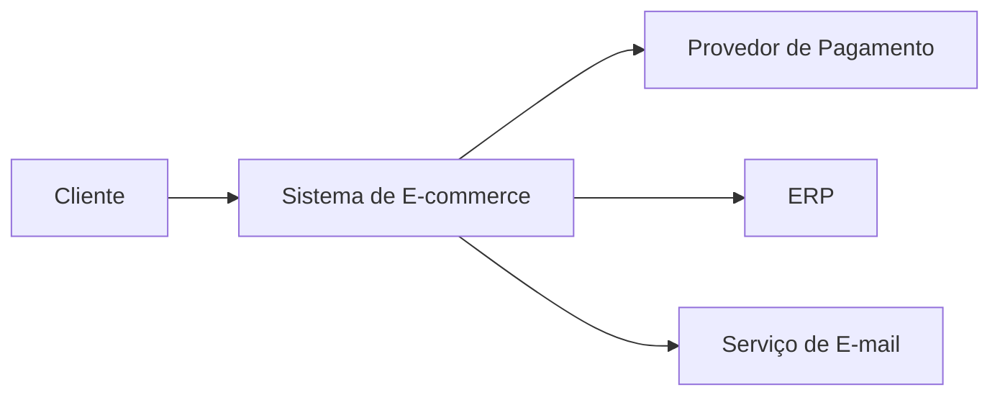
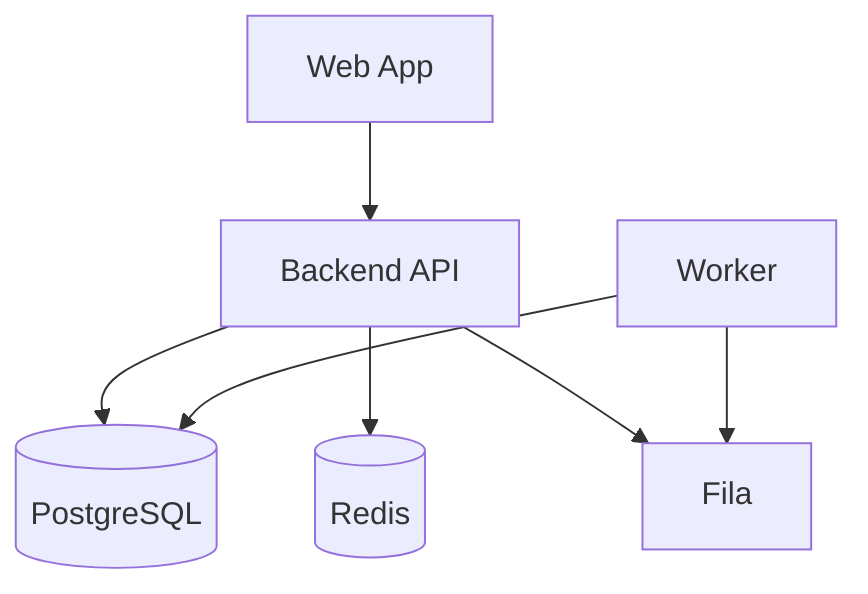

# Documentação Arquitetural

> [!abstract] Em uma frase
> Documentação arquitetural boa registra contexto, decisão e consequência para que o time não precise redescobrir a mesma conversa a cada mês.

Documentação ruim tenta descrever tudo. Documentação boa ajuda alguém a tomar uma decisão ou entender por que uma decisão já foi tomada.

---

## ADR

ADR (*Architecture Decision Record*) registra uma decisão arquitetural.

Estrutura simples:

```text
# ADR 001 - Usar PostgreSQL como banco transacional

## Status
Aceita

## Contexto
Precisamos de transações fortes e consultas relacionais.

## Decisão
Usaremos PostgreSQL.

## Consequências
Ganhamos consistência e maturidade.
Escala horizontal de escrita exigirá outra estratégia no futuro.
```

## Ciclo de vida de um ADR



Status comuns:

- Proposta
- Aceita
- Rejeitada
- Substituída
- Obsoleta

ADR não precisa ser longo. Precisa ser honesto sobre contexto e consequência.

## C4 Model

C4 ajuda a desenhar arquitetura em níveis.



### Exemplo de contexto



### Exemplo de container



Contexto mostra o sistema no mundo. Container mostra as peças executáveis/deployáveis.

## RFC leve

RFC é útil antes de decisões maiores. Diferente do ADR, ele pode existir antes da decisão.

Boas seções:

- Problema.
- Objetivos.
- Não-objetivos.
- Opções consideradas.
- Proposta.
- Riscos.
- Plano de migração.
- Perguntas abertas.

## Quando usar ADR, RFC ou README

| Documento | Melhor uso |
|---|---|
| ADR | Registrar decisão tomada |
| RFC | Discutir proposta antes de decidir |
| README | Explicar como usar/rodar uma parte do sistema |
| Runbook | Operar ou resolver incidente |
| Diagrama C4 | Comunicar estrutura e fronteiras |

## Template de RFC

```markdown
# RFC - Título

## Problema

## Objetivos

## Não-objetivos

## Proposta

## Alternativas consideradas

## Riscos

## Plano de migração

## Perguntas abertas
```

## Diagramas úteis

- Contexto.
- Container.
- Sequência.
- Fluxo de dados.
- Estado.
- Deploy.

> [!tip]
> Diagrama bom reduz conversa repetida. Se o diagrama precisa de uma palestra para ser entendido, ele ainda não está bom.

## Erros comuns

**Documentar o óbvio.** "A API chama o banco" raramente ajuda se não explica por quê ou quais limites existem.

**Diagrama sem data.** Arquitetura muda; diagrama sem data vira suspeito.

**ADR sem consequência negativa.** Toda decisão relevante cobra algum preço.

**Documento morto.** Se ninguém usa para decidir, operar ou entender, ele vira decoração.

## Checklist

- [ ] A documentação responde uma pergunta real?
- [ ] Existe contexto, não só decisão?
- [ ] Trade-offs estão explícitos?
- [ ] Consequências negativas aparecem?
- [ ] Diagramas têm legenda clara?
- [ ] Documento tem dono e data?

## Notas relacionadas

- [[ADR - Architecture Decision Records]]
- [[C4 Model]]
- [[Trade-off Arquitetural]]
- [[Requisitos e Qualidade Arquitetural]]
