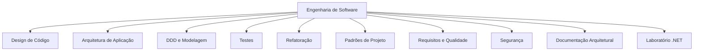

# Engenharia de Software

> [!abstract] Em uma frase
> Engenharia de software é a prática de construir sistemas que resolvem problemas reais e continuam compreensíveis, testáveis e evolutivos depois que a primeira versão funciona.

Esta trilha é a base "por dentro" do software. [[System Design]] ajuda a pensar sistemas em escala; engenharia de software ajuda a construir código, módulos, testes, decisões e evolução sem virar uma bola de neve.

---

## Mapa da trilha

## Ordem sugerida

1. [[Design de Código]] - coesão, acoplamento, SOLID, boundaries e abstrações.
2. [[Arquitetura de Aplicação]] - camadas, Clean Architecture, Hexagonal e Vertical Slice.
3. [[DDD e Modelagem]] - entidades, value objects, aggregates, domain services e bounded contexts.
4. [[Testes]] - pirâmide, unitários, integração, contrato e e2e.
5. [[Refatoração]] - code smells, refatorações seguras e dívida técnica.
6. [[Padrões de Projeto]] - padrões como ferramentas, não como catálogo decorado.
7. [[Requisitos e Qualidade Arquitetural]] - requisitos funcionais, não-funcionais e atributos de qualidade.
8. [[Segurança para Engenharia de Software]] - OWASP, secrets, threat modeling e APIs.
9. [[Documentação Arquitetural]] - ADRs, C4, RFCs e comunicação técnica.
10. [[Laboratório .NET]] - prática com mini-projetos, exemplos e estudos de caso em .NET.

## Como estudar

> [!tip]
> Para cada conceito, tente responder três perguntas: que problema isso resolve, qual custo adiciona e como eu reconheço quando estou exagerando?

## Relação com System Design

- [[System Design]] olha o sistema de fora para dentro: escala, tráfego, dados, falhas e operação.
- [[Engenharia de Software]] olha de dentro para fora: código, módulos, testes, domínio, evolução e manutenção.

As duas trilhas se encontram em arquitetura: uma decisão ruim no código limita o sistema; uma decisão ruim de sistema complica o código.

## Prática

- [[Mini-projeto - Fila de E-mails com Outbox]] - consistência transacional, testes de integração e observabilidade.
- [[Exemplo prático - Testes de Arquitetura em .NET]] - boundaries, dependências e regras automatizadas.
- [[Estudo de caso - Monólito Modular para Microsserviços]] - modularidade, refatoração e evolução arquitetural.
