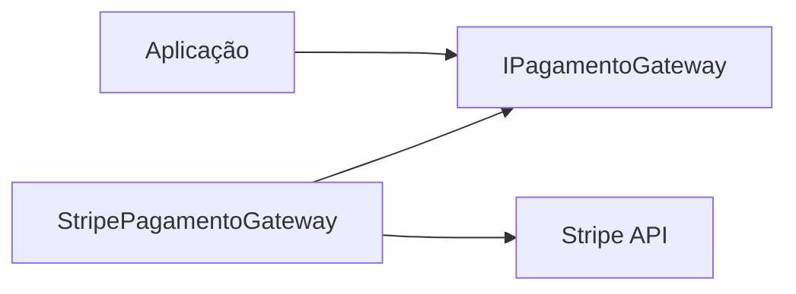
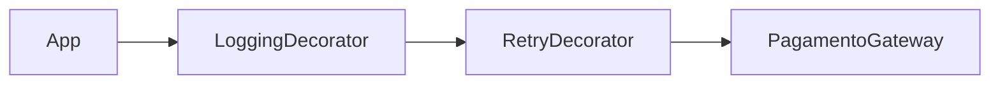

# Padrões de Projeto

> [!abstract] Em uma frase
> Padrões de projeto são nomes para soluções recorrentes; eles ajudam quando resolvem uma pressão real do código, não quando são usados para parecer sofisticado.

Padrão bom deixa o código mais simples de mudar. Padrão usado cedo demais só espalha indireção.

---

## Padrões úteis no dia a dia backend

| Padrão | Quando aparece |
|---|---|
| Strategy | Variação de regra/algoritmo |
| Factory | Criação com regra ou dependência |
| Adapter | Integrar API externa sem contaminar domínio |
| Decorator | Adicionar comportamento ao redor de outro |
| Mediator | Desacoplar envio de comandos/queries |
| Specification | Regras combináveis de seleção/validação |
| Observer | Reagir a eventos |
| Result | Retornar sucesso/falha sem exception para fluxo esperado |

## Strategy em C#

```csharp
public interface ICalculadoraFrete
{
    string Tipo { get; }
    decimal Calcular(Pedido pedido);
}

public sealed class FreteExpresso : ICalculadoraFrete
{
    public string Tipo => "expresso";
    public decimal Calcular(Pedido pedido) => pedido.Total * 0.15m;
}

public sealed class FreteNormal : ICalculadoraFrete
{
    public string Tipo => "normal";
    public decimal Calcular(Pedido pedido) => pedido.Total * 0.05m;
}
```

Uso:

```csharp
public sealed class FreteService
{
    private readonly IReadOnlyDictionary<string, ICalculadoraFrete> _estrategias;

    public FreteService(IEnumerable<ICalculadoraFrete> estrategias)
    {
        _estrategias = estrategias.ToDictionary(x => x.Tipo);
    }

    public decimal Calcular(Pedido pedido, string tipo) =>
        _estrategias[tipo].Calcular(pedido);
}
```

## Adapter



Adapter protege o restante do sistema de detalhes do provedor.

```csharp
public sealed class StripePagamentoGateway : IPagamentoGateway
{
    private readonly StripeClient _client;

    public async Task<AutorizacaoPagamento> AutorizarAsync(Pedido pedido, CancellationToken ct)
    {
        var response = await _client.AuthorizeAsync(new StripeAuthorizeRequest
        {
            AmountInCents = (long)(pedido.Total * 100),
            Currency = "BRL"
        }, ct);

        return new AutorizacaoPagamento(
            response.Id,
            response.Status == "authorized");
    }
}
```

O domínio não precisa saber que a Stripe usa centavos, status em string ou nomes específicos.

## Decorator

Decorator adiciona comportamento ao redor de outro objeto sem mudar a implementação original.



```csharp
public sealed class LoggingPagamentoGateway : IPagamentoGateway
{
    private readonly IPagamentoGateway _inner;
    private readonly ILogger<LoggingPagamentoGateway> _logger;

    public async Task<AutorizacaoPagamento> AutorizarAsync(Pedido pedido, CancellationToken ct)
    {
        _logger.LogInformation("Autorizando pagamento do pedido {PedidoId}", pedido.Id);
        return await _inner.AutorizarAsync(pedido, ct);
    }
}
```

## Factory

Factory é útil quando criar um objeto exige regra.

```csharp
public static class PedidoFactory
{
    public static Pedido CriarPedidoB2B(Guid clienteId, IEnumerable<ItemPedidoInput> itens)
    {
        var pedido = Pedido.Criar(clienteId, itens);
        pedido.DefinirPoliticaPagamento(PoliticaPagamento.Faturado);
        return pedido;
    }
}
```

Se a criação é só `new`, factory pode ser ruído. Se a criação preserva invariantes, ela ajuda.

## Result Pattern

```csharp
public sealed record Result<T>(bool Success, T? Value, string? Error)
{
    public static Result<T> Ok(T value) => new(true, value, null);
    public static Result<T> Fail(string error) => new(false, default, error);
}
```

Útil quando falha é parte esperada do fluxo, como validação de negócio. Exception fica para erro inesperado.

## Specification

Specification encapsula regra booleana reutilizável.

```csharp
public interface ISpecification<T>
{
    bool IsSatisfiedBy(T value);
}

public sealed class PedidoPodeSerCanceladoSpec : ISpecification<Pedido>
{
    public bool IsSatisfiedBy(Pedido pedido) =>
        pedido.Status is PedidoStatus.Criado or PedidoStatus.Confirmado;
}
```

Use quando a regra aparece em mais de um lugar ou precisa ser combinada. Não use para transformar todo `if` simples em classe.

## Erros comuns

**Pattern shopping.** Escolher padrão antes de entender o problema.

**Nome técnico escondendo negócio.** `Strategy` é menos expressivo que `PoliticaDesconto`.

**Indireção demais.** Se para entender uma regra você precisa abrir 12 arquivos, talvez o padrão esteja cobrando caro.

## Checklist

- [ ] O padrão resolve uma variação real?
- [ ] O código ficou mais fácil de entender?
- [ ] Existe teste protegendo o comportamento?
- [ ] A abstração tem nome de negócio ou só nome técnico?
- [ ] Remover o padrão deixaria o código mais simples?

## Notas relacionadas

- [[Design de Código]]
- [[Refatoração]]
- [[Arquitetura de Aplicação]]
