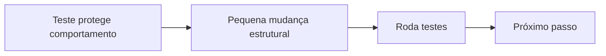
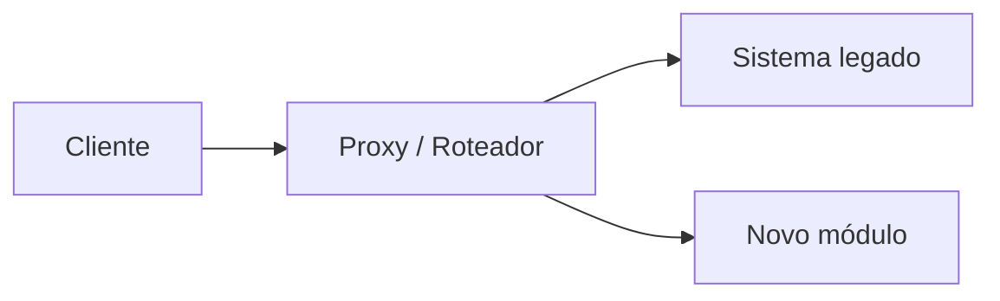
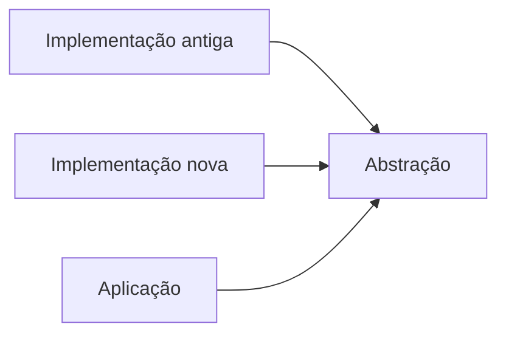
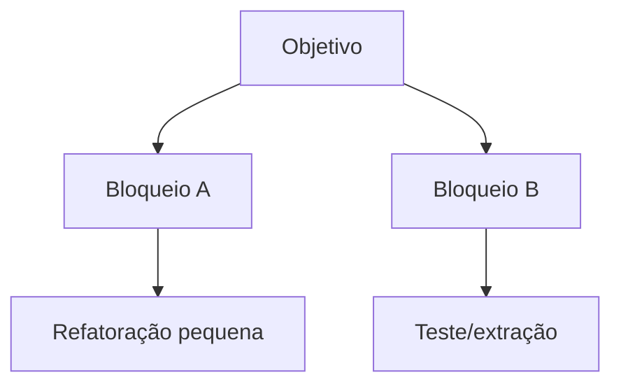

# Refatoração

> [!abstract] Em uma frase
> Refatorar é mudar a estrutura interna do código sem mudar o comportamento observável.

Refatoração não é "dar uma arrumada". É uma técnica para manter o sistema maleável enquanto ele aprende novas regras de negócio.

---

## Ciclo seguro



Sem teste, refatoração vira aposta. Com teste ruim, vira aposta com fantasia de segurança.

## Code smells comuns

| Smell | Sinal |
|---|---|
| Long Method | Método difícil de ler de uma vez |
| God Class | Classe sabe e faz demais |
| Shotgun Surgery | Uma mudança exige mexer em muitos lugares |
| Feature Envy | Classe usa mais dados de outra classe do que dela mesma |
| Primitive Obsession | Tudo é `string`, `int`, `decimal` sem conceito de domínio |
| Divergent Change | Mesma classe muda por motivos diferentes |

## Exemplo: primitive obsession

Antes:

```csharp
public void CadastrarCliente(string cpf, string email)
{
    if (cpf.Length != 11)
    {
        throw new ArgumentException("CPF inválido.");
    }

    if (!email.Contains('@'))
    {
        throw new ArgumentException("Email inválido.");
    }
}
```

Depois:

```csharp
public void CadastrarCliente(Cpf cpf, Email email)
{
    var cliente = new Cliente(cpf, email);
    _repository.Add(cliente);
}
```

A validação saiu do fluxo e virou parte do modelo.

## Strangler Fig

Strangler Fig é uma estratégia para substituir um sistema aos poucos.



Você redireciona fatias do comportamento para o novo código, sem precisar reescrever tudo de uma vez.

## Branch by abstraction

Crie uma abstração, faça código antigo e novo conviverem, migre aos poucos e remova o antigo quando não houver uso.



## Characterization tests

Quando o código legado não tem testes e ninguém confia nele, comece registrando o comportamento atual.

```csharp
[Fact]
public void CalculoLegado_DeveManterComportamentoAtual()
{
    var result = CalculadoraLegada.Calcular(valor: 100, clienteVip: true);

    result.Should().Be(87.35m); // comportamento atual, mesmo que estranho
}
```

Esse teste não diz que o comportamento é bonito. Ele diz: "antes de mexer, vamos saber se quebramos algo".

## Refatorações pequenas e úteis

| Refatoração | Quando usar |
|---|---|
| Extract Method | Método longo com blocos nomeáveis |
| Extract Class | Classe com responsabilidades demais |
| Introduce Parameter Object | Muitos parâmetros sempre juntos |
| Replace Primitive with Value Object | Valor importante espalhado como string/int |
| Move Method | Método usa mais dados de outra classe |
| Replace Conditional with Polymorphism | `switch/if` crescendo por tipo |

## Mikado Method

Quando a mudança parece grande demais:

1. tente fazer a mudança desejada;
2. anote o que quebrou;
3. reverta;
4. resolva pré-requisitos menores;
5. tente de novo.



## Erros comuns

**Refatorar junto com feature grande.** Mistura risco estrutural com risco funcional.

**Reescrever por frustração.** Reescrita total parece limpa até precisar reproduzir 8 anos de comportamento implícito.

**Não remover abstração antiga.** Branch by abstraction só termina quando o caminho antigo sai.

**Refatoração sem objetivo.** Se a estrutura nova não facilita uma mudança real, talvez seja só estética.

## Checklist

- [ ] O comportamento atual está protegido por testes?
- [ ] A refatoração é pequena o bastante para revisar?
- [ ] Existe motivo real para mudar a estrutura?
- [ ] O nome novo melhora intenção?
- [ ] O código ficou mais local para mudanças futuras?
- [ ] Alguma abstração antiga pode ser removida?

## Notas relacionadas

- [[Testes]]
- [[Design de Código]]
- [[DDD e Modelagem]]
