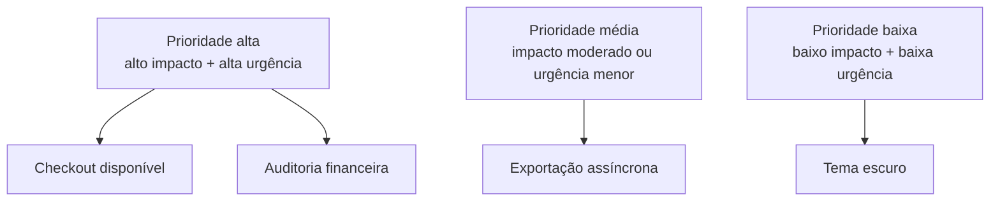
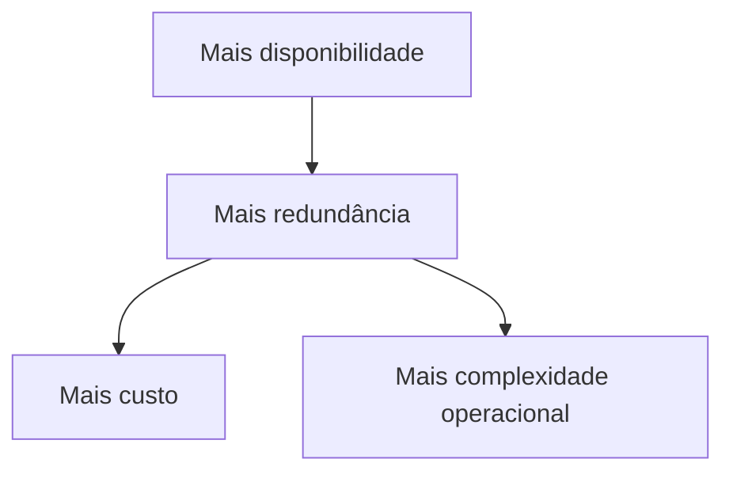

# Requisitos e Qualidade Arquitetural

> [!abstract] Em uma frase
> Requisito funcional diz o que o sistema faz; atributo de qualidade diz como o sistema precisa se comportar enquanto faz.

Muita decisão arquitetural ruim nasce de requisito vago. "Precisa ser rápido" não é requisito; "p95 abaixo de 300 ms no checkout" começa a ser.

---

## Funcional vs não-funcional

| Tipo | Exemplo |
|---|---|
| Funcional | Usuário pode criar pedido |
| Não-funcional / qualidade | Criar pedido deve responder em até 500 ms no p95 |

## Atributos de qualidade

| Atributo | Pergunta |
|---|---|
| Performance | Quão rápido precisa ser? |
| Disponibilidade | Quanto pode ficar fora? |
| Confiabilidade | Como se comporta quando falha? |
| Segurança | Quem pode acessar e como protegemos? |
| Manutenibilidade | Quanto custa mudar? |
| Escalabilidade | Como cresce com carga? |
| Observabilidade | Como sabemos o que está acontecendo? |
| Custo | Quanto custa operar? |
| Compliance | Que regra externa precisa cumprir? |

## Quality Attribute Scenario

Um jeito bom de escrever requisito de qualidade:

```text
Fonte: usuário autenticado
Estímulo: acessa histórico de pedidos
Ambiente: horário de pico
Resposta: sistema retorna os últimos 50 pedidos
Métrica: p95 abaixo de 300 ms, erro abaixo de 0,1%
```

## De requisito vago para requisito útil

| Vago | Melhor |
|---|---|
| Sistema rápido | Checkout com p95 menor que 500 ms em horário de pico |
| Sistema seguro | Apenas usuários com permissão `pedidos.cancelar` podem cancelar pedidos do próprio tenant |
| Sistema escalável | Suportar 5x tráfego de leitura adicionando instâncias sem alterar código |
| Sistema confiável | Processar pagamento sem duplicidade mesmo com retry do provedor |
| Sistema observável | Todo pedido deve ter trace do checkout até pagamento |

## Táticas arquiteturais por atributo

| Atributo | Táticas comuns |
|---|---|
| Performance | cache, índice, async, paginação, profiling |
| Disponibilidade | redundância, failover, health check, deploy gradual |
| Segurança | least privilege, validação, criptografia, audit log |
| Manutenibilidade | modularidade, testes, baixo acoplamento, ADRs |
| Observabilidade | logs estruturados, métricas, traces, correlation id |
| Confiabilidade | idempotência, retry com backoff, DLQ, circuit breaker |

## Priorização

Nem todo atributo merece investimento máximo. Um sistema interno usado por 20 pessoas pode priorizar manutenibilidade e simplicidade. Um checkout precisa priorizar disponibilidade, consistência e observabilidade. Um sistema analítico pode aceitar latência maior, mas exigir rastreabilidade e custo controlado.



## Exemplo: requisito de idempotência

```text
Fonte: provedor de pagamento
Estímulo: envia o mesmo webhook payment.approved mais de uma vez
Ambiente: operação normal ou retry após timeout
Resposta: pedido é marcado como pago uma única vez
Métrica: zero efeitos duplicados por event_id
```

Esse requisito puxa decisões: guardar `event_id`, criar índice único, responder 200 para duplicados, observar falhas.

## Erros comuns

**Requisito sem métrica.** "Alta disponibilidade" pode significar 99% ou 99,99%. O custo muda muito.

**Qualidade tratada tarde.** Segurança, observabilidade e performance ficam caras quando entram depois do desenho.

**Otimizar atributo errado.** Baixar 20 ms de uma tela pouco usada enquanto o checkout cai em pico é má priorização.

**Não registrar trade-off.** Quando a razão se perde, o time rediscute a mesma decisão.

## Trade-offs



Arquitetura é negociação. Melhorar um atributo pode piorar outro.

## Checklist

- [ ] Requisitos de qualidade têm métrica?
- [ ] O negócio concorda com o nível de disponibilidade?
- [ ] Performance foi definida por fluxo?
- [ ] Segurança foi considerada desde o começo?
- [ ] Custo operacional entra na decisão?
- [ ] Trade-offs foram registrados?

## Notas relacionadas

- [[Trade-off Arquitetural]]
- [[ADR - Architecture Decision Records]]
- [[System Design]]
