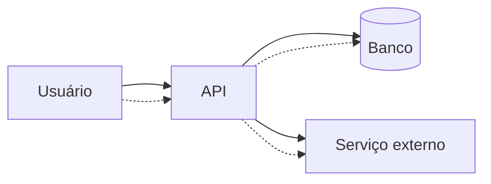

# Segurança para Engenharia de Software

> [!abstract] Em uma frase
> Segurança é desenhar o sistema assumindo que entradas são hostis, segredos vazam, permissões importam e falhas precisam ser contidas.

Segurança não é só colocar autenticação no final. Ela aparece em modelagem, API, banco, logs, deploy e operação.

---

## OWASP como mapa mental

Alguns riscos recorrentes:

- Controle de acesso quebrado.
- Injeção.
- Falhas criptográficas.
- Configuração insegura.
- Autenticação fraca.
- Logging/monitoramento insuficiente.
- SSRF.

## Validação de entrada

```csharp
public sealed class CriarUsuarioRequest
{
    [Required]
    [EmailAddress]
    public string Email { get; init; } = default!;

    [Required]
    [MinLength(12)]
    public string Password { get; init; } = default!;
}
```

Validação de DTO ajuda, mas regra de domínio importante não deve depender só de annotation em request.

## Injeção

O risco não é só SQL injection, mas qualquer lugar onde entrada vira comando: SQL, shell, template, NoSQL query, LDAP, regex.

Errado:

```csharp
var sql = $"SELECT * FROM Clientes WHERE Email = '{email}'";
```

Melhor:

```csharp
var cliente = await connection.QuerySingleOrDefaultAsync<Cliente>(
    "SELECT * FROM Clientes WHERE Email = @Email",
    new { Email = email });
```

## Autorização por recurso

Não basta saber que o usuário está autenticado. Ele pode acessar este recurso específico?

```csharp
if (pedido.TenantId != usuario.TenantId)
{
    return Results.Forbid();
}
```

Essa validação precisa estar no backend. Frontend esconder botão é experiência, não segurança.

## Secrets

Não coloque segredo em código, appsettings versionado ou log.

Use:

- Variáveis de ambiente.
- Secret managers.
- Rotação.
- Privilégio mínimo.

## Senhas e hashing

Senha não deve ser criptografada para "descriptografar depois". Senha deve ser hasheada com algoritmo próprio para senha, como Argon2, bcrypt ou PBKDF2.

Em ASP.NET Core Identity, prefira o hasher do framework:

```csharp
var hasher = new PasswordHasher<Usuario>();
var hash = hasher.HashPassword(usuario, password);
var result = hasher.VerifyHashedPassword(usuario, hash, password);
```

## Logs seguros

Nunca logue:

- access token;
- refresh token;
- senha;
- cartão;
- segredo de webhook;
- documento pessoal sem necessidade;
- payload sensível completo.

Log bom ajuda incidente. Log ruim cria incidente.

## Threat modeling básico



Perguntas simples:

- Quem pode chamar isso?
- O que impede acesso indevido?
- Que dado sensível passa por aqui?
- O que aparece no log?
- O que acontece se essa dependência for comprometida?

## STRIDE como checklist mental

| Letra | Risco | Pergunta |
|---|---|---|
| S | Spoofing | Alguém pode fingir ser outro usuário/serviço? |
| T | Tampering | Alguém pode alterar dado em trânsito/repouso? |
| R | Repudiation | Conseguimos auditar quem fez? |
| I | Information disclosure | Algum dado sensível vaza? |
| D | Denial of service | Alguém consegue derrubar ou degradar? |
| E | Elevation of privilege | Alguém ganha permissão indevida? |

## Erros comuns

**Confiar na rede interna.** Serviço interno também precisa autenticação/autorização adequadas.

**Permissão só no menu.** Usuário pode chamar API direto.

**Segredo em arquivo versionado.** Mesmo repositório privado não é cofre.

**Mensagem de erro reveladora.** Erro pode indicar tabela, stack trace, versão ou regra interna.

**Dependências esquecidas.** Pacotes vulneráveis fazem parte da superfície de ataque.

## Checklist

- [ ] Endpoints validam autenticação e autorização?
- [ ] Existe autorização por recurso, não só por papel?
- [ ] Entradas são validadas?
- [ ] Queries usam parâmetros?
- [ ] Segredos estão fora do repositório?
- [ ] Logs evitam dados sensíveis?
- [ ] Dependências são atualizadas?
- [ ] Erros não vazam detalhe interno?

## Notas relacionadas

- [[Autenticação e Autorização em Sistemas Distribuídos]]
- [[API Gateway]]
- [[Requisitos e Qualidade Arquitetural]]
