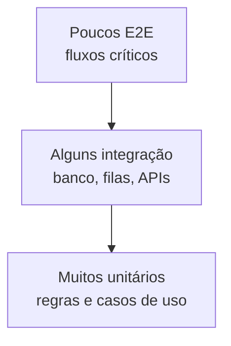
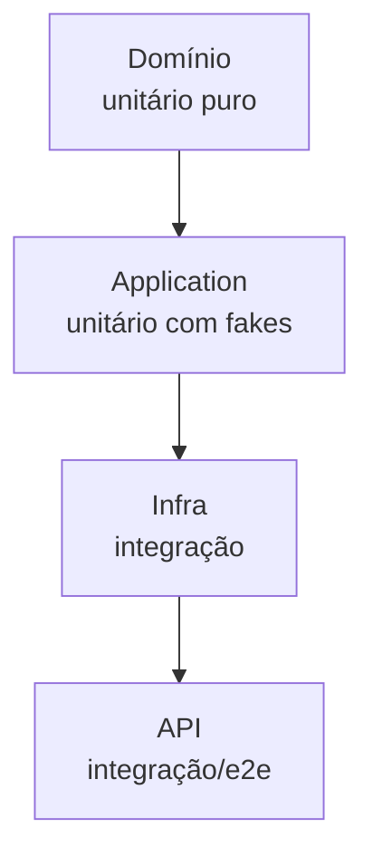
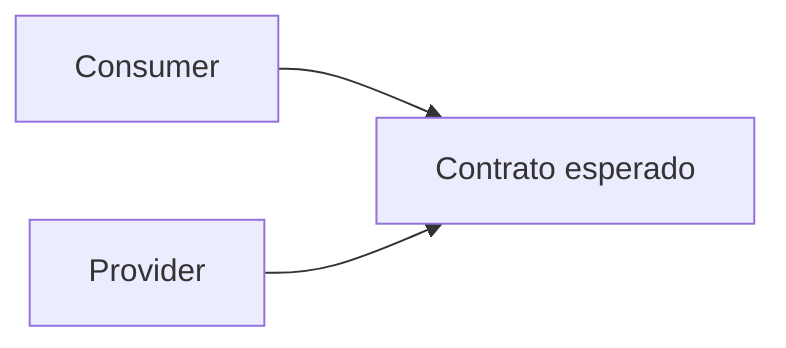

# Testes

> [!abstract] Em uma frase
> Teste bom dá confiança para mudar o sistema sem transformar cada alteração em um ato de fé.

Teste não serve só para "pegar bug". Serve para documentar comportamento, proteger regra importante e permitir refatoração.

---

## Pirâmide de testes



Quanto mais alto na pirâmide, mais realista e mais caro. Quanto mais baixo, mais rápido e mais isolado.

## Tipos

| Tipo | Bom para |
|---|---|
| Unitário | Regra de negócio, algoritmo, validação |
| Integração | Banco, repositório, fila, API externa fake |
| Contrato | Garantir que produtor e consumidor concordam |
| E2E | Fluxos críticos do usuário |
| Arquitetura | Regras de dependência entre camadas/módulos |

## Exemplo em C#: teste de domínio

```csharp
public sealed class PedidoTests
{
    [Fact]
    public void Confirmar_DeveFalhar_QuandoPedidoNaoTemItens()
    {
        var pedido = Pedido.Criar(clienteId: Guid.NewGuid(), itens: []);

        var act = () => pedido.Confirmar();

        act.Should().Throw<InvalidOperationException>()
            .WithMessage("Pedido sem itens não pode ser confirmado.");
    }
}
```

Esse teste é rápido porque não precisa de banco, HTTP ou framework.

## Exemplo em C#: teste de integração com WebApplicationFactory

```csharp
public sealed class PedidosApiTests : IClassFixture<WebApplicationFactory<Program>>
{
    private readonly HttpClient _client;

    public PedidosApiTests(WebApplicationFactory<Program> factory)
    {
        _client = factory.CreateClient();
    }

    [Fact]
    public async Task CriarPedido_DeveRetornarCreated()
    {
        var response = await _client.PostAsJsonAsync("/pedidos", new
        {
            clienteId = Guid.NewGuid(),
            itens = new[] { new { produtoId = Guid.NewGuid(), quantidade = 1 } }
        });

        response.StatusCode.Should().Be(HttpStatusCode.Created);
    }
}
```

## Test double sem mistério

| Tipo | Ideia |
|---|---|
| Dummy | Só preenche parâmetro |
| Stub | Retorna resposta preparada |
| Fake | Implementação simples funcional |
| Mock | Verifica interação |
| Spy | Registra chamadas para inspeção |

Use mock com cuidado. Teste que verifica chamada interna demais costuma quebrar em refatoração sem mudança de comportamento.

## Estratégia por camada



Uma divisão saudável:

- domínio: teste puro, sem DI, sem banco;
- application: testa caso de uso com fakes/stubs;
- infraestrutura: testa EF, SQL, broker, filesystem;
- API: testa contrato HTTP e autenticação/autorização;
- E2E: cobre poucos fluxos que realmente representam risco.

## Teste de arquitetura

Teste de arquitetura protege dependências entre camadas.

Exemplo conceitual:

```csharp
[Fact]
public void Domain_NaoDeveDepender_De_Infrastructure()
{
    var domainAssembly = typeof(Pedido).Assembly;
    var forbidden = new[] { "Infrastructure", "Microsoft.EntityFrameworkCore" };

    var violations = domainAssembly.GetTypes()
        .SelectMany(t => t.GetFields().Select(f => f.FieldType)
            .Concat(t.GetProperties().Select(p => p.PropertyType)))
        .Where(t => forbidden.Any(ns => t.FullName?.Contains(ns) == true))
        .ToList();

    violations.Should().BeEmpty();
}
```

Em projetos reais, bibliotecas como NetArchTest ou ArchUnitNET ajudam, mas o princípio é o mesmo: automatizar regras arquiteturais.

## Teste de contrato

Teste de contrato garante que produtor e consumidor concordam.



Use quando um serviço publica API/evento consumido por outro. Sem contrato, o produtor pode "só renomear um campo" e quebrar produção.

## Test data builder

Builder deixa teste legível e evita setup gigante.

```csharp
public sealed class PedidoBuilder
{
    private readonly List<ItemPedidoInput> _itens = new();

    public PedidoBuilder ComItem(decimal preco = 10m, int quantidade = 1)
    {
        _itens.Add(new ItemPedidoInput(Guid.NewGuid(), quantidade, preco));
        return this;
    }

    public Pedido Build() => Pedido.Criar(Guid.NewGuid(), _itens);
}
```

Uso:

```csharp
var pedido = new PedidoBuilder()
    .ComItem(preco: 100m)
    .Build();
```

## Erros comuns

**Testar implementação, não comportamento.** Se mudar refatoração interna quebra teste sem mudar resultado, talvez o teste saiba demais.

**Mockar tudo.** Teste cheio de mock pode provar que você chamou métodos, não que o sistema funciona.

**Sem teste de integração.** Unitário não prova que mapping do EF, SQL real ou autenticação HTTP estão corretos.

**E2E demais.** Muitos E2E deixam pipeline lento e instável.

## Checklist

- [ ] Regras críticas têm teste unitário?
- [ ] Integrações importantes têm teste de integração?
- [ ] Fluxos críticos têm E2E?
- [ ] Testes quebram por comportamento ou por detalhe interno?
- [ ] Dá para refatorar com confiança?
- [ ] Testes são rápidos o bastante para rodar sempre?

## Notas relacionadas

- [[Refatoração]]
- [[Arquitetura de Aplicação]]
- [[Design de Código]]
