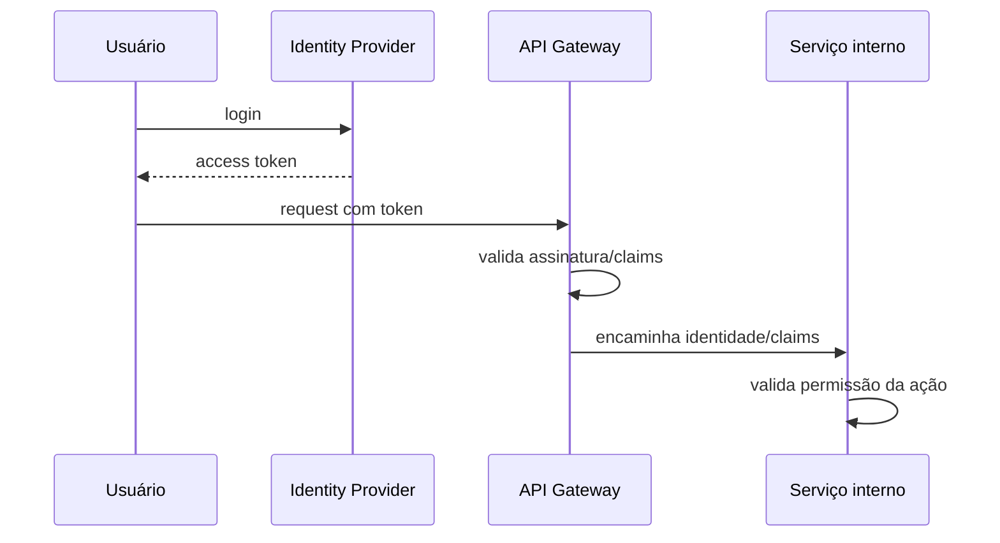
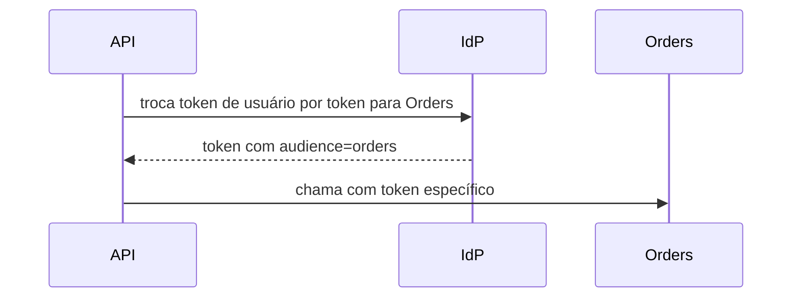

# Autenticação e Autorização em Sistemas Distribuídos

> [!abstract] Em uma frase
> Autenticação responde "quem é você?"; autorização responde "o que você pode fazer?".

Em sistemas distribuídos, autenticação e autorização precisam atravessar fronteiras: browser, API Gateway, APIs internas, workers e integrações.



## Termos

| Conceito | Papel |
|---|---|
| OAuth2 | Delegação de acesso |
| OpenID Connect | Identidade sobre OAuth2 |
| JWT | Formato comum de token assinado |
| Claims | Atributos sobre o usuário/cliente |
| Scopes | Permissões concedidas ao token |
| RBAC | Permissão por papel |
| ABAC | Permissão por atributos |

## Validação no Gateway e no serviço

O gateway pode validar autenticação e regras gerais, mas o serviço dono da regra ainda deve validar autorização de negócio.

Exemplo: o gateway sabe que o usuário está autenticado. O serviço de pedidos sabe se aquele usuário pode cancelar aquele pedido específico.

## Autorização por recurso

RBAC responde "o usuário tem o papel certo?". Muitas regras reais precisam ir além:

```text
Usuário pode cancelar pedido se:
- tem permissão pedidos.cancelar
- pedido pertence ao tenant dele
- pedido ainda não foi enviado
```

```csharp
public sealed class CancelarPedidoAuthorizationService
{
    public bool PodeCancelar(ClaimsPrincipal user, Pedido pedido)
    {
        var tenantId = user.FindFirst("tenant_id")?.Value;
        var canCancel = user.HasClaim("permissions", "pedidos.cancelar");

        return canCancel
            && pedido.TenantId.ToString() == tenantId
            && pedido.Status == PedidoStatus.Criado;
    }
}
```

Esse tipo de regra pertence ao serviço dono do recurso, não apenas ao gateway.

## Exemplo em C#: policy baseada em claim

```csharp
builder.Services.AddAuthorization(options =>
{
    options.AddPolicy("Pedidos.Cancelar", policy =>
        policy.RequireClaim("permissions", "pedidos.cancelar"));
});

app.MapPost("/pedidos/{id:guid}/cancelar", CancelarPedido)
   .RequireAuthorization("Pedidos.Cancelar");
```

## Propagação de identidade

Ao chamar outro serviço, evite repassar token de usuário sem critério. Existem dois modelos comuns:

- **Propagar contexto do usuário:** útil quando o serviço chamado precisa decidir com base no usuário final.
- **Token de serviço:** útil para comunicação máquina-a-máquina, com permissões próprias do serviço.

## Token exchange

Em arquiteturas maiores, um serviço pode trocar o token recebido por outro token com audiência e escopo específicos para o próximo serviço.



Isso reduz o risco de um token amplo demais circular por muitos serviços.

## JWT vs sessão

JWT é bom para APIs distribuídas porque permite validação local da assinatura. Mas tem custo:

- revogação imediata é mais difícil;
- token grande pesa em toda requisição;
- claims antigas continuam válidas até expirar;
- segredo/chave de assinatura precisa ser bem protegido.

Sessão centralizada facilita revogação, mas adiciona dependência de armazenamento compartilhado.

## Riscos comuns

- JWT grande demais carregando permissões demais.
- Token sem expiração curta.
- Serviço interno confiando cegamente no gateway.
- Autorização só por papel, sem considerar o recurso.
- Misturar autenticação de usuário e autenticação de serviço.

## Erros comuns

**Confiar só no frontend.** UI esconder botão não é autorização.

**Colocar permissão demais no token.** Token inchado fica difícil de evoluir e pode vazar informação.

**Serviço interno sem validação.** Rede interna não é fronteira de segurança suficiente.

**Logs com token.** Access token em log é vazamento esperando acontecer.

## Checklist

- [ ] Quem emite tokens?
- [ ] Quem valida assinatura e expiração?
- [ ] Gateway e serviços têm responsabilidades claras?
- [ ] Claims/scopes são mínimos?
- [ ] Existe autorização no nível do recurso?
- [ ] Comunicação serviço-a-serviço usa identidade própria?
- [ ] Logs evitam gravar tokens?

## Notas relacionadas

- [[API Gateway]]
- [[Microsserviços]]
- [[Fundamentos - Resiliência e Controle de Tráfego]]
