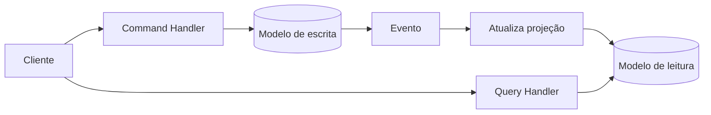
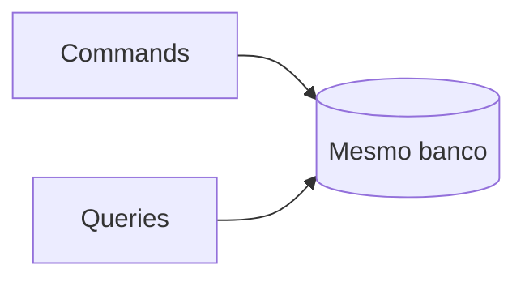
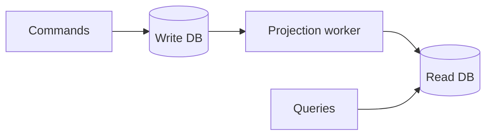

# CQRS

> [!abstract] Em uma frase
> CQRS separa o modelo de escrita do modelo de leitura quando os dois têm necessidades diferentes demais para caberem bem no mesmo desenho.

CQRS significa *Command Query Responsibility Segregation*. A ideia é simples: comandos mudam estado; queries leem estado.



## Sem CQRS

Um mesmo modelo tenta servir escrita, regras de negócio, consultas complexas, telas e relatórios.

Isso funciona muito bem em CRUD simples. O problema aparece quando a escrita precisa proteger invariantes complexas e a leitura precisa de projeções otimizadas, agregadas ou desnormalizadas.

## Com CQRS

- **Command side:** valida regra de negócio e altera estado.
- **Query side:** responde rápido com modelo preparado para leitura.

## CQRS simples vs CQRS com bancos separados

CQRS não exige dois bancos. Você pode começar separando handlers e modelos no mesmo banco.



O passo seguinte é ter projeções específicas de leitura.



Comece simples. Separe fisicamente só quando a leitura pedir escala ou formato diferente.

## Exemplo em C#

```csharp
public sealed record CriarPedido(Guid ClienteId, IReadOnlyList<ItemPedidoDto> Itens);

public sealed class CriarPedidoHandler
{
    private readonly AppDbContext _db;

    public async Task<Guid> HandleAsync(CriarPedido command, CancellationToken ct)
    {
        var pedido = Pedido.Criar(command.ClienteId, command.Itens);
        _db.Pedidos.Add(pedido);
        await _db.SaveChangesAsync(ct);
        return pedido.Id;
    }
}

public sealed record PedidoResumoDto(Guid Id, string Cliente, decimal Total, string Status);

public sealed class ObterPedidosRecentesQuery
{
    private readonly ReadDbContext _db;

    public Task<List<PedidoResumoDto>> ExecuteAsync(CancellationToken ct) =>
        _db.PedidosResumo
            .OrderByDescending(p => p.CriadoEm)
            .Take(50)
            .Select(p => new PedidoResumoDto(p.Id, p.ClienteNome, p.Total, p.Status))
            .ToListAsync(ct);
}
```

## Projeção de leitura

```csharp
public sealed class PedidoCriadoProjection
{
    private readonly ReadDbContext _readDb;

    public async Task HandleAsync(PedidoCriadoIntegrationEvent evento, CancellationToken ct)
    {
        var resumo = new PedidoResumo
        {
            Id = evento.PedidoId,
            ClienteId = evento.ClienteId,
            Total = evento.Total,
            Status = "Criado",
            CriadoEm = evento.OccurredAt
        };

        _readDb.PedidosResumo.Add(resumo);
        await _readDb.SaveChangesAsync(ct);
    }
}
```

Projeção precisa ser idempotente. Se o mesmo evento chegar duas vezes, a tabela de leitura não pode duplicar o pedido.

## Consistência eventual na UI

Com projeções assíncronas, a tela pode não mostrar imediatamente o dado recém-criado. Opções:

- responder com o ID e mostrar estado "processando";
- ler do write model logo após comando;
- usar atualização otimista na UI;
- exibir "pode levar alguns segundos";
- usar polling ou SignalR para atualização.

## Erros comuns

**Usar CQRS em CRUD trivial.** Separar tudo cedo demais cria boilerplate sem ganho.

**Projection sem rebuild.** Se a projeção corrompe ou muda formato, você precisa reconstruí-la.

**Query side virando regra de negócio.** Leitura pode formatar e filtrar, mas invariantes continuam no lado de escrita.

**Ignorar latência da projeção.** Usuário percebe quando uma ação "sumiu". A UX precisa considerar isso.

## Quando usar

- Leitura muito diferente da escrita.
- Telas precisam de dados agregados de várias fontes.
- Escrita tem regras ricas e leitura precisa ser simples/rápida.
- Você aceita consistência eventual nas projeções.
- Existem consumidores diferentes para o mesmo dado.

## Quando evitar

- CRUD simples.
- Time ainda está modelando o domínio básico.
- Consistência imediata em todas as telas é obrigatória.
- O custo de manter projeções não se paga.

## Checklist

- [ ] A leitura realmente tem formato diferente da escrita?
- [ ] Existe problema de performance de leitura?
- [ ] Projeção eventual é aceitável?
- [ ] Existe mecanismo para reconstruir projeções?
- [ ] Eventos de atualização são confiáveis?
- [ ] A complexidade extra compensa?

## Notas relacionadas

- [[Arquitetura Orientada a Eventos]]
- [[Outbox e Inbox Pattern]]
- [[SQL, NoSQL e Quando Usar]]
