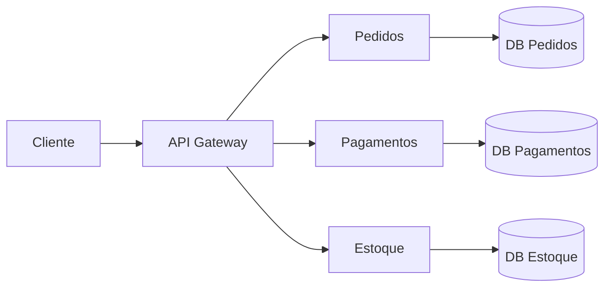

# Microsserviços

> [!abstract] Em uma frase
> Microsserviços são serviços pequenos e autônomos em torno de capacidades de negócio, com deploy e persistência próprios, pagando o preço de operar um sistema distribuído.

Microsserviço não é "controller separado". Também não é pasta diferente no mesmo deploy. A ideia central é autonomia: cada serviço pode evoluir, escalar e ser implantado com baixo acoplamento.



## Quando faz sentido

- Times independentes precisam evoluir partes diferentes.
- Domínio tem fronteiras bem compreendidas.
- Partes do sistema escalam de forma diferente.
- Deploy independente gera valor real.
- A organização tem maturidade de observabilidade, CI/CD e operação.

## Sinais de que ainda é cedo

- O domínio ainda não tem fronteiras claras.
- O time não tem CI/CD confiável.
- Logs e traces ainda são frágeis.
- Deploy já é difícil com uma aplicação.
- Banco ainda é compartilhado sem ownership.
- A motivação principal é "parece mais moderno".

Microsserviços aumentam autonomia, mas também aumentam superfície de falha.

## Custos

- Rede falha.
- Dados ficam distribuídos.
- Transações viram sagas ou consistência eventual.
- Debug exige tracing.
- Testes end-to-end ficam mais caros.
- Versionamento de APIs/eventos vira parte do trabalho.

> [!warning]
> Se o time ainda não consegue operar bem um monólito, microsserviços geralmente multiplicam o problema.

## Banco por serviço

Cada serviço deve ser dono dos seus dados. Outro serviço não deve consultar diretamente as tabelas internas.

Errado:

```text
Serviço de Pagamentos -> SELECT direto no banco de Pedidos
```

Melhor:

```text
Serviço de Pagamentos -> API/Eventos do serviço de Pedidos
```

Isso preserva autonomia, mas exige desenho de integração.

## Dados duplicados de propósito

Em microsserviços, duplicar dados pode ser correto.

Exemplo: serviço de Pagamentos pode guardar `pedido_id`, `cliente_id` e `valor_total` recebidos em um evento `PedidoCriado`. Ele não precisa consultar o banco de Pedidos a cada operação.


Essa cópia é uma projeção local. Ela precisa de versionamento, idempotência e reconciliação, mas reduz acoplamento.

## Comunicação

| Tipo | Quando usar |
|---|---|
| Síncrona HTTP/gRPC | Precisa de resposta imediata |
| Assíncrona por eventos | Reação eventual, menor acoplamento temporal |
| Fila de comandos | Trabalho assíncrono com um consumidor responsável |

## Resiliência obrigatória

Chamada síncrona entre serviços precisa de:

- timeout curto;
- retry com backoff, quando fizer sentido;
- circuit breaker;
- fallback ou degradação;
- correlation id;
- métrica por dependência.

```csharp
builder.Services.AddHttpClient<IPagamentosClient, PagamentosClient>()
    .AddStandardResilienceHandler();
```

Em .NET moderno, `Microsoft.Extensions.Http.Resilience` ajuda a compor políticas padrão, mas a decisão de timeout/retry continua sendo arquitetural.

## Deploy independente

Se dois "microsserviços" sempre precisam ser deployados juntos, talvez eles ainda sejam um único serviço mal dividido.

Pergunte:

- consigo subir Pagamentos sem subir Pedidos?
- contrato é compatível com versão anterior?
- existe teste de contrato?
- observabilidade mostra impacto por serviço?

## Erros comuns

**Banco compartilhado.** Serviços com o mesmo banco geralmente viram monólito distribuído.

**Chatty communication.** Um endpoint que precisa chamar 8 serviços em sequência tende a ser lento e frágil.

**Sem dono por serviço.** Autonomia exige ownership; sem isso, só sobram fronteiras artificiais.

**Ignorar dados.** O maior desafio raramente é quebrar controllers; é quebrar consistência e ownership de dados.

## Checklist

- [ ] Existe fronteira de domínio clara?
- [ ] O serviço tem banco próprio?
- [ ] O serviço pode ser deployado sozinho?
- [ ] A comunicação síncrona tem timeout e circuit breaker?
- [ ] Eventos são versionados?
- [ ] Existe observabilidade distribuída?
- [ ] Existe plano para consistência eventual?
- [ ] Um monólito modular resolveria com menos custo?

## Notas relacionadas

- [[Monólito Modular]]
- [[Sagas e Transações Distribuídas]]
- [[Outbox e Inbox Pattern]]
- [[Fundamentos - Observabilidade e Estudo de Caso]]
