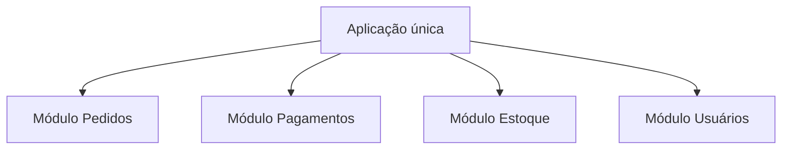
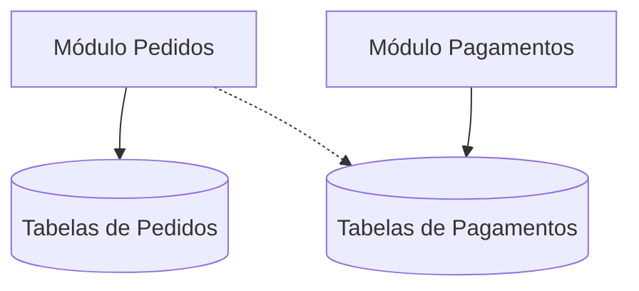

# Monólito Modular

> [!abstract] Em uma frase
> Monólito modular é uma aplicação única organizada em módulos com fronteiras explícitas, permitindo evoluir com simplicidade operacional antes de distribuir serviços.

Monólito não precisa ser sinônimo de bagunça. O problema geralmente não é estar em um processo único; é não ter fronteiras internas.



## Quando faz sentido

- Time pequeno ou médio.
- Domínio ainda mudando bastante.
- Necessidade de deploy simples.
- Baixa maturidade operacional para microsserviços.
- Fronteiras de domínio ainda não estão claras.

## Regras de um bom monólito modular

- Módulos têm APIs internas explícitas.
- Um módulo não acessa tabelas internas de outro diretamente.
- Dependências apontam para contratos, não para detalhes.
- Regras de negócio ficam dentro do módulo dono.
- Comunicação entre módulos pode ser síncrona ou via eventos internos.

## Banco compartilhado sem bagunça

Um monólito modular pode usar um banco único, mas os módulos não deveriam mexer livremente nas tabelas uns dos outros.



O ideal é cada módulo ter seu schema ou pelo menos uma convenção clara de ownership.

```text
orders.pedidos
orders.itens_pedido
payments.pagamentos
payments.transacoes
```

Se um módulo precisa de informação de outro, prefira contrato interno, evento interno ou projeção controlada.

## Exemplo de estrutura em .NET

```text
src/
  App/
    Program.cs
  Modules/
    Orders/
      Orders.Application/
      Orders.Domain/
      Orders.Infrastructure/
    Payments/
      Payments.Application/
      Payments.Domain/
      Payments.Infrastructure/
  Shared/
    Kernel/
    Infrastructure/
```

## Exemplo de contrato interno

```csharp
public interface IReservarEstoque
{
    Task<ResultadoReserva> ReservarAsync(Guid pedidoId, IReadOnlyList<ItemPedido> itens, CancellationToken ct);
}

public sealed class CriarPedidoHandler
{
    private readonly IReservarEstoque _estoque;

    public async Task<Guid> HandleAsync(CriarPedido command, CancellationToken ct)
    {
        var pedido = Pedido.Criar(command.ClienteId, command.Itens);
        await _estoque.ReservarAsync(pedido.Id, pedido.Itens, ct);
        return pedido.Id;
    }
}
```

O módulo de pedidos depende de um contrato, não da implementação interna do módulo de estoque.

## Eventos internos

Eventos internos ajudam a evitar que um caso de uso vire um método gigante.

```csharp
public sealed record PedidoCriado(Guid PedidoId, Guid ClienteId, decimal Total);

public sealed class CriarPedidoHandler
{
    private readonly IDomainEventDispatcher _events;

    public async Task<Guid> HandleAsync(CriarPedido command, CancellationToken ct)
    {
        var pedido = Pedido.Criar(command.ClienteId, command.Itens);
        await _repository.AddAsync(pedido, ct);

        await _events.DispatchAsync(new PedidoCriado(pedido.Id, pedido.ClienteId, pedido.Total), ct);

        return pedido.Id;
    }
}
```

Como ainda está no mesmo deploy, você não precisa começar com broker externo. O importante é desenhar a fronteira.

## Caminho para microsserviços

Monólito modular bem feito deixa uma porta aberta:

1. módulo tem fronteira clara;
2. dados têm ownership;
3. comunicação passa por contrato;
4. métricas mostram que aquele módulo precisa escalar/evoluir separado;
5. aí a extração para serviço fica possível.


## Risco

O monólito modular vira "monólito comum" quando as fronteiras são ignoradas: qualquer camada acessa qualquer tabela, qualquer serviço chama qualquer classe, e toda mudança exige entender o sistema inteiro.

## Erros comuns

**Criar pastas, não módulos.** Módulo tem regra, contrato e ownership. Pasta é só organização visual.

**Shared Kernel gigante.** Tudo que é colocado em `Shared` vira acoplamento global. Use com parcimônia.

**Bypass de módulo.** Uma urgência vira acesso direto ao repositório interno de outro módulo; três meses depois, a fronteira morreu.

**Extrair cedo demais.** Se o módulo ainda muda toda semana e a fronteira não estabilizou, transformar em serviço pode cristalizar uma divisão ruim.

## Checklist

- [ ] Existem módulos com nomes de domínio?
- [ ] Cada módulo tem dono claro?
- [ ] Um módulo acessa dados internos de outro?
- [ ] Existem contratos internos estáveis?
- [ ] Dá para testar um módulo sem subir tudo?
- [ ] Existe caminho futuro para extrair um módulo se precisar?

## Notas relacionadas

- [[Microsserviços]]
- [[C4 Model]]
- [[Modelagem de Domínio e Arquitetura Orientada a Negócio]]
