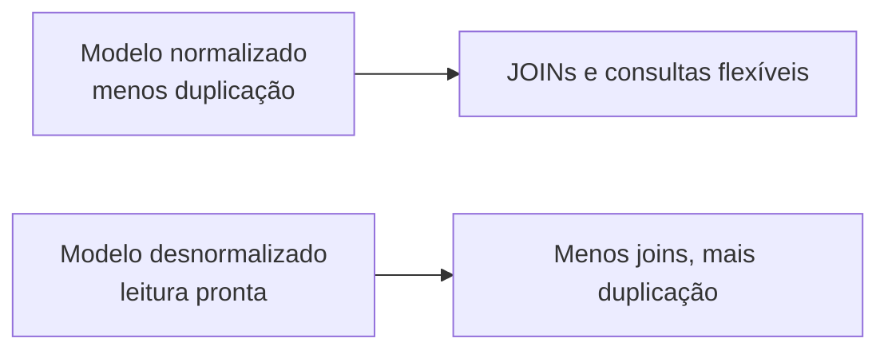
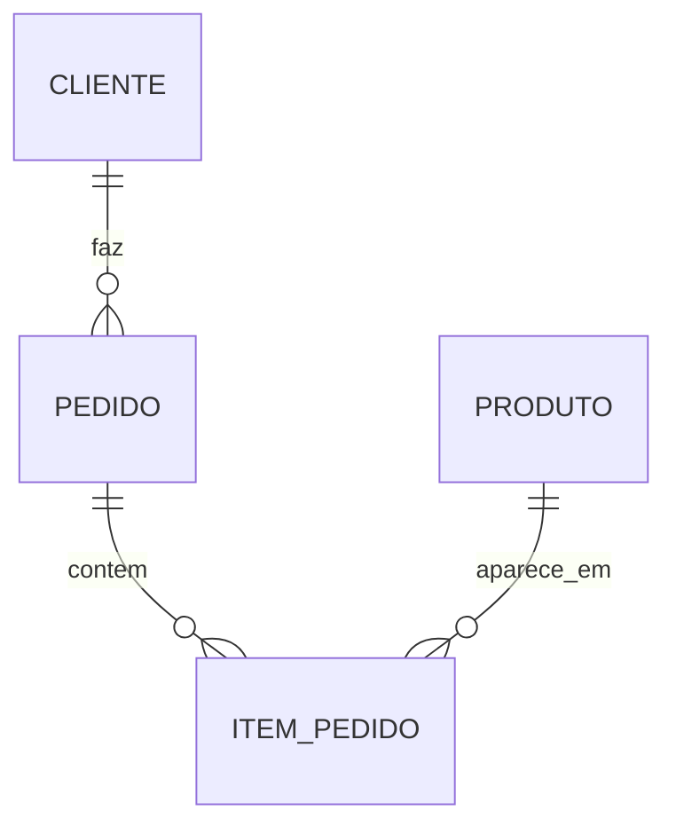
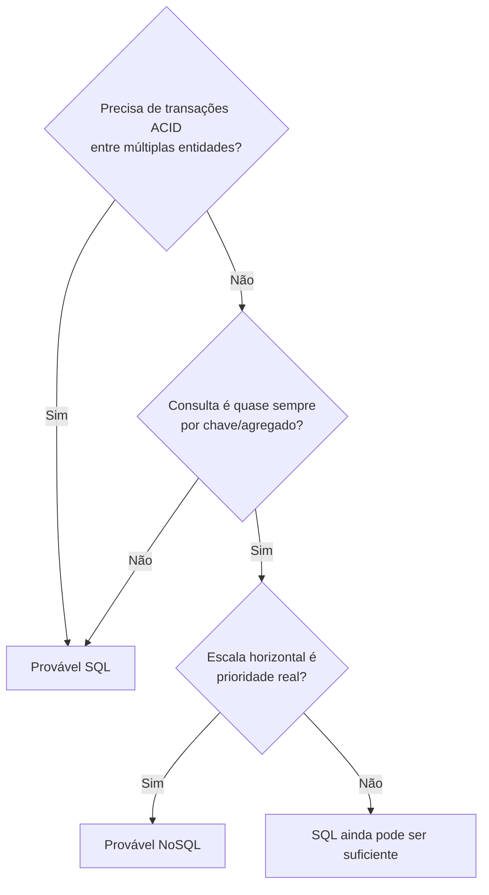
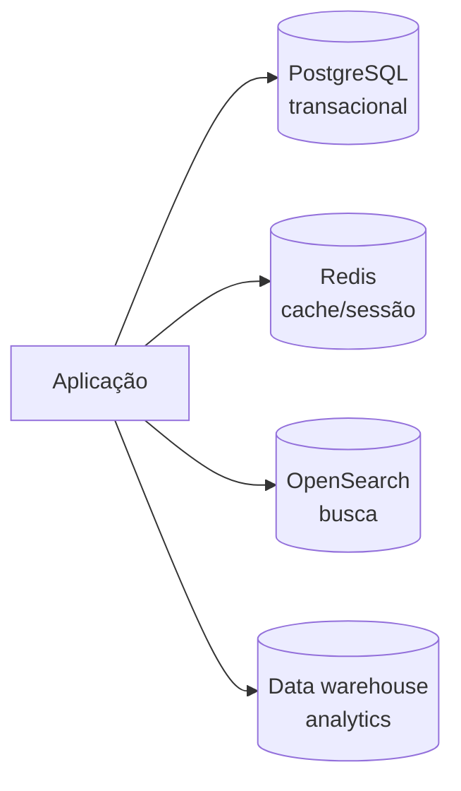
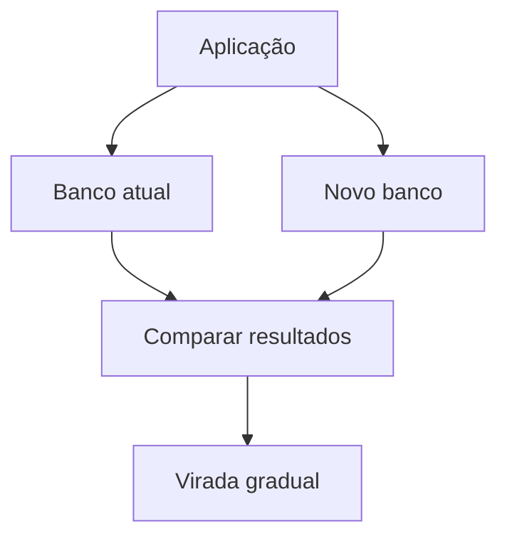

# SQL, NoSQL e Quando Usar

> [!abstract] Em uma frase
> A escolha entre SQL e NoSQL deve seguir o padrão de acesso, as garantias de consistência e o modelo de dados; não o tamanho imaginado do sistema.

SQL e NoSQL não são níveis de maturidade. Não é "começa SQL e quando crescer vira NoSQL". Muitos sistemas grandes rodam muito bem em PostgreSQL, SQL Server ou MySQL. E muitos sistemas pequenos ficam piores quando escolhem NoSQL sem precisar.

---

## Bancos SQL

Bancos relacionais organizam dados em tabelas, linhas, colunas, chaves e relacionamentos.

**Exemplos:** PostgreSQL, SQL Server, MySQL, Oracle.

Use SQL quando:

- O domínio tem relacionamentos importantes.
- Transações ACID importam.
- Consultas variam bastante.
- Você precisa de joins, filtros e relatórios.
- Integridade referencial evita bugs de negócio.
- O schema é conhecido e muda com controle.

## Normalização e desnormalização

Normalização reduz duplicação e protege consistência. Desnormalização acelera leitura quando você sabe exatamente como o dado será consumido.



Normalize por padrão em sistemas transacionais. Desnormalize de propósito quando uma leitura importante justificar.



## Bancos NoSQL

NoSQL é um guarda-chuva. Existem modelos bem diferentes.

| Tipo | Exemplos | Bom para |
|---|---|---|
| Documento | MongoDB, Cosmos DB | Agregados lidos juntos, schema flexível |
| Chave-valor | Redis, DynamoDB | Lookup rápido por chave |
| Colunar/wide-column | Cassandra, HBase | Alto volume distribuído por chave |
| Grafo | Neo4j | Relações profundas e navegação em grafos |

Use NoSQL quando:

- O padrão de leitura é bem previsível.
- O dado pode ser modelado como agregado/documento.
- Escala horizontal é prioridade real.
- Você aceita desnormalização.
- Consistência eventual é aceitável em partes do fluxo.
- O volume de escrita/leitura por chave justifica o modelo.

## Modelagem por padrão de acesso

Em NoSQL, você começa pela pergunta: "quais consultas eu preciso responder?". Isso muda a ordem mental.

Em SQL, é comum modelar entidades e relacionamentos primeiro. Em NoSQL, principalmente chave-valor/documento/wide-column, você modela para as consultas principais.

```text
Tela: histórico de pedidos do cliente
Consulta: cliente_id + data desc
Modelo NoSQL provável: documento/projeção por cliente com pedidos recentes
```

Se amanhã você precisar de relatório flexível por produto, região, cupom, status e período, talvez o modelo NoSQL transacional não seja o melhor lugar para isso. Você pode precisar de uma projeção analítica separada.

---

## O mesmo pedido em SQL e documento

### SQL com EF Core

```csharp
public sealed class Pedido
{
    public Guid Id { get; set; }
    public Guid ClienteId { get; set; }
    public Cliente Cliente { get; set; } = default!;
    public List<ItemPedido> Itens { get; set; } = new();
}

public sealed class ItemPedido
{
    public Guid Id { get; set; }
    public Guid PedidoId { get; set; }
    public Guid ProdutoId { get; set; }
    public int Quantidade { get; set; }
    public decimal PrecoUnitario { get; set; }
}

var pedido = await db.Pedidos
    .Include(p => p.Itens)
    .FirstOrDefaultAsync(p => p.Id == pedidoId);
```

### Documento com MongoDB

```csharp
public sealed class PedidoDocument
{
    public Guid Id { get; set; }
    public Guid ClienteId { get; set; }
    public List<ItemPedidoDocument> Itens { get; set; } = new();
    public decimal Total { get; set; }
}

public sealed class ItemPedidoDocument
{
    public Guid ProdutoId { get; set; }
    public string NomeProduto { get; set; } = default!;
    public int Quantidade { get; set; }
    public decimal PrecoUnitario { get; set; }
}

var collection = database.GetCollection<PedidoDocument>("pedidos");
var pedido = await collection
    .Find(p => p.Id == pedidoId)
    .FirstOrDefaultAsync();
```

No SQL, relacionamentos ficam explícitos e consultas flexíveis são naturais. No documento, a leitura do pedido inteiro é direta, mas você aceitou duplicar dados dentro do documento.

> [!note]
> Duplicar o preço do produto dentro do pedido não é necessariamente errado. Em compras, isso costuma ser correto: o pedido precisa preservar o preço pago na época.

---

## Perguntas de decisão



## Antes de migrar para NoSQL

Antes de trocar tecnologia, veja se o problema não é mais simples:

- Índices ruins.
- Queries sem paginação.
- Falta de cache.
- Falta de [[Read Replicas]].
- Modelo relacional mal desenhado.
- Banco pequeno demais para a carga.
- Operações analíticas rodando no banco transacional.

Migração de banco tem alto [[Custo de Reversão]]. Faça quando o padrão de acesso justificar, não quando o banco atual estiver apenas mal cuidado.

## Arquitetura híbrida

Muitos sistemas bons usam mais de um banco, cada um para um papel claro.



Isso é diferente de espalhar tecnologia por moda. Cada banco precisa ter um motivo:

- SQL para transação e integridade.
- Redis para cache ou lookup rápido.
- OpenSearch para busca textual.
- Warehouse/lake para analytics.
- Documento para agregados com leitura previsível.

## Migração: caminho seguro

Trocar banco em produção é uma das decisões com maior custo de reversão. Uma estratégia comum:

1. Criar novo modelo em paralelo.
2. Fazer dual-write ou publicar eventos para alimentar o novo banco.
3. Comparar respostas entre banco antigo e novo.
4. Mover leitura gradualmente.
5. Mover escrita quando houver confiança.
6. Desligar o caminho antigo depois de observabilidade e janela de rollback.



## Erros comuns

**Escolher NoSQL para evitar modelagem.** NoSQL não elimina modelagem; ele exige modelagem orientada a acesso.

**Usar SQL como documento gigante.** Uma tabela com coluna JSON para tudo pode ser útil pontualmente, mas se tudo vira blob, você perde boa parte do valor relacional.

**Ignorar transações.** Se o fluxo exige invariantes fortes, você precisa saber exatamente quais garantias o banco escolhido entrega.

**Migrar antes de medir.** Índices, read replicas, cache e otimização de query muitas vezes resolvem antes de uma troca de tecnologia.

## Checklist

- [ ] Quais consultas são mais frequentes?
- [ ] O dado é lido como agregado ou como relações flexíveis?
- [ ] Transação forte é requisito?
- [ ] Consistência eventual é aceitável?
- [ ] A equipe domina a tecnologia?
- [ ] Existe plano de migração e rollback?
- [ ] Read replicas, cache e índices já foram avaliados?

## Notas relacionadas

- [[SQL vs NoSQL]]
- [[Read Replicas]]
- [[Fundamentos - Cache, CDN e Banco de Dados]]
- [[Fundamentos - Replicação, Sharding e Consistent Hashing]]
