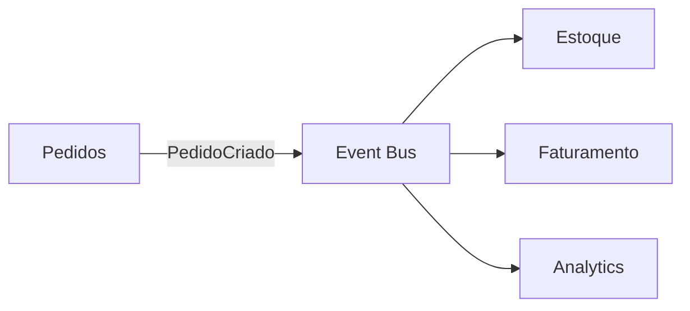

# Arquitetura Orientada a Eventos

> [!abstract] Em uma frase
> Arquitetura orientada a eventos faz sistemas reagirem a fatos que já aconteceram, em vez de dependerem apenas de chamadas diretas entre serviços.

Um evento deve representar um fato no passado: `PedidoCriado`, `PagamentoAprovado`, `UsuarioCadastrado`. Ele não é um comando disfarçado. Comando pede para fazer algo; evento informa que algo aconteceu.



## Comando vs evento

| Tipo | Intenção | Nome típico |
|---|---|---|
| Comando | Solicitar uma ação | `CriarPedido`, `CancelarAssinatura` |
| Evento | Informar um fato ocorrido | `PedidoCriado`, `AssinaturaCancelada` |

Comandos costumam ter um dono claro. Eventos podem ter vários interessados.

## Evento de domínio vs evento de integração

**Evento de domínio** vive dentro do mesmo bounded context. Ele ajuda o modelo interno a reagir a mudanças sem acoplar tudo no mesmo método.

**Evento de integração** cruza fronteiras entre sistemas/serviços. Ele precisa ser mais estável, versionável e pensado como contrato público.

```csharp
public sealed record PedidoCriadoDomainEvent(
    Guid PedidoId,
    Guid ClienteId,
    decimal Total);

public sealed record PedidoCriadoIntegrationEvent(
    Guid EventId,
    DateTimeOffset OccurredAt,
    Guid PedidoId,
    Guid ClienteId,
    decimal Total,
    int SchemaVersion = 1);
```

## Benefícios

- Reduz acoplamento temporal: produtor não precisa esperar todos os consumidores.
- Permite adicionar novos consumidores sem alterar o produtor.
- Ajuda a montar fluxos assíncronos.
- Facilita auditoria e observabilidade de processos.

## Custos

- Consistência eventual.
- Eventos duplicados.
- Eventos fora de ordem.
- Versionamento de contrato.
- Debug mais difícil sem observabilidade.

## Granularidade de eventos

Evento genérico demais vira ruído:

```text
EntidadeAtualizada
```

Esse nome obriga todo consumidor a abrir payload, comparar estado antigo/novo e adivinhar intenção.

Evento específico demais pode explodir o contrato:

```text
CampoNomeDoClienteAlteradoNaTelaDeCadastro
```

Um bom evento costuma representar uma mudança relevante de negócio:

```text
ClienteCadastrado
PedidoCriado
PagamentoAprovado
AssinaturaCancelada
```

## Contrato de evento

Um evento de integração precisa ser tratado como contrato público. Isso significa:

- adicionar campos sem quebrar consumidores;
- evitar renomear/remover campos;
- versionar mudanças incompatíveis;
- documentar semântica, não só JSON;
- manter exemplos reais de payload.

```json
{
  "event_id": "9f23b8e2-8b89-4db7-99f6-67b2f8d2c9e1",
  "event_type": "pedido.criado",
  "schema_version": 1,
  "occurred_at": "2026-07-16T12:30:00Z",
  "correlation_id": "checkout-123",
  "payload": {
    "pedido_id": "8fd2f8f2-706f-4c98-a289-a7a967a7f9c4",
    "cliente_id": "b579f20f-a35d-46e5-b735-7d1b7020c456",
    "total": 199.90
  }
}
```

> [!warning]
> Event-driven sem idempotência e rastreabilidade vira um sistema difícil de confiar. Todo evento precisa de ID, data, tipo, versão e correlação.

## Envelope de evento

Um envelope evita que cada mensagem invente sua própria estrutura.

```csharp
public sealed record IntegrationEventEnvelope<TPayload>(
    Guid EventId,
    string EventType,
    int SchemaVersion,
    DateTimeOffset OccurredAt,
    string CorrelationId,
    TPayload Payload);
```

## Exemplo em C#: publicador de eventos

```csharp
public interface IEventBus
{
    Task PublishAsync<T>(IntegrationEventEnvelope<T> envelope, CancellationToken ct);
}

public sealed class PedidoCriadoPublisher
{
    private readonly IEventBus _eventBus;

    public PedidoCriadoPublisher(IEventBus eventBus)
    {
        _eventBus = eventBus;
    }

    public Task PublishAsync(Pedido pedido, string correlationId, CancellationToken ct)
    {
        var payload = new PedidoCriadoIntegrationEvent(
            EventId: Guid.NewGuid(),
            OccurredAt: DateTimeOffset.UtcNow,
            PedidoId: pedido.Id,
            ClienteId: pedido.ClienteId,
            Total: pedido.Total);

        var envelope = new IntegrationEventEnvelope<PedidoCriadoIntegrationEvent>(
            EventId: payload.EventId,
            EventType: "pedido.criado",
            SchemaVersion: 1,
            OccurredAt: payload.OccurredAt,
            CorrelationId: correlationId,
            Payload: payload);

        return _eventBus.PublishAsync(envelope, ct);
    }
}
```

## Erros comuns

**Evento como comando disfarçado.** `EnviarEmailDeBoasVindas` é comando. `UsuarioCadastrado` é evento.

**Consumidor dependendo de ordem perfeita.** Rede, filas e retries podem reordenar entregas. Proteja transições de estado.

**Evento sem dono.** Alguém precisa ser responsável por contrato, versionamento e compatibilidade.

**Payload pobre demais.** Se todo consumidor precisa chamar o produtor para entender o evento, você só moveu o acoplamento de lugar.

## Checklist

- [ ] O evento descreve algo que já aconteceu?
- [ ] O payload é contrato estável?
- [ ] Existe `event_id` para idempotência?
- [ ] Existe `correlation_id` para rastrear o fluxo?
- [ ] O consumidor tolera duplicidade?
- [ ] O consumidor tolera evento fora de ordem?
- [ ] Existe estratégia de versionamento?

## Notas relacionadas

- [[Filas e Mensageria]]
- [[Outbox e Inbox Pattern]]
- [[Sagas e Transações Distribuídas]]
- [[Comunicação Síncrona e Assíncrona]]
