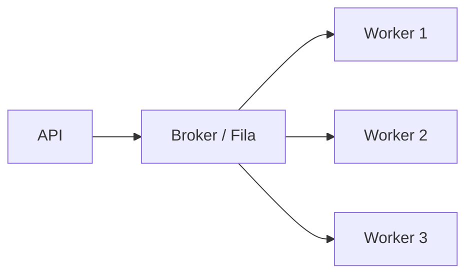
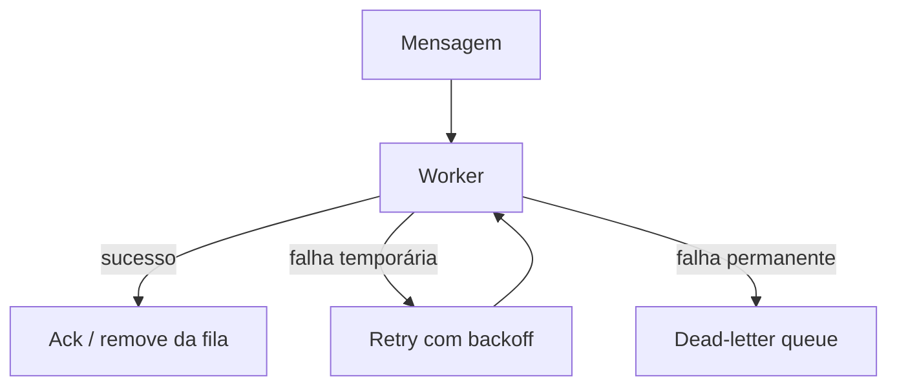
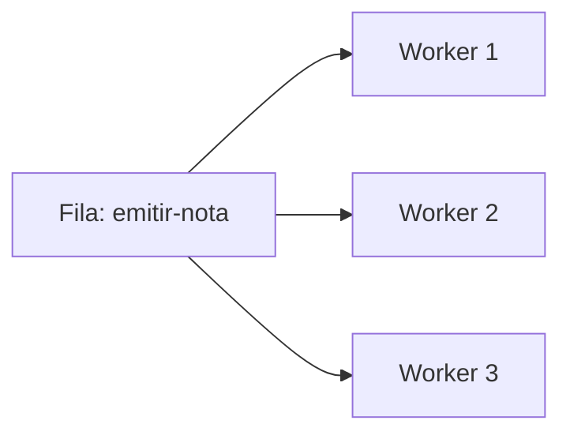
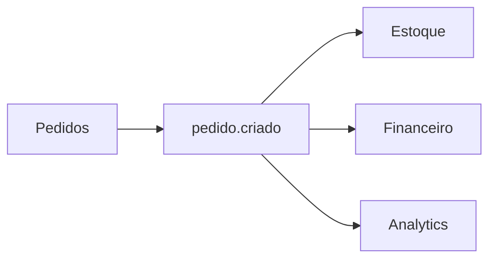

# Filas e Mensageria

> [!abstract] Em uma frase
> Filas desacoplam quem produz trabalho de quem processa trabalho, permitindo absorver picos, processar em segundo plano e lidar melhor com falhas.

Uma fila entra quando a resposta ao usuário não precisa esperar todo o processamento terminar. Em vez de fazer tudo dentro da requisição, a API registra a intenção e publica uma mensagem. Um worker processa depois.



## Fila, tópico e broker

| Conceito | O que é | Exemplo |
|---|---|---|
| **Broker** | Infraestrutura que recebe e entrega mensagens | RabbitMQ, Kafka, SQS, Pub/Sub |
| **Fila** | Mensagens distribuídas para consumidores concorrentes | Processar e-mails pendentes |
| **Tópico** | Mensagem publicada para múltiplos assinantes | `pedido.criado` ouvido por estoque, billing e analytics |
| **Consumer/worker** | Processo que consome e processa mensagens | BackgroundService em .NET |

Fila normalmente distribui trabalho. Tópico normalmente distribui evento.

## Quando usar

- Enviar e-mail, nota fiscal, relatório, PDF ou notificação sem prender a requisição.
- Absorver pico de tráfego sem derrubar o processamento.
- Integrar serviços com menor acoplamento temporal.
- Reprocessar falhas.
- Processar jobs demorados.

> [!warning]
> Fila não torna um sistema automaticamente simples. Ela troca acoplamento síncrono por consistência eventual, retentativas, idempotência e observabilidade.

## Entrega: at-most-once, at-least-once e exactly-once

| Modelo | O que significa | Risco |
|---|---|---|
| At-most-once | Entrega no máximo uma vez | Pode perder mensagem |
| At-least-once | Entrega uma ou mais vezes | Pode duplicar mensagem |
| Exactly-once | Entrega exatamente uma vez | Difícil/caro; geralmente depende do contexto |

Na prática, assuma **at-least-once** e escreva consumers idempotentes. A pergunta certa não é "como garanto que nunca duplica?", e sim "se duplicar, meu sistema continua correto?".

## Retry e DLQ



Retentativa sem limite cria loop infinito. Retentativa sem backoff cria tempestade. DLQ (*dead-letter queue*) é a fila para mensagens que falharam além do limite e precisam de análise ou reprocessamento manual.

## Modelos de consumo

### Competing consumers

Vários workers competem pela mesma fila. Cada mensagem é processada por um deles.



Esse modelo escala bem processamento de trabalho independente: envio de e-mail, geração de PDF, emissão de nota, conciliação, thumbnail de imagem.

### Pub/sub

Uma mensagem é publicada em um tópico e entregue para vários assinantes.



Use quando o evento é um fato de negócio que pode interessar a mais de um consumidor.

## Ordering: quando a ordem importa

Ordem global é cara. Na maioria dos sistemas, o que você precisa é ordem por chave.

Exemplo: eventos do mesmo pedido devem ser processados em ordem, mas eventos de pedidos diferentes podem correr em paralelo.

```text
partition key = pedido_id
```

Em Kafka, isso normalmente significa publicar eventos com a mesma chave na mesma partição. Em filas tradicionais, pode significar separar filas por grupo, usar FIFO queue ou aceitar reordenação e proteger a transição de estado.

## Backpressure

Backpressure é o sistema dizer "não consigo consumir mais rápido agora". Sem isso, filas crescem até virarem incidente.

Sinais:

- idade média da mensagem subindo;
- tamanho da fila crescendo continuamente;
- workers com erro ou lentidão;
- retry aumentando;
- DLQ acumulando.

Mitigações:

- aumentar número de consumers;
- reduzir custo de cada job;
- aplicar rate limit na entrada;
- separar filas por prioridade;
- pausar produtores não críticos;
- degradar funcionalidade temporariamente.

## Exemplo em C#: worker com Channel

Esse exemplo usa `Channel<T>` para mostrar o modelo mental sem depender de RabbitMQ/SQS. Em produção, o broker seria externo.

```csharp
public record EmailMessage(Guid Id, string To, string Subject, string Body);

public interface IEmailQueue
{
    ValueTask EnqueueAsync(EmailMessage message, CancellationToken ct);
    IAsyncEnumerable<EmailMessage> ConsumeAsync(CancellationToken ct);
}

public sealed class InMemoryEmailQueue : IEmailQueue
{
    private readonly Channel<EmailMessage> _channel = Channel.CreateUnbounded<EmailMessage>();

    public ValueTask EnqueueAsync(EmailMessage message, CancellationToken ct) =>
        _channel.Writer.WriteAsync(message, ct);

    public IAsyncEnumerable<EmailMessage> ConsumeAsync(CancellationToken ct) =>
        _channel.Reader.ReadAllAsync(ct);
}

public sealed class EmailWorker : BackgroundService
{
    private readonly IEmailQueue _queue;
    private readonly IEmailSender _sender;
    private readonly ILogger<EmailWorker> _logger;

    public EmailWorker(IEmailQueue queue, IEmailSender sender, ILogger<EmailWorker> logger)
    {
        _queue = queue;
        _sender = sender;
        _logger = logger;
    }

    protected override async Task ExecuteAsync(CancellationToken stoppingToken)
    {
        await foreach (var message in _queue.ConsumeAsync(stoppingToken))
        {
            try
            {
                await _sender.SendAsync(message, stoppingToken);
                _logger.LogInformation("Email enviado {MessageId}", message.Id);
            }
            catch (Exception ex)
            {
                _logger.LogError(ex, "Falha ao enviar email {MessageId}", message.Id);
                // Em broker real: nack/retry/DLQ.
            }
        }
    }
}
```

## Exemplo em C#: idempotência no consumer

```csharp
public sealed class EmailConsumer
{
    private readonly IProcessedMessageStore _processed;
    private readonly IEmailSender _sender;

    public async Task HandleAsync(EmailMessage message, CancellationToken ct)
    {
        if (await _processed.ExistsAsync(message.Id, ct))
        {
            return;
        }

        await _sender.SendAsync(message, ct);
        await _processed.MarkAsProcessedAsync(message.Id, ct);
    }
}
```

Esse exemplo tem uma sutileza: se o e-mail for enviado e a aplicação cair antes de marcar como processado, o e-mail pode ser enviado de novo. Para efeitos colaterais externos, às vezes você precisa de idempotência também no provedor, usando uma chave de idempotência.

## Erros comuns

**Colocar objeto gigante na mensagem.** Mensagem deve carregar o necessário para o consumidor agir ou buscar o resto. Payload enorme dificulta versionamento e aumenta custo.

**Não versionar contrato.** Produtor e consumidor evoluem em ritmos diferentes. Evento público precisa ser tratado como API.

**Retry imediato em massa.** Se uma dependência caiu, tentar de novo imediatamente pode derrubar tudo de vez.

**DLQ sem dono.** Dead-letter queue não é cemitério. Precisa de alerta, triagem e reprocessamento.

**Consumer não idempotente.** Em at-least-once, duplicidade não é exceção; é parte do contrato.

## Checklist

- [ ] A mensagem tem ID único?
- [ ] O consumer é idempotente?
- [ ] Existe retry com limite e backoff?
- [ ] Existe DLQ?
- [ ] O payload é pequeno e versionável?
- [ ] Existe métrica de idade/tamanho da fila?
- [ ] O sistema sabe reprocessar mensagens?
- [ ] A ordem das mensagens importa? Se sim, por qual chave?

## Notas relacionadas

- [[Outbox e Inbox Pattern]]
- [[Sagas e Transações Distribuídas]]
- [[Webhooks]]
- [[Arquitetura Orientada a Eventos]]
