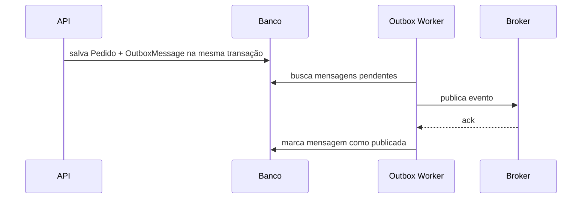
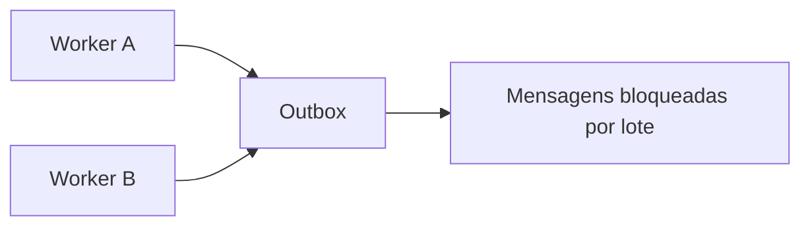

# Outbox e Inbox Pattern

> [!abstract] Em uma frase
> Outbox resolve o problema "gravei no banco mas falhei ao publicar o evento"; Inbox resolve o problema "recebi o mesmo evento mais de uma vez".

O problema clássico:

```text
1. API cria pedido no banco
2. API tenta publicar PedidoCriado na fila
3. API cai antes de publicar
```

O banco diz que o pedido existe, mas nenhum outro serviço ficou sabendo. Outbox evita essa inconsistência gravando a mudança de negócio e a mensagem na mesma transação.



## Tabela de outbox

```sql
CREATE TABLE outbox_messages (
    id UNIQUEIDENTIFIER PRIMARY KEY,
    type NVARCHAR(200) NOT NULL,
    payload NVARCHAR(MAX) NOT NULL,
    occurred_at DATETIMEOFFSET NOT NULL,
    processed_at DATETIMEOFFSET NULL,
    error NVARCHAR(MAX) NULL
);
```

## Exemplo em C#: entidade de outbox

```csharp
public sealed class OutboxMessage
{
    public Guid Id { get; init; } = Guid.NewGuid();
    public string Type { get; init; } = default!;
    public string Payload { get; init; } = default!;
    public DateTimeOffset OccurredAt { get; init; } = DateTimeOffset.UtcNow;
    public DateTimeOffset? ProcessedAt { get; private set; }
    public string? Error { get; private set; }

    public void MarkAsProcessed() => ProcessedAt = DateTimeOffset.UtcNow;
    public void MarkAsFailed(Exception ex) => Error = ex.Message;
}
```

## Salvando negócio + evento na mesma transação

```csharp
public async Task<Guid> CriarPedidoAsync(CriarPedido command, CancellationToken ct)
{
    var pedido = Pedido.Criar(command.ClienteId, command.Itens);

    _db.Pedidos.Add(pedido);

    var evento = new PedidoCriadoIntegrationEvent(
        EventId: Guid.NewGuid(),
        OccurredAt: DateTimeOffset.UtcNow,
        PedidoId: pedido.Id,
        ClienteId: pedido.ClienteId,
        Total: pedido.Total);

    _db.OutboxMessages.Add(new OutboxMessage
    {
        Type = nameof(PedidoCriadoIntegrationEvent),
        Payload = JsonSerializer.Serialize(evento)
    });

    await _db.SaveChangesAsync(ct);
    return pedido.Id;
}
```

## Worker de publicação

```csharp
public sealed class OutboxPublisher : BackgroundService
{
    private readonly IServiceScopeFactory _scopeFactory;
    private readonly IMessageBus _bus;

    protected override async Task ExecuteAsync(CancellationToken stoppingToken)
    {
        while (!stoppingToken.IsCancellationRequested)
        {
            using var scope = _scopeFactory.CreateScope();
            var db = scope.ServiceProvider.GetRequiredService<AppDbContext>();

            var pending = await db.OutboxMessages
                .Where(x => x.ProcessedAt == null)
                .OrderBy(x => x.OccurredAt)
                .Take(50)
                .ToListAsync(stoppingToken);

            foreach (var message in pending)
            {
                await _bus.PublishAsync(message.Type, message.Payload, stoppingToken);
                message.MarkAsProcessed();
            }

            await db.SaveChangesAsync(stoppingToken);
            await Task.Delay(TimeSpan.FromSeconds(2), stoppingToken);
        }
    }
}
```

## Concorrência no worker

Se você roda mais de uma instância do `OutboxPublisher`, precisa impedir que duas instâncias publiquem a mesma mensagem ao mesmo tempo.

Estratégias comuns:

- lock pessimista no banco;
- coluna `locked_until`;
- `SELECT ... FOR UPDATE SKIP LOCKED` em bancos que suportam;
- particionar outbox por agregado/tenant;
- um publisher único por partição.



## Publicado no broker, falhou ao marcar como processado

Esse é o caso que assusta no começo:

```text
1. Worker publica evento no broker
2. Broker confirma
3. Worker cai antes de marcar ProcessedAt
4. Worker publica o mesmo evento de novo depois
```

Por isso Outbox não elimina duplicidade. Ele garante que o evento não será perdido. Quem elimina efeito duplicado é a idempotência do consumidor, geralmente com Inbox.

## Exemplo em C#: Inbox no consumer

```csharp
public sealed class PedidoCriadoConsumer
{
    private readonly AppDbContext _db;

    public async Task HandleAsync(
        IntegrationEventEnvelope<PedidoCriadoIntegrationEvent> envelope,
        CancellationToken ct)
    {
        var alreadyProcessed = await _db.InboxMessages
            .AnyAsync(x => x.Id == envelope.EventId, ct);

        if (alreadyProcessed)
        {
            return;
        }

        _db.InboxMessages.Add(new InboxMessage
        {
            Id = envelope.EventId,
            Type = envelope.EventType,
            ReceivedAt = DateTimeOffset.UtcNow
        });

        // Aplica efeito de negócio aqui.

        await _db.SaveChangesAsync(ct);
    }
}
```

## Limpeza da outbox/inbox

Outbox e Inbox crescem para sempre se ninguém cuidar. Defina retenção:

- mensagens processadas há mais de 30/60/90 dias podem ir para arquivo;
- mensagens com erro ficam mais tempo para análise;
- índices precisam considerar busca por `ProcessedAt`, `OccurredAt` e `Id`.

## Erros comuns

**Publicar evento direto no request e achar que está resolvido.** Se a transação do banco e o publish não são atômicos, existe janela de inconsistência.

**Consumer sem Inbox.** Outbox evita perda; Inbox evita efeito duplicado.

**Outbox sem observabilidade.** Métrica essencial: mensagens pendentes, idade da mensagem mais antiga e quantidade com erro.

**Payload não versionado.** Outbox pode republicar eventos antigos. O consumidor precisa entender versões antigas.

## Inbox Pattern

Inbox registra eventos recebidos antes de processar. Se o mesmo `event_id` chegar de novo, o consumidor responde como sucesso e não repete efeito colateral.

```sql
CREATE TABLE inbox_messages (
    id UNIQUEIDENTIFIER PRIMARY KEY,
    type NVARCHAR(200) NOT NULL,
    received_at DATETIMEOFFSET NOT NULL,
    processed_at DATETIMEOFFSET NULL
);
```

## Checklist

- [ ] Evento e alteração de negócio são gravados na mesma transação?
- [ ] Existe worker de outbox com retry?
- [ ] Mensagens publicadas são marcadas como processadas?
- [ ] O consumer registra `event_id` em inbox?
- [ ] O processamento é idempotente?
- [ ] Existe limpeza/arquivamento de outbox e inbox antigas?

## Notas relacionadas

- [[Filas e Mensageria]]
- [[Arquitetura Orientada a Eventos]]
- [[Sagas e Transações Distribuídas]]
