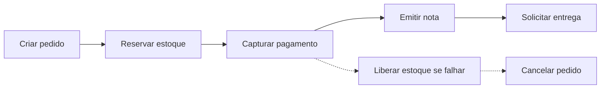
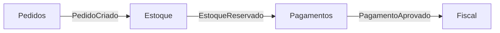
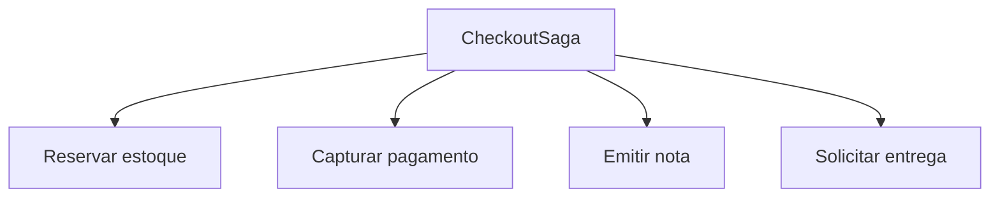
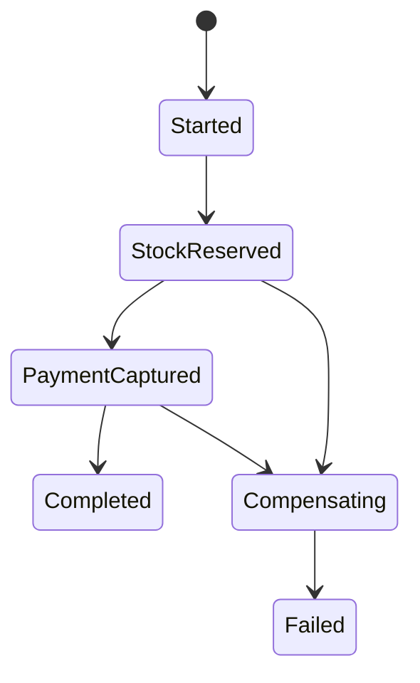

# Sagas e Transações Distribuídas

> [!abstract] Em uma frase
> Saga coordena um processo de negócio que passa por vários serviços sem depender de uma transação distribuída gigante.

Imagine um checkout:

1. Criar pedido.
2. Reservar estoque.
3. Capturar pagamento.
4. Emitir nota.
5. Solicitar entrega.

Fazer tudo em uma transação ACID entre serviços diferentes costuma ser inviável. A saga divide o processo em passos locais e define compensações quando algo falha.



## Coreografia vs orquestração

### Coreografia

Cada serviço reage a eventos e publica novos eventos.



É simples no começo, mas o fluxo fica espalhado. Para entender o checkout completo, você precisa olhar vários serviços.

### Orquestração

Um orquestrador conhece o fluxo e manda comandos para cada serviço.



É mais explícito e fácil de observar, mas cria um componente central com responsabilidade importante.

## Compensação não é rollback

Compensar não é voltar no tempo. Se o pagamento foi capturado, a compensação pode ser estornar. Se estoque foi reservado, pode liberar. Se uma nota foi emitida, talvez a compensação seja emitir nota de cancelamento, não apagar a nota original.

## Estado da saga

Saga sem estado persistido é frágil. Se o processo cair no meio, ele precisa saber onde parou.



O estado mínimo costuma guardar:

- `correlation_id`;
- identificadores dos recursos envolvidos;
- status atual;
- data da última transição;
- tentativas;
- erro atual;
- próximos passos pendentes.

## Exemplo em C#: estado de saga

```csharp
public enum CheckoutSagaStatus
{
    Started,
    StockReserved,
    PaymentCaptured,
    Completed,
    Compensating,
    Failed
}

public sealed class CheckoutSagaState
{
    public Guid CorrelationId { get; init; }
    public Guid PedidoId { get; init; }
    public CheckoutSagaStatus Status { get; private set; } = CheckoutSagaStatus.Started;

    public void MarkStockReserved() => Status = CheckoutSagaStatus.StockReserved;
    public void MarkPaymentCaptured() => Status = CheckoutSagaStatus.PaymentCaptured;
    public void Complete() => Status = CheckoutSagaStatus.Completed;
    public void StartCompensation() => Status = CheckoutSagaStatus.Compensating;
    public void Fail() => Status = CheckoutSagaStatus.Failed;
}
```

## Exemplo em C#: orquestrador simplificado

```csharp
public sealed class CheckoutSaga
{
    private readonly IEstoqueClient _estoque;
    private readonly IPagamentoClient _pagamento;
    private readonly ILogger<CheckoutSaga> _logger;

    public async Task ExecutarAsync(Guid pedidoId, CancellationToken ct)
    {
        try
        {
            await _estoque.ReservarAsync(pedidoId, ct);
            await _pagamento.CapturarAsync(pedidoId, ct);
        }
        catch (Exception ex)
        {
            _logger.LogError(ex, "Falha no checkout {PedidoId}. Iniciando compensação.", pedidoId);
            await _estoque.LiberarReservaAsync(pedidoId, ct);
            throw;
        }
    }
}
```

Esse exemplo é propositalmente pequeno. Em produção, o estado da saga precisa ser persistido, comandos/eventos precisam ser idempotentes e cada passo precisa ter observabilidade.

## Exemplo em C#: handler orientado a eventos

```csharp
public sealed class CheckoutSagaHandler
{
    private readonly ISagaStateStore _store;
    private readonly IMessageBus _bus;

    public async Task HandleAsync(EstoqueReservado evento, CancellationToken ct)
    {
        var state = await _store.GetAsync(evento.CorrelationId, ct);

        if (state.Status != CheckoutSagaStatus.Started)
        {
            return; // idempotência / evento fora de ordem
        }

        state.MarkStockReserved();
        await _store.SaveAsync(state, ct);

        await _bus.SendAsync(new CapturarPagamento(
            CorrelationId: state.CorrelationId,
            PedidoId: state.PedidoId), ct);
    }
}
```

Esse estilo combina com coreografia/orquestração por mensagens. O handler sempre valida o estado atual antes de avançar.

## Timeout e processos esquecidos

Nem todo passo falha de forma explícita. Às vezes o evento esperado nunca chega.

Exemplo: pagamento ficou `pendente` e nenhum evento final foi entregue. Uma saga madura precisa de timeout:

```text
se CheckoutSaga está em StockReserved há mais de 15 minutos
então consultar pagamento ou iniciar compensação
```

## Erros comuns

**Compensação impossível.** Se não existe ação de compensação, talvez o fluxo precise ser síncrono, manual ou ter uma etapa de confirmação antes.

**Saga sem observabilidade.** Precisa ser possível abrir uma saga e ver em que passo está.

**Misturar regra de domínio demais no orquestrador.** O orquestrador coordena. As regras de cada operação devem continuar no serviço dono.

**Acreditar em rollback distribuído.** Em sistemas distribuídos, o caminho normal é avançar com compensações, não apagar o passado.

## Quando usar

- Processo cruza múltiplos serviços.
- Cada serviço tem seu próprio banco.
- Existe fluxo de negócio longo.
- Não dá para depender de transação distribuída.
- Compensações fazem sentido no domínio.

## Checklist

- [ ] O fluxo precisa mesmo cruzar vários serviços?
- [ ] Cada passo tem uma compensação possível?
- [ ] O estado da saga é persistido?
- [ ] Eventos/comandos têm `correlation_id`?
- [ ] Passos são idempotentes?
- [ ] Existe timeout para passos que nunca respondem?
- [ ] A saga é observável de ponta a ponta?

## Notas relacionadas

- [[Outbox e Inbox Pattern]]
- [[Filas e Mensageria]]
- [[Microsserviços]]
