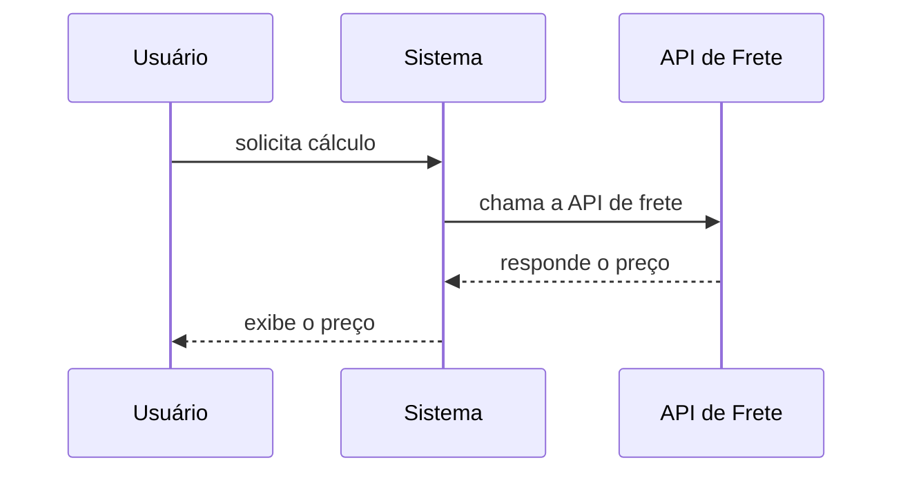
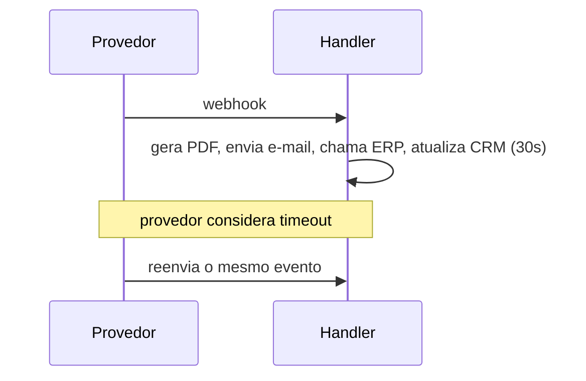
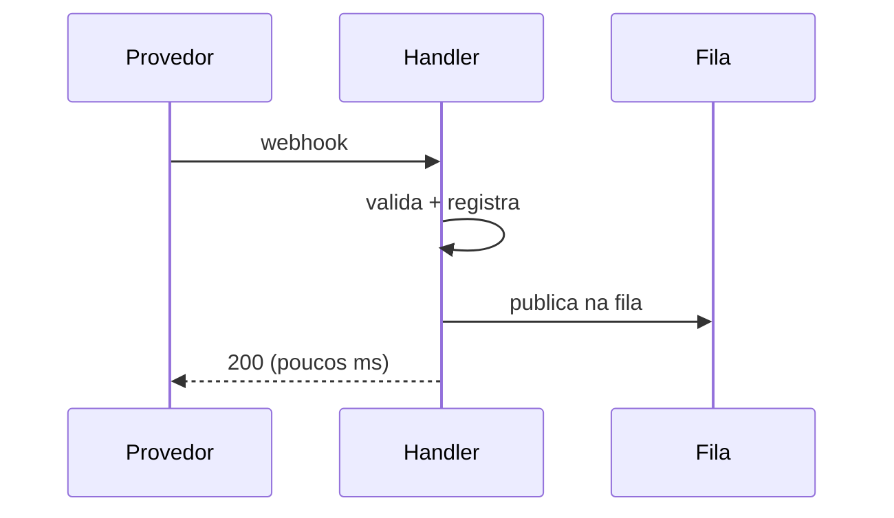

# Webhooks — Boas Práticas, Erros Comuns e Checklist

Quinta e última parte de [[Webhooks|Webhooks e Webhook Handlers]]. Continuação de [[Webhooks - Webhook vs Polling vs Fila]].

---

## Quando não usar webhook

Evite depender apenas de webhooks quando:

- o provedor não oferece retentativas confiáveis;
- você precisa de consistência imediata e síncrona;
- a ação precisa retornar um resultado diretamente ao usuário;
- o sistema receptor não pode expor um endpoint;
- o volume é alto demais para o desenho atual;
- não existe identificador único de evento;
- o provedor não possui forma segura de autenticação.

### Exemplo de comunicação síncrona

Quando um usuário clica em "calcular frete", ele precisa da resposta imediatamente.



Esse caso é melhor resolvido por uma chamada de API síncrona, não por webhook.

---

## Modelo mental para decidir

Perguntas de decisão:

1. O evento ocorre em outro sistema?
2. O momento do evento é imprevisível?
3. Meu sistema precisa reagir automaticamente?
4. O provedor oferece webhook?
5. Existe assinatura ou mecanismo de autenticação?
6. Existe um ID único para deduplicação?
7. Posso responder rapidamente e processar em fila?
8. Preciso de polling periódico para reconciliação?

Se a maioria das respostas for "sim", webhook provavelmente é uma boa escolha.

---

## Checklist de produção

### Segurança

- [ ] Usar HTTPS
- [ ] Validar assinatura
- [ ] Validar timestamp, quando disponível
- [ ] Evitar segredos no código-fonte
- [ ] Rotacionar segredos
- [ ] Limitar tamanho do payload
- [ ] Não confiar em campos sem validação
- [ ] Proteger logs contra dados sensíveis

### Confiabilidade

- [ ] Salvar o ID do evento
- [ ] Implementar idempotência
- [ ] Aceitar eventos duplicados
- [ ] Tratar eventos fora de ordem
- [ ] Usar fila para processamento pesado
- [ ] Criar retentativas internas
- [ ] Criar dead-letter queue, quando necessário
- [ ] Fazer reconciliação periódica

### Observabilidade

- [ ] Registrar recebimento
- [ ] Registrar sucesso e falha
- [ ] Medir tempo de resposta
- [ ] Medir quantidade de erros
- [ ] Criar alertas
- [ ] Ter uma forma de reprocessar eventos
- [ ] Manter correlação entre evento e ação gerada

### Contrato

- [ ] Documentar tipos de evento
- [ ] Validar schema
- [ ] Versionar mudanças incompatíveis
- [ ] Ignorar campos extras quando possível
- [ ] Tratar tipos desconhecidos
- [ ] Testar payloads reais do provedor

---

## Erros comuns

### Processar tudo antes de responder

Problema, tudo processado de forma síncrona dentro do handler:



Melhor, processamento pesado sai do caminho síncrono:



### Confiar apenas no status HTTP

Receber `200` significa que o endpoint aceitou a requisição. Não significa necessariamente que todo o processo de negócio terminou.

Separe:

- status de recebimento;
- status de processamento;
- status da ação de negócio.

### Não validar assinatura

Uma URL pública pode receber requisições falsas.

Sem validação, alguém poderia tentar enviar:

```json
{
  "type": "payment.approved",
  "data": {
    "order_id": "order_456"
  }
}
```

O handler deve confirmar que o payload foi realmente emitido pelo provedor.

### Assumir ordem perfeita

Você pode receber:

```text
order.delivered
```

antes de:

```text
order.shipped
```

Isso pode acontecer por atrasos, filas e retentativas.

O sistema deve usar timestamps, versões ou regras de transição para evitar regressões de estado.

---

## Estrutura sugerida de código

```text
src/
├── routes/
│   └── webhooks.js
├── handlers/
│   ├── payment-approved.js
│   ├── payment-refunded.js
│   └── order-cancelled.js
├── services/
│   ├── signature-validator.js
│   ├── event-store.js
│   └── queue.js
└── workers/
    └── webhook-worker.js
```

Separar o endpoint dos handlers específicos evita uma função gigantesca.

---

## Pseudocódigo recomendado

```text
receber requisição
validar método e content-type
ler corpo bruto
validar assinatura
validar schema
extrair event_id
verificar duplicidade
registrar recebimento
publicar evento em uma fila
responder 200

worker recebe evento
verifica estado atual
executa regra de negócio
registra sucesso ou erro
agenda retentativa, se necessário
```

---

## Como testar

### Testes locais

Durante o desenvolvimento, você pode usar um túnel HTTPS para expor seu servidor local.

Fluxo:

```text
Provedor
→ URL pública temporária
→ localhost
```

Também é útil salvar payloads de exemplo e reproduzi-los em testes automatizados.

### Casos de teste importantes

- [ ] assinatura válida;
- [ ] assinatura inválida;
- [ ] evento duplicado;
- [ ] evento desconhecido;
- [ ] JSON inválido;
- [ ] payload incompleto;
- [ ] processamento com sucesso;
- [ ] falha temporária;
- [ ] falha permanente;
- [ ] evento fora de ordem;
- [ ] timeout do serviço interno.

---

## Fechamento

Volte para [[Webhooks|o índice do tema]] para o resumo geral e o exemplo mental final.
