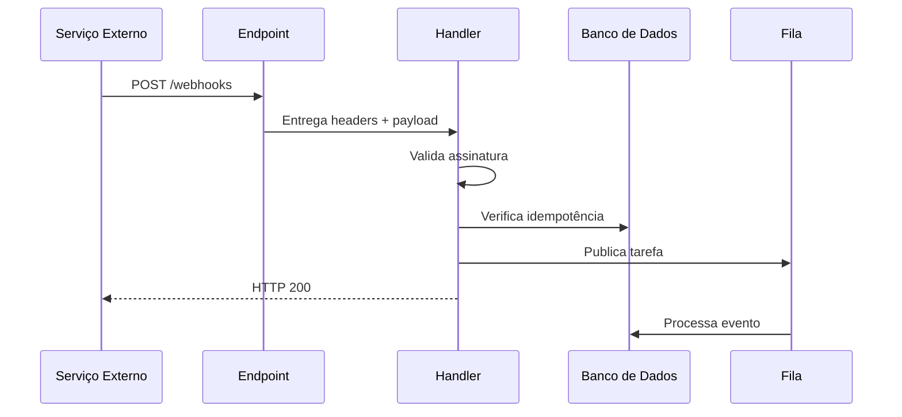

# Webhooks — Conceitos e Fluxo

Primeira parte de [[Webhooks|Webhooks e Webhook Handlers]].

---

## O que é um webhook?

Um **webhook** é uma forma de comunicação orientada a eventos entre sistemas.

Em vez de o seu sistema perguntar repetidamente:

> "O pagamento já foi aprovado?"

a plataforma de pagamentos avisa:

> "O pagamento foi aprovado agora."

Normalmente, esse aviso acontece por meio de uma requisição HTTP `POST` enviada para uma URL que você configurou.

### Exemplo

A plataforma de pagamentos envia:

```http
POST https://meusistema.com/webhooks/pagamentos
Content-Type: application/json
```

```json
{
  "id": "evt_123",
  "type": "payment.approved",
  "created_at": "2026-07-15T15:30:00Z",
  "data": {
    "payment_id": "pay_987",
    "order_id": "order_456",
    "amount": 99.90
  }
}
```

Nesse caso:

- o evento é `payment.approved`;
- o webhook é a requisição enviada;
- a URL `/webhooks/pagamentos` é o endpoint receptor;
- o webhook handler é o código executado quando a requisição chega.

---

## Webhook x webhook handler

| Conceito | O que é | Responsabilidade |
|---|---|---|
| **Webhook** | A notificação ou requisição enviada por um sistema | Informar que um evento aconteceu |
| **Webhook endpoint** | A URL pública que recebe a requisição | Expor um ponto de entrada |
| **Webhook handler** | A função ou código que trata a requisição | Validar, registrar, responder e processar o evento |

### Analogia

> [!example]
> O webhook é a encomenda chegando.
> O endpoint é o endereço da casa.
> O webhook handler é a pessoa que recebe, confere o remetente e decide o que fazer com a encomenda.

---

## Fluxo completo



### Etapas

1. Um evento acontece no sistema externo.
2. O sistema externo cria um payload.
3. Ele envia uma requisição para a URL cadastrada.
4. Seu webhook handler valida a autenticidade.
5. O handler verifica se o evento já foi processado.
6. O handler responde rapidamente com `2xx`.
7. O processamento pesado pode continuar em segundo plano.

---

## Quando usar webhooks?

Webhooks são indicados quando:

- outro sistema precisa avisar o seu sistema sobre eventos;
- o evento acontece em um momento imprevisível;
- você quer evitar consultas repetidas;
- uma pequena demora entre o evento e o processamento é aceitável;
- o serviço externo oferece entrega, retentativas e assinatura de segurança.

> [!tip] Regra prática
> Use webhook quando a frase fizer sentido:
>
> **"Quando X acontecer no sistema A, o sistema B deve reagir."**

---

## Próxima nota

Veja exemplos reais em [[Webhooks - Casos de Uso Reais]].
