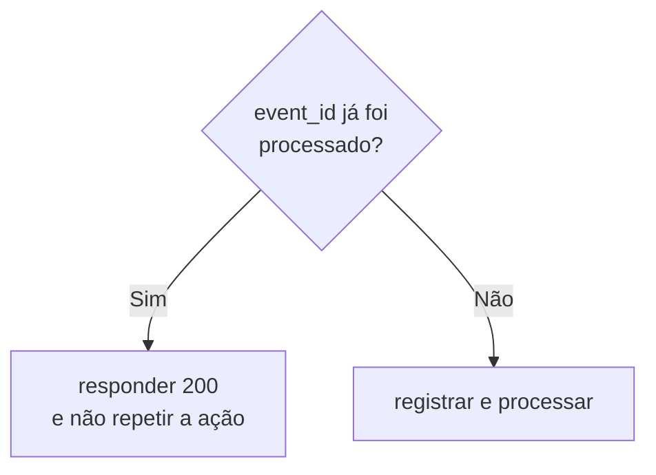

# Webhooks — Implementando um Handler

Terceira parte de [[Webhooks|Webhooks e Webhook Handlers]]. Continuação de [[Webhooks - Casos de Uso Reais]].

---

## Exemplo simples com Node.js e Express

```js
import express from "express";

const app = express();

app.use(express.json());

app.post("/webhooks/pagamentos", async (req, res) => {
  const event = req.body;

  console.log("Evento recebido:", event.type);

  if (event.type === "payment.approved") {
    await markOrderAsPaid(event.data.order_id);
  }

  return res.sendStatus(200);
});
```

Esse exemplo demonstra o fluxo básico, mas ainda não está pronto para produção.

---

## Exemplo mais seguro

```js
import express from "express";

const app = express();

app.post(
  "/webhooks/pagamentos",
  express.raw({ type: "application/json" }),
  async (req, res) => {
    const signature = req.header("x-webhook-signature");
    const rawBody = req.body;

    if (!isValidSignature(rawBody, signature)) {
      return res.status(401).send("Invalid signature");
    }

    const event = JSON.parse(rawBody.toString("utf8"));

    const alreadyProcessed = await eventExists(event.id);

    if (alreadyProcessed) {
      return res.sendStatus(200);
    }

    await saveEvent({
      id: event.id,
      type: event.type,
      payload: event
    });

    await enqueueWebhookEvent(event);

    return res.sendStatus(200);
  }
);
```

### O que esse handler faz?

1. lê o corpo original da requisição;
2. valida a assinatura;
3. converte o payload;
4. verifica duplicidade;
5. registra o evento;
6. envia o trabalho para uma fila;
7. responde rapidamente.

### O mesmo handler em C# / ASP.NET Core

```csharp
[ApiController]
[Route("webhooks")]
public class WebhooksController : ControllerBase
{
    private readonly IWebhookSignatureValidator _signatureValidator;
    private readonly IEventStore _eventStore;
    private readonly IWebhookQueue _queue;

    public WebhooksController(
        IWebhookSignatureValidator signatureValidator,
        IEventStore eventStore,
        IWebhookQueue queue)
    {
        _signatureValidator = signatureValidator;
        _eventStore = eventStore;
        _queue = queue;
    }

    [HttpPost("pagamentos")]
    public async Task<IActionResult> ReceberPagamento(CancellationToken cancellationToken)
    {
        // 1. lê o corpo bruto (necessário pra validar a assinatura corretamente)
        Request.EnableBuffering();
        using var reader = new StreamReader(Request.Body, leaveOpen: true);
        var rawBody = await reader.ReadToEndAsync(cancellationToken);

        // 2. valida a assinatura
        var signature = Request.Headers["X-Webhook-Signature"].ToString();
        if (!_signatureValidator.EhValida(rawBody, signature))
        {
            return Unauthorized("Invalid signature");
        }

        // 3. converte o payload
        var evento = JsonSerializer.Deserialize<WebhookEvent>(rawBody)
            ?? throw new InvalidOperationException("Payload inválido");

        // 4. verifica duplicidade (idempotência)
        if (await _eventStore.JaProcessadoAsync(evento.Id, cancellationToken))
        {
            return Ok(); // já processamos esse event_id, responde 200 sem repetir a ação
        }

        // 5. registra o evento
        await _eventStore.SalvarAsync(evento, cancellationToken);

        // 6. envia o trabalho para uma fila (processamento pesado acontece depois, em background)
        await _queue.EnfileirarAsync(evento, cancellationToken);

        // 7. responde rapidamente
        return Ok();
    }
}

public record WebhookEvent(string Id, string Type, JsonElement Data, DateTimeOffset CreatedAt);
```

A validação de assinatura HMAC, o mesmo `isValidSignature` do exemplo em JS, fica assim em C#:

```csharp
public class HmacSignatureValidator : IWebhookSignatureValidator
{
    private readonly string _segredoCompartilhado;

    public HmacSignatureValidator(IConfiguration configuration) =>
        _segredoCompartilhado = configuration["Webhooks:Segredo"]!;

    public bool EhValida(string rawBody, string assinaturaRecebida)
    {
        var chave = Encoding.UTF8.GetBytes(_segredoCompartilhado);
        using var hmac = new HMACSHA256(chave);

        var hash = hmac.ComputeHash(Encoding.UTF8.GetBytes(rawBody));
        var assinaturaCalculada = Convert.ToHexString(hash).ToLowerInvariant();

        // comparação em tempo constante, evita timing attack
        return CryptographicOperations.FixedTimeEquals(
            Encoding.UTF8.GetBytes(assinaturaCalculada),
            Encoding.UTF8.GetBytes(assinaturaRecebida));
    }
}
```

O processamento pesado, que no exemplo conceitual vira `await enqueueWebhookEvent(event)`, roda separado num `BackgroundService` consumindo a fila (RabbitMQ, Azure Service Bus, SQS, o que estiver disponível):

```csharp
public class WebhookProcessorWorker : BackgroundService
{
    private readonly IWebhookQueue _queue;
    private readonly IServiceScopeFactory _scopeFactory;

    public WebhookProcessorWorker(IWebhookQueue queue, IServiceScopeFactory scopeFactory)
    {
        _queue = queue;
        _scopeFactory = scopeFactory;
    }

    protected override async Task ExecuteAsync(CancellationToken stoppingToken)
    {
        await foreach (var evento in _queue.ConsumirAsync(stoppingToken))
        {
            using var scope = _scopeFactory.CreateScope();
            var handler = scope.ServiceProvider.GetRequiredService<IPagamentoEventHandler>();

            await handler.ProcessarAsync(evento, stoppingToken); // marca pedido como pago, emite nota, etc.
        }
    }
}
```

---

## Responsabilidades de um bom webhook handler

### Validar autenticidade

Não confie em uma requisição apenas porque ela chegou na URL correta.

Formas comuns de validação:

- assinatura HMAC;
- segredo compartilhado;
- certificado;
- token;
- allowlist de IP, como proteção complementar.

> [!important]
> Em muitos provedores, a assinatura é calculada usando o corpo bruto da requisição.
> Alterar ou reconverter o JSON antes da validação pode invalidar a assinatura.

### Garantir idempotência

Um provedor pode enviar o mesmo evento mais de uma vez.

Isso pode acontecer porque:

- sua resposta demorou;
- houve uma falha de rede;
- o provedor fez uma retentativa;
- o processamento foi concluído, mas o `200` não chegou.

#### Problema

Sem idempotência:

```text
payment.approved recebido duas vezes
→ pedido liberado duas vezes
→ e-mail enviado duas vezes
→ saldo creditado duas vezes
```

#### Solução

Armazene um identificador único do evento:

```text
event_id = evt_123
```

Antes de processar:



#### Exemplo conceitual

```js
if (await eventExists(event.id)) {
  return res.sendStatus(200);
}

await processEvent(event);
await markEventAsProcessed(event.id);
```

### Responder rapidamente

O provedor normalmente espera uma resposta em poucos segundos.

Evite fazer diretamente no handler:

- envio de e-mail demorado;
- geração de PDF;
- chamada para várias APIs;
- processamento de vídeo;
- cálculos pesados;
- operações que podem travar.

Prefira:

```text
Receber
→ validar
→ registrar
→ colocar em fila
→ responder 200
→ processar depois
```

### Tratar retentativas

Provedores geralmente repetem a entrega quando recebem:

- timeout;
- erro de conexão;
- status `5xx`;
- alguns códigos `4xx`, dependendo do serviço.

Por isso, o handler deve ser preparado para:

- eventos duplicados;
- eventos fora de ordem;
- atrasos;
- indisponibilidade temporária;
- payloads desconhecidos.

### Registrar eventos

Registre pelo menos:

- ID do evento;
- tipo;
- data de recebimento;
- provedor;
- resultado da validação;
- status do processamento;
- quantidade de tentativas;
- erro, quando houver.

Evite registrar dados sensíveis sem necessidade.

### Aceitar eventos desconhecidos com cuidado

Um provedor pode adicionar novos tipos de evento.

Exemplo:

```js
switch (event.type) {
  case "payment.approved":
    await handlePaymentApproved(event);
    break;

  case "payment.refunded":
    await handlePaymentRefunded(event);
    break;

  default:
    console.log(`Evento não tratado: ${event.type}`);
}
```

Em muitos casos, um evento válido porém não utilizado pode receber `200`, evitando retentativas inúteis.

---

## Próxima nota

Veja como o webhook se compara a outras estratégias em [[Webhooks - Webhook vs Polling vs Fila]].
