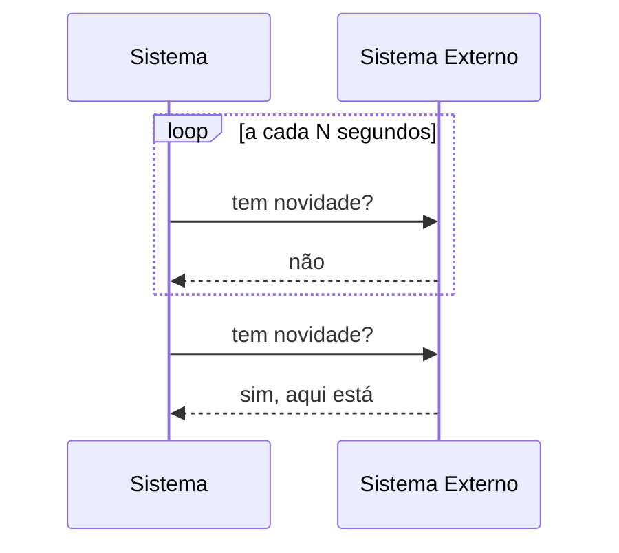
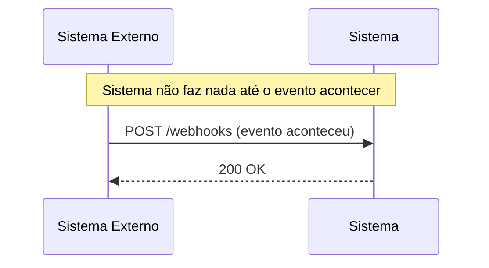
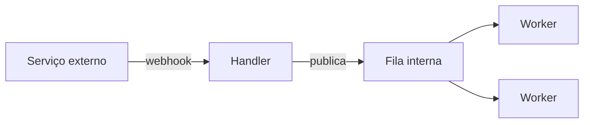

# Webhooks — Webhook vs Polling vs Fila

Quarta parte de [[Webhooks|Webhooks e Webhook Handlers]]. Continuação de [[Webhooks - Implementando um Handler]].

---

## Webhook x polling

### Polling

Seu sistema pergunta periodicamente "tem novidade?".

### Webhook

O outro sistema avisa quando acontece, sem seu sistema precisar perguntar.

| Critério | Webhook | Polling |
|---|---|---|
| Iniciativa | Sistema externo | Seu sistema |
| Latência | Normalmente baixa | Depende do intervalo |
| Uso de recursos | Mais eficiente | Pode gerar consultas inúteis |
| Complexidade | Exige endpoint público e segurança | Pode ser mais simples |
| Falhas | Exige retentativas e idempotência | Exige controle de estado e paginação |
| Melhor uso | Eventos imprevisíveis | Reconciliação e sistemas sem webhook |

> [!note]
> Webhooks e polling podem ser usados juntos.
> O webhook entrega rapidez; o polling periódico faz reconciliação e corrige eventos perdidos.

---

## Webhook x fila de mensagens

Um webhook normalmente usa HTTP entre sistemas.

Uma fila usa infraestrutura de mensageria, como:

- RabbitMQ;
- Kafka;
- SQS;
- Pub/Sub;
- Redis Streams.

| Critério | Webhook | Fila |
|---|---|---|
| Comunicação | HTTP | Protocolo de mensageria |
| Exposição pública | Frequentemente necessária | Nem sempre |
| Acoplamento | Integração entre serviços | Comunicação interna ou distribuída |
| Entrega | Depende do provedor | Controlada pelo broker |
| Escalabilidade | Boa, com arquitetura adequada | Geralmente melhor para alto volume |

### Padrão comum

O webhook recebe o evento. A fila distribui o processamento.

---

## Próxima nota

Veja quando evitar webhooks, checklist de produção e erros comuns em [[Webhooks - Boas Práticas, Erros Comuns e Checklist]].
