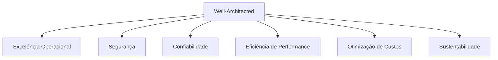

# AWS Well-Architected Framework

> [!abstract] Em uma frase
> Seis lentes para revisar uma decisão de arquitetura na AWS — não é uma checklist de produto, é um jeito de perguntar "o que estou trocando por quê" antes de decidir.

O framework não é exclusivo de quem usa só AWS — os 6 pilares são perguntas de arquitetura genéricas, só que o material oficial usa serviços AWS como exemplo. Como Cognito e S3 já fazem parte da stack real deste vault, os exemplos abaixo usam eles diretamente.

## Os 6 pilares

### Excelência Operacional

Rodar o sistema é tão parte da arquitetura quanto o código. Pergunta guia: se este sistema falhar às 3h da manhã, alguém consegue diagnosticar e agir sem ter escrito o código?

Conecta direto com [[Fundamentos - Observabilidade e Estudo de Caso]] (logs/métricas/traces) e com [[Exemplo prático - CI Mínimo com GitHub Actions]] (mudança passa por pipeline automatizado, não por deploy manual).

### Segurança

Autenticação, autorização, proteção de dados em trânsito e em repouso, resposta a incidente. Exemplo concreto já implementado neste vault: o [[Mini-projeto - Autenticação e Autorização com JWT]] modela exatamente o padrão Cognito (token JWT validado por issuer/audience, autorização por grupo) que este pilar pede — a diferença entre a versão do laboratório e produção é só apontar `Authority` para o User Pool real em vez de uma chave simétrica local.

Ver também [[Segurança para Engenharia de Software]] para o nível de engenharia (OWASP, threat modeling) por trás deste pilar.

### Confiabilidade

O sistema se recupera de falha de infraestrutura, erro humano e pico de demanda sem virar indisponibilidade total. Isso é [[Fundamentos - Resiliência e Controle de Tráfego]] (retry, circuit breaker, timeout) e [[Deploy sem Downtime]] (rollback claro, versões compatíveis) na prática.

Um ponto específico do pilar que vale destacar: **multi-AZ não é multi-região**. Rodar em múltiplas Availability Zones dentro de uma região AWS protege contra falha de datacenter; só multi-região protege contra falha da região inteira (rara, mas acontece). A maioria dos sistemas não precisa de multi-região — o custo/complexidade só se justifica quando o impacto de uma região inteira cair é inaceitável para o negócio.

### Eficiência de Performance

Usar o tipo certo de recurso para o padrão de acesso certo — não é "usar o serviço mais rápido", é escolher onde vale investir. Conecta com [[Fundamentos - Cache, CDN e Banco de Dados]] e com a decisão registrada no [[Mini-projeto - Catálogo com Cache e Busca]] (cache-aside com invalidação ativa em vez de cache mais sofisticado, porque o padrão de acesso não justificava a complexidade extra).

### Otimização de Custos

Toda decisão de arquitetura tem um custo de operação, não só um custo de implementação. Exemplo direto do vault: a retrospectiva do [[Mini-projeto - Histórico de Pedidos com MongoDB]] já registra esse trade-off — documento vs relacional não é só uma decisão técnica, é uma decisão que muda o custo de armazenamento e de operação ao longo do tempo.

Prática concreta: S3 tem classes de armazenamento (`Standard`, `Infrequent Access`, `Glacier`) com custo decrescente e latência de acesso crescente — um recibo de pagamento gerado no desafio extra do [[Mini-projeto - Webhook Handler de Pagamentos]] não precisa ficar em `Standard` para sempre; uma política de lifecycle movendo para `Glacier` depois de alguns meses é uma decisão de custo, não de arquitetura de aplicação.

### Sustentabilidade

O pilar mais recente do framework: minimizar o impacto ambiental das cargas de trabalho — usar só os recursos necessários (não superprovisionar "por segurança"), preferir regiões com matriz energética mais limpa quando a decisão de região for flexível, desligar ambientes não-produtivos fora do horário de uso. Na prática do dia a dia de um time de plataforma, isso costuma convergir com o pilar de custo: menos recurso ocioso é, ao mesmo tempo, mais barato e mais sustentável.

## Como usar isto na prática, não como checklist de certificação

O framework não pede "sim" para os 6 pilares em todo sistema — pede uma decisão **consciente** sobre qual pilar está sendo priorizado e o que está sendo sacrificado. Um serviço interno de baixo risco pode aceitar menos Confiabilidade (sem multi-AZ) para ganhar Otimização de Custos; um sistema de pagamento não pode fazer essa mesma troca. Isso é literalmente o que [[Trade-off Arquitetural]] e [[ADR - Architecture Decision Records]] já pedem — o Well-Architected só nomeia as 6 dimensões em que o trade-off normalmente acontece.

## Checklist

- [ ] Para a decisão em questão, qual pilar está sendo priorizado e qual está sendo conscientemente sacrificado?
- [ ] A escolha de multi-AZ/multi-região é proporcional ao impacto real de uma indisponibilidade?
- [ ] Existe política de custo (lifecycle de storage, direito de desligar ambiente não-produtivo) ou tudo fica provisionado para sempre "por via das dúvidas"?
- [ ] A decisão foi registrada como ADR, com o trade-off explícito?

## Notas relacionadas

- [[Infraestrutura como Código]]
- [[Trade-off Arquitetural]]
- [[Segurança para Engenharia de Software]]
