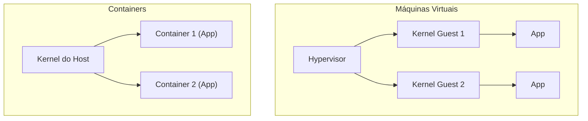

# Containers e Docker

> [!abstract] Em uma frase
> Um container empacota a aplicação com tudo que ela precisa para rodar (runtime, bibliotecas, configuração), isolado do resto do sistema operacional host, mas compartilhando o mesmo kernel — o que o torna muito mais leve que uma máquina virtual.

## Container não é máquina virtual

Uma VM virtualiza hardware e roda um kernel próprio por VM. Um container usa **namespaces** (isolamento de processos, rede, filesystem) e **cgroups** (limite de CPU/memória) do próprio kernel do host — não existe um segundo kernel rodando. É por isso que um container sobe em milissegundos e uma VM em segundos/minutos, e por isso que a imagem de um container é ordens de grandeza menor que uma imagem de VM.



## Imagem vs container

Imagem é o artefato imutável (camadas empilhadas, cada instrução do Dockerfile vira uma camada). Container é uma instância em execução dessa imagem, com um filesystem gravável por cima das camadas read-only da imagem. A mesma imagem pode virar N containers rodando ao mesmo tempo, cada um com seu próprio estado de execução.

## Dockerfile multi-stage para uma API .NET

O erro mais comum em Dockerfile de .NET é publicar a imagem com o SDK inteiro (compilador, ferramentas de build) — pesado e desnecessário em produção, onde só o runtime precisa existir. Multi-stage resolve isso: um estágio compila, outro só copia o resultado publicado.

```dockerfile
# Estágio 1: build. Usa o SDK completo (pesado: ~800MB) só para compilar.
FROM mcr.microsoft.com/dotnet/sdk:8.0 AS build
WORKDIR /src

COPY src/MinhaApi/MinhaApi.csproj src/MinhaApi/
RUN dotnet restore src/MinhaApi/MinhaApi.csproj

COPY src/MinhaApi/ src/MinhaApi/
RUN dotnet publish src/MinhaApi/MinhaApi.csproj -c Release -o /app

# Estágio 2: runtime. Usa só o runtime ASP.NET (bem mais leve que o SDK) —
# a imagem final não carrega compilador, cache do NuGet nem código-fonte.
FROM mcr.microsoft.com/dotnet/aspnet:8.0 AS final
WORKDIR /app
COPY --from=build /app .

ENV ASPNETCORE_URLS=http://+:8080
EXPOSE 8080

ENTRYPOINT ["dotnet", "MinhaApi.dll"]
```

Testado neste vault com o [[Mini-projeto - CRUD de Tarefas com EF Core e Testes]] — build real, imagem final de **367 MB** com `mcr.microsoft.com/dotnet/aspnet:8.0` como base (o estágio de build/SDK nunca chega na imagem final). Ver [[Exemplo prático - Containerização com Docker]] para o resultado completo.

### Por que copiar o `.csproj` antes do resto do código

```dockerfile
COPY src/MinhaApi/MinhaApi.csproj src/MinhaApi/
RUN dotnet restore src/MinhaApi/MinhaApi.csproj

COPY src/MinhaApi/ src/MinhaApi/
RUN dotnet publish ...
```

Docker faz cache por camada. Se o `.csproj` (dependências) não mudou desde o último build, o `dotnet restore` inteiro é reaproveitado do cache — só o `COPY` do código-fonte e o `publish` rodam de novo. Copiar tudo de uma vez faria qualquer mudança de uma linha de código invalidar o cache do restore inteiro, que costuma ser a parte mais lenta do build.

## docker-compose: subir API e banco juntos

```yaml
services:
  api:
    build:
      context: .
      dockerfile: Dockerfile
    ports:
      - "8080:8080"
    environment:
      ConnectionStrings__Default: "Data Source=/data/app.db"
    volumes:
      - app-data:/data

volumes:
  app-data:
```

`ConnectionStrings__Default` (com `__` duplo) é a convenção do .NET para mapear variável de ambiente para uma seção aninhada de configuração (`ConnectionStrings:Default`) sem precisar de um `appsettings.json` por ambiente. O volume nomeado (`app-data`) garante que os dados sobrevivem a `docker compose down` sem `-v` e a recriação do container — testado neste vault: parar e recriar o container com o mesmo volume manteve os dados gravados anteriormente.

Quando o banco é um serviço separado (Postgres/MySQL), o padrão se repete: cada serviço declarado em `services:`, uma rede compartilhada criada automaticamente pelo Compose, e o serviço da API referencia o hostname do serviço de banco (não `localhost`) na connection string.

## Erros comuns

- **Não usar multi-stage.** A imagem final carrega o SDK inteiro — build mais lento de transferir, mais superfície de ataque, sem ganho nenhum em produção.
- **Rodar como root dentro do container.** As imagens oficiais `aspnet` já vêm com um usuário não-root (`app`) disponível; usar `USER app` no Dockerfile reduz o dano possível se o processo for comprometido.
- **Ignorar `.dockerignore`.** Sem ele, `COPY . .` copia `bin/`, `obj/` e `.git` para dentro do contexto de build, inflando a imagem e, pior, potencialmente sobrescrevendo binários compilados no host com os do container (ou vice-versa).
- **Confundir imagem grande com "mais completa".** Uma imagem `aspnet` (runtime) rodando corretamente é estritamente melhor que uma imagem `sdk` em produção — não existe trade-off aqui, só desatenção.

## Checklist

- [ ] Dockerfile usa multi-stage (SDK só no estágio de build, runtime na imagem final).
- [ ] `.csproj` copiado e restaurado antes do resto do código-fonte, para aproveitar cache de camada.
- [ ] Porta exposta corresponde a `ASPNETCORE_URLS` configurado no container.
- [ ] Dados que precisam sobreviver ao ciclo de vida do container usam volume nomeado, não o filesystem do container.
- [ ] `.dockerignore` existe e exclui `bin/`, `obj/`, `.git`.

## Notas relacionadas

- [[Kubernetes - Fundamentos]]
- [[Deploy sem Downtime]]
- [[Exemplo prático - Containerização com Docker]]
