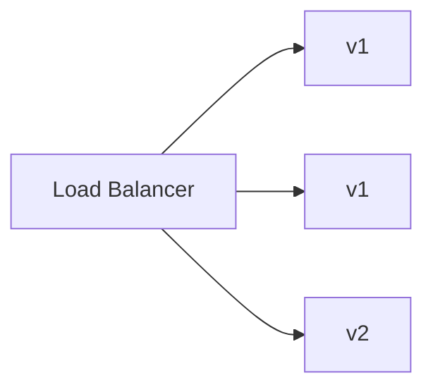
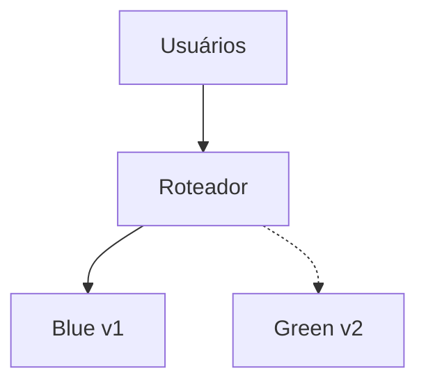
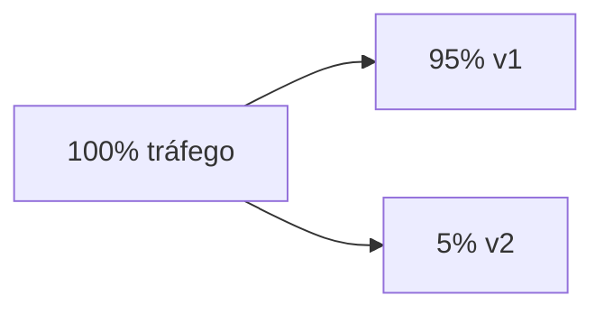
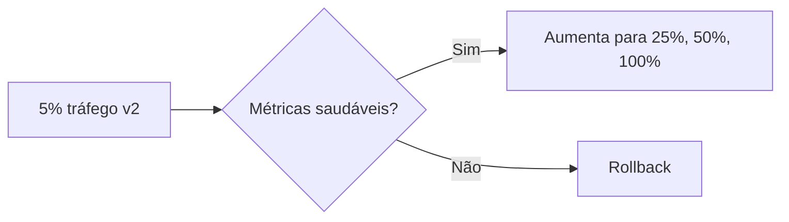
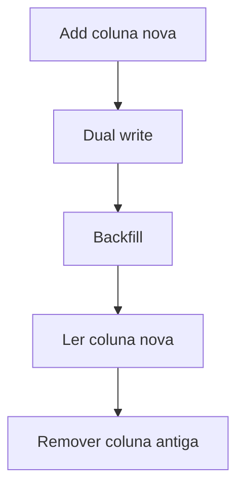

# Deploy sem Downtime

> [!abstract] Em uma frase
> Deploy sem downtime é desenhar a entrega para mudar o sistema enquanto usuários continuam usando, com rota de rollback e observabilidade.

Deploy não é só subir código. É trocar uma parte do sistema em movimento.

## Estratégias

### Rolling deploy

Atualiza instâncias aos poucos.



É simples, mas durante alguns minutos versões diferentes rodam ao mesmo tempo. Isso exige compatibilidade entre versões.

## Compatibilidade entre versões

Deploy sem downtime exige que versão antiga e nova convivam por um tempo.

Exemplo de mudança perigosa:

```text
v1 escreve coluna nome
v2 espera coluna nome_completo
deploy rolling deixa v1 e v2 rodando juntos
```

Prefira mudanças expansivas:

1. adicionar novo campo;
2. fazer v1 e v2 tolerarem ambos;
3. migrar dados;
4. remover antigo em deploy posterior.

### Blue-green

Mantém dois ambientes: azul atual e verde novo. Quando o verde está validado, o tráfego vira para ele.



Rollback costuma ser rápido: voltar o tráfego para o ambiente anterior.

### Canary

Libera a versão nova para uma fração pequena do tráfego. Se métricas estiverem saudáveis, aumenta gradualmente.



É ótimo para reduzir risco, mas exige métricas boas por versão.

### Feature flags

Permitem separar deploy de release. O código vai para produção desligado; a funcionalidade é habilitada por configuração.

```csharp
if (await _featureFlags.IsEnabledAsync("novo-checkout", clienteId))
{
    return await _novoCheckout.ProcessarAsync(command, ct);
}

return await _checkoutAtual.ProcessarAsync(command, ct);
```

> [!warning]
> Feature flag antiga vira dívida. Toda flag precisa de dono e data para remoção.

## Observabilidade do deploy

Antes de aumentar tráfego em canary, compare:

- taxa de erro da versão nova vs antiga;
- latência p95/p99;
- logs por versão;
- métricas de negócio;
- consumo de CPU/memória;
- erros em dependências.



## Rollback vs roll forward

Rollback volta para a versão anterior. Roll forward sobe uma correção nova.

Rollback é melhor quando a versão anterior ainda é compatível com banco e contratos. Roll forward pode ser necessário quando a migração já alterou estado de forma irreversível.

## Migração de banco sem downtime

Banco costuma ser a parte mais perigosa. Use mudanças compatíveis em etapas.

Exemplo: renomear coluna.

1. Criar coluna nova.
2. Aplicação escreve nas duas colunas.
3. Backfill dos dados antigos.
4. Aplicação passa a ler da coluna nova.
5. Remover coluna antiga em outro deploy.



## Exemplo em C#: código tolerante durante migração

```csharp
public sealed class Cliente
{
    public string? Nome { get; set; } // antigo
    public string? NomeCompleto { get; set; } // novo

    public string NomeParaExibicao => NomeCompleto ?? Nome ?? "Cliente sem nome";
}
```

Esse tipo de compatibilidade temporária permite que deploy e migração aconteçam em etapas.

## Erros comuns

**Migração destrutiva no mesmo deploy.** Remover coluna/campo enquanto versão antiga ainda roda quebra rolling deploy.

**Health check superficial.** `200 OK` em `/health` não significa que o serviço consegue atender fluxo real.

**Feature flag sem remoção.** Flag permanente vira ramificação invisível do sistema.

**Canary sem métrica.** Liberar 5% sem medir é só deploy normal mais lento.

## Checklist

- [ ] Versão nova é compatível com versão antiga?
- [ ] Migração de banco é expansiva antes de ser destrutiva?
- [ ] Existe rollback claro?
- [ ] Métricas por versão estão visíveis?
- [ ] Health check reflete saúde real?
- [ ] Feature flags têm dono e plano de remoção?
- [ ] Logs/traces permitem comparar v1 e v2?

## Notas relacionadas

- [[Fundamentos - Observabilidade e Estudo de Caso]]
- [[LoadBalancer]]
- [[ADR - Architecture Decision Records]]
