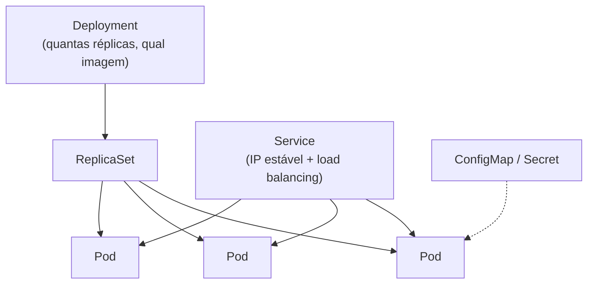
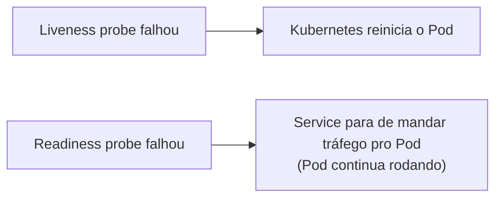

# Kubernetes - Fundamentos

> [!abstract] Em uma frase
> Kubernetes é o orquestrador que decide onde rodar cada container, reinicia o que morre, distribui tráfego entre réplicas e troca versões gradualmente — automatizando boa parte do que [[Deploy sem Downtime]] descreve manualmente.

> [!warning] Não executado neste ambiente
> Este vault não tem acesso a um cluster Kubernetes (`kubectl` não está instalado no ambiente onde este material foi escrito). O manifest abaixo foi validado apenas como **sintaxe YAML correta** — não foi aplicado contra um cluster real. Trate como referência de estrutura, não como prova de funcionamento.

## As peças



- **Pod**: a menor unidade — um ou mais containers que sempre rodam juntos, no mesmo nó, compartilhando rede e volumes. Na prática, quase sempre um container por Pod para uma API .NET comum.
- **Deployment**: declara "quero N réplicas deste Pod, rodando esta imagem" e cuida do rolling update quando a imagem muda — é o Kubernetes fazendo, por padrão, o mesmo rolling deploy que [[Deploy sem Downtime]] descreve.
- **Service**: um IP e nome DNS estáveis na frente de um grupo de Pods, com balanceamento de carga entre eles — os Pods vêm e vão (reiniciam, escalam), o Service não muda.
- **ConfigMap / Secret**: configuração e segredos injetados como variável de ambiente ou arquivo montado, sem rebuildar a imagem para trocar um valor.

## Readiness vs Liveness probe — a distinção que mais importa numa API .NET



- **Liveness**: "este processo travou e precisa ser reiniciado?" Falhar aqui mata o Pod.
- **Readiness**: "este processo está pronto para receber tráfego agora?" Falhar aqui só tira o Pod da rotação do Service — ele continua rodando, só não recebe requisição nova.

O erro clássico é usar o mesmo endpoint para os dois. Uma API que está temporariamente sobrecarregada (fila de conexão de banco cheia, por exemplo) deveria falhar o *readiness* (para de receber tráfego novo até se recuperar) sem falhar o *liveness* (não devia ser reiniciada — reiniciar não resolve sobrecarga, e ainda causa um cold start no meio do problema). Ver `Erros comuns` em [[Fundamentos - Observabilidade e Estudo de Caso]] sobre health check superficial — o mesmo problema, agravado, porque aqui a consequência de um probe malfeito é o Kubernetes tomando a decisão errada automaticamente.

## Manifest mínimo — Deployment + Service para uma API .NET containerizada

```yaml
apiVersion: apps/v1
kind: Deployment
metadata:
  name: minha-api
spec:
  replicas: 3
  selector:
    matchLabels:
      app: minha-api
  template:
    metadata:
      labels:
        app: minha-api
    spec:
      containers:
        - name: minha-api
          image: meu-registro/minha-api:1.4.0
          ports:
            - containerPort: 8080
          env:
            - name: ConnectionStrings__Default
              valueFrom:
                secretKeyRef:
                  name: minha-api-secrets
                  key: connection-string
          readinessProbe:
            httpGet:
              path: /health/ready
              port: 8080
            initialDelaySeconds: 5
            periodSeconds: 10
          livenessProbe:
            httpGet:
              path: /health/live
              port: 8080
            initialDelaySeconds: 15
            periodSeconds: 20
          resources:
            requests:
              cpu: "100m"
              memory: "128Mi"
            limits:
              cpu: "500m"
              memory: "256Mi"
---
apiVersion: v1
kind: Service
metadata:
  name: minha-api
spec:
  selector:
    app: minha-api
  ports:
    - port: 80
      targetPort: 8080
  type: ClusterIP
```

`resources.requests` vs `resources.limits`: `requests` é o que o Kubernetes reserva ao decidir em qual nó agendar o Pod; `limits` é o teto — passar do limite de memória mata o Pod (`OOMKilled`), passar do limite de CPU só faz o processo ser limitado (throttled), não morre.

## Rolling update — o que já acontece por padrão

Quando a imagem de um Deployment muda (`kubectl set image` ou um novo `apply`), o Kubernetes por padrão sobe Pods novos gradualmente e desliga os antigos só depois que os novos passam no *readiness probe* — é a estratégia de rolling deploy de [[Deploy sem Downtime]], só que orquestrada pela plataforma em vez de manualmente. A mesma regra de compatibilidade entre versões (v1 e v2 rodando ao mesmo tempo durante o rollout) se aplica.

## Checklist

- [ ] Readiness e liveness probes são endpoints diferentes, com semânticas diferentes (não o mesmo `/health` para os dois).
- [ ] `resources.requests`/`limits` definidos — sem isso, um Pod problemático pode consumir recursos de todo o nó.
- [ ] Configuração sensível vem de `Secret`, não de variável de ambiente em texto plano no manifest.
- [ ] Réplicas suficientes para tolerar a perda de um nó sem indisponibilidade total.

## Notas relacionadas

- [[Containers e Docker]]
- [[Deploy sem Downtime]]
- [[LoadBalancer]]
