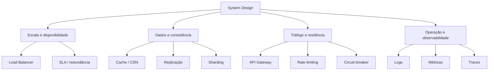

# Fundamentos de System Design

> [!abstract] Em uma frase
> System design é menos sobre decorar componentes e mais sobre entender trade-offs: onde colocar estado, como lidar com falhas, quando aceitar latência, quando abrir mão de consistência e como evoluir sem criar complexidade antes da hora.

Esta nota é o índice do tema. A ideia é estudar os fundamentos por blocos, como foi feito em [[Webhooks|Webhooks e Webhook Handlers]], para não transformar uma única página em um livro difícil de revisar.

---

## Trilha sugerida

1. [[Fundamentos - Escalabilidade, Disponibilidade e Consistência]] - escala vertical e horizontal, SLA, consistência forte/eventual e Teorema CAP.
2. [[Fundamentos - Cache, CDN e Banco de Dados]] - cache-aside, write-through, write-behind, TTL, cache stampede, CDN, índices e escolha de SGBD.
3. [[Fundamentos - Replicação, Sharding e Consistent Hashing]] - réplicas, read replicas, sharding, hot shards, resharding e anel de hash.
4. [[Fundamentos - Resiliência e Controle de Tráfego]] - failover, rate limiting, circuit breaker, API Gateway, connection pooling e WebSockets.
5. [[Fundamentos - Observabilidade e Estudo de Caso]] - logs, métricas, traces, SLOs e um desenho completo de encurtador de URL.

---

## Mapa mental rápido

---

## Resumo de bolso

> [!summary]
> - **Escalabilidade:** aumentar a capacidade do sistema sem reescrever tudo.
> - **Disponibilidade:** manter o sistema respondendo mesmo quando partes falham.
> - **Consistência:** definir o quanto as leituras precisam refletir a escrita mais recente.
> - **CAP:** em uma partição de rede, escolher entre consistência e disponibilidade.
> - **Cache/CDN:** reduzir latência e carga evitando trabalho repetido.
> - **Replicação:** copiar dados para disponibilidade e leitura.
> - **Sharding:** dividir dados para caber e performar em várias máquinas.
> - **Rate limiting:** proteger o sistema contra abuso e picos.
> - **Circuit breaker:** impedir que dependências instáveis derrubem o sistema inteiro.
> - **Observabilidade:** conseguir entender produção sem adivinhar.

---

## Como pensar em uma entrevista ou desenho de arquitetura

Antes de sair colocando Redis, Kafka, CDN, Kubernetes e banco distribuído no desenho, pergunte:

1. Qual é o fluxo principal do usuário?
2. O sistema é mais pesado em leitura, escrita ou processamento assíncrono?
3. Qual latência é aceitável para cada operação?
4. O que pode ficar temporariamente inconsistente?
5. O que não pode ficar fora do ar?
6. Onde está o estado?
7. O que acontece quando uma dependência cai?
8. Como eu vou saber que deu problema?

Essas perguntas costumam valer mais do que qualquer componente isolado. Um desenho simples com bons trade-offs geralmente é melhor do que um desenho cheio de tecnologia usada "por garantia".

---

## Notas relacionadas

- [[LoadBalancer]]
- [[Webhooks]]
- [[SQL vs NoSQL]]
- [[Read Replicas]]
- [[Comunicação Síncrona e Assíncrona]]
