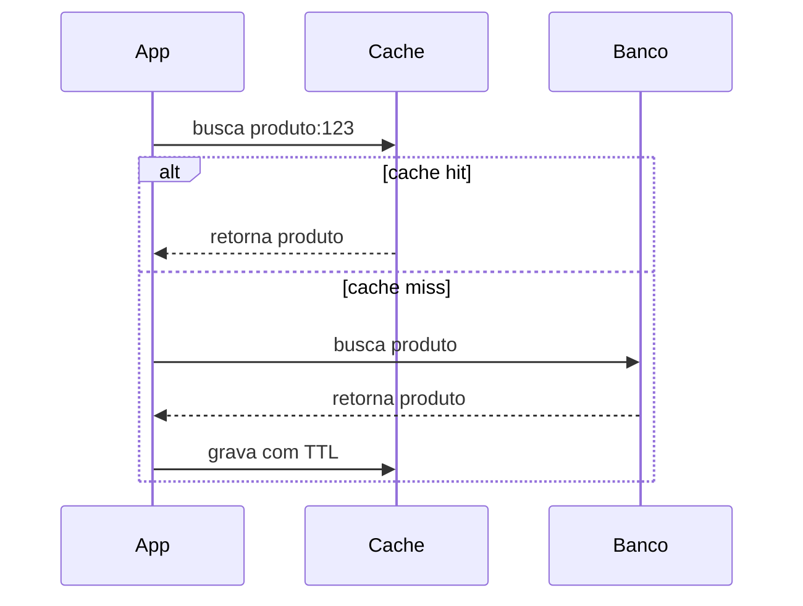

# Fundamentos - Cache, CDN e Banco de Dados

Segunda parte de [[Fundamentos|Fundamentos de System Design]]. Continuação de [[Fundamentos - Escalabilidade, Disponibilidade e Consistência]].

---

## Cache

Cache é uma camada de armazenamento temporário usada para evitar trabalho repetido. Em vez de recalcular, consultar banco ou chamar uma API externa toda vez, o sistema reaproveita uma resposta recente.

Cache melhora latência e reduz carga, mas também cria um novo problema: dado guardado pode ficar velho. Por isso, todo cache precisa responder duas perguntas: por quanto tempo esse dado pode viver e o que acontece se ele estiver desatualizado?

### Onde cache aparece

| Camada | Exemplo | Uso típico |
|---|---|---|
| Cliente | Browser, app mobile | Assets, respostas locais, estado de tela |
| Borda | CDN | Imagens, JS, CSS, páginas públicas, APIs cacheáveis |
| Aplicação | MemoryCache, Redis, Memcached | Objetos, sessões, tokens, resultados de consultas |
| Banco | Buffer pool, query cache | Páginas de dados e índices usados com frequência |

Cache local em memória é rápido, mas cada instância tem o seu. Em uma API com várias réplicas, isso pode gerar respostas diferentes entre instâncias. Cache distribuído, como Redis, resolve o compartilhamento, mas adiciona uma dependência de rede.

---

## Estratégias de cache

### Cache-aside

É a estratégia mais comum. A aplicação tenta ler do cache. Se não encontrar, busca na fonte original, salva no cache e responde.



Exemplo em C# com `IMemoryCache`:

```csharp
public async Task<Produto?> ObterPorIdAsync(int id)
{
    var chave = $"produto:{id}";

    if (_cache.TryGetValue(chave, out Produto? produtoEmCache))
    {
        return produtoEmCache;
    }

    var produto = await _repository.ObterPorIdAsync(id);

    if (produto is not null)
    {
        _cache.Set(chave, produto, TimeSpan.FromMinutes(10));
    }

    return produto;
}
```

### Write-through

Toda escrita vai para o banco e para o cache no mesmo fluxo. A leitura fica simples e tende a encontrar dado fresco, mas a escrita fica mais lenta e o sistema precisa lidar com falha parcial: o que fazer se gravou no banco e falhou ao atualizar o cache?

### Write-behind

A escrita entra primeiro no cache ou em uma fila, e a persistência no banco acontece depois. É ótimo para alto volume e baixa latência, mas só serve quando o sistema tolera risco controlado de perda ou atraso. Contadores e telemetria combinam melhor com isso do que pagamento.

---

## Problemas clássicos de cache

**Cache invalidation.** O difícil não é guardar o dado, é saber quando ele deixou de ser verdade. TTL ajuda, mas não resolve tudo. Em dados críticos, pode ser necessário invalidar explicitamente quando uma escrita acontece.

**Cache stampede.** Um item popular expira e centenas de requisições tentam recalculá-lo ao mesmo tempo. Mitigações comuns: lock por chave, TTL com variação aleatória, refresh assíncrono e stale-while-revalidate.

**Dados grandes demais.** Cache não é depósito infinito. Guardar payloads gigantes reduz a eficiência e aumenta custo. Muitas vezes é melhor cachear uma projeção pequena, feita para leitura.

**Cache como fonte de verdade.** Se o sistema não funciona com cache vazio, ele virou banco de dados sem as garantias de banco de dados. Cache deve acelerar o caminho feliz, não ser a única cópia confiável.

---

## CDN

CDN, ou *Content Delivery Network*, é uma rede de servidores distribuídos geograficamente que entrega conteúdo a partir de um ponto mais próximo do usuário.


CDN nasceu para conteúdo estático, como imagens, vídeos, CSS e JavaScript. Hoje também pode cachear HTML e respostas de API, desde que os headers permitam e o dado seja seguro para cache compartilhado.

### O que uma CDN melhora

- Reduz latência para usuários distantes.
- Diminui tráfego no servidor de origem.
- Absorve picos de acesso.
- Ajuda em proteção contra DDoS.
- Aumenta disponibilidade de conteúdo cacheado.

### Cuidado com cache público

Uma resposta com dados de usuário não deve ser cacheada em CDN como se fosse pública. Headers como `Cache-Control: private`, `no-store`, `max-age` e `s-maxage` fazem parte do desenho, não são detalhe de infraestrutura.

---

## Banco de dados

Banco de dados entra em quase todo desenho de system design porque concentra estado. E estado é onde a complexidade mora.

Antes de escolher tecnologia, entenda o padrão de acesso:

- Quais consultas são mais frequentes?
- O sistema lê muito mais do que escreve?
- As consultas precisam de joins e transações?
- O schema muda o tempo todo?
- O dado precisa ser global ou regional?
- A consistência forte é obrigatória?

### SQL e NoSQL

Bancos relacionais são uma boa escolha quando o domínio precisa de transações, integridade referencial, consultas flexíveis e consistência forte. Bancos NoSQL podem encaixar melhor quando o volume é muito alto, o modelo de leitura é previsível, o schema é flexível ou a escala horizontal é prioridade.

Não existe "SQL para pequeno, NoSQL para grande". Existem padrões de acesso. Um PostgreSQL bem modelado aguenta muito mais do que parece. Um NoSQL mal escolhido pode complicar consultas simples.

Veja também [[SQL vs NoSQL]].

---

## Índices

Índice acelera leitura ao custo de escrita e armazenamento. A cada `INSERT`, `UPDATE` ou `DELETE`, o banco também precisa manter os índices.

```sql
-- Sem índice, o banco pode varrer a tabela inteira
SELECT *
FROM clientes
WHERE cpf = '11144477735';

-- Com índice, a busca fica muito mais barata
CREATE INDEX idx_clientes_cpf ON clientes (cpf);

-- Índice composto ajuda quando a consulta filtra pelas colunas juntas
CREATE INDEX idx_pedidos_cliente_status
ON pedidos (cliente_id, status);
```

Regra prática: indexe colunas usadas com frequência em `WHERE`, `JOIN` e `ORDER BY`, olhando consultas reais. Não crie índice em toda coluna "por garantia".

### Sinais de problema no banco

- Consulta lenta em tabela grande sem índice adequado.
- Índice demais tornando escrita lenta.
- Campo genérico demais, como `VARCHAR` para tudo.
- Entidade muito normalizada exigindo joins caros em todo endpoint.
- Entidade muito desnormalizada gerando inconsistência.
- Banco usado para fila de alto volume sem cuidado.

---

## Checklist de desenho

- [ ] O dado pode ficar desatualizado por alguns segundos?
- [ ] O cache é local ou compartilhado?
- [ ] Qual é o TTL e quem invalida o dado?
- [ ] O sistema funciona se o cache estiver vazio?
- [ ] Existe risco de cache stampede?
- [ ] Alguma resposta pode ir para CDN?
- [ ] Os headers HTTP permitem cache com segurança?
- [ ] O padrão de acesso favorece SQL ou NoSQL?
- [ ] Os índices refletem consultas reais?
- [ ] A escrita ficou mais lenta por excesso de índices?

---

## Próxima nota

Veja [[Fundamentos - Replicação, Sharding e Consistent Hashing]].
