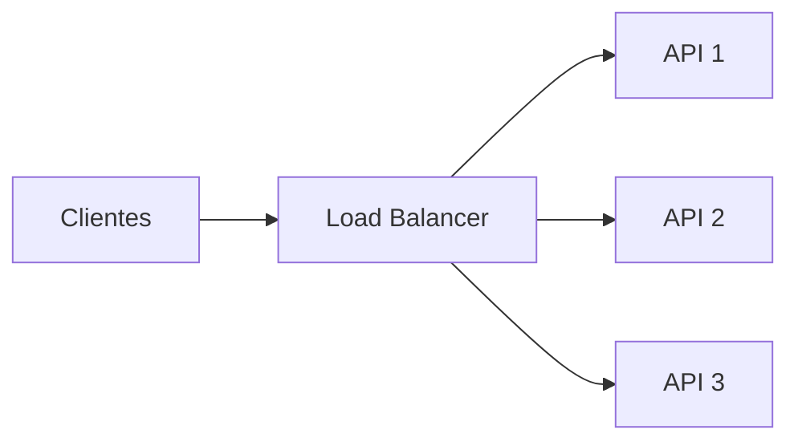
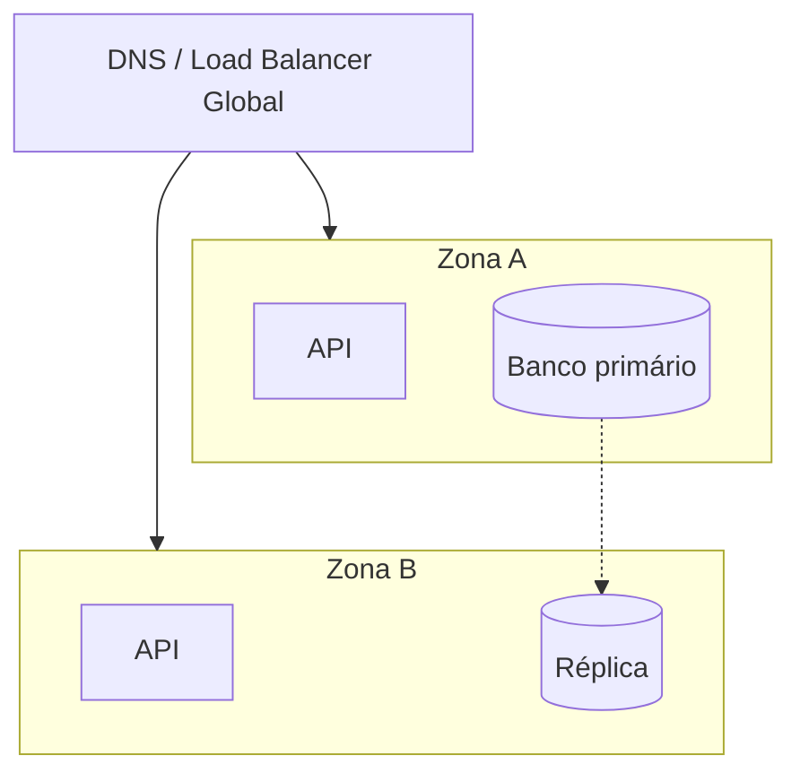
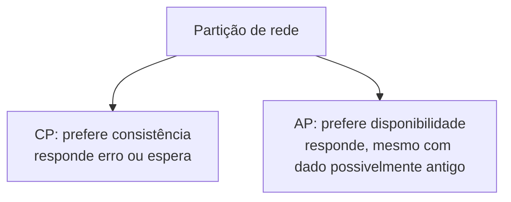

# Fundamentos - Escalabilidade, Disponibilidade e Consistência

Primeira parte de [[Fundamentos|Fundamentos de System Design]].

---

## Escalabilidade

Escalabilidade é a capacidade de um sistema lidar com aumento de carga sem degradar de forma inaceitável. Carga pode ser mais requisições por segundo, mais usuários simultâneos, mais dados armazenados, arquivos maiores, jobs mais demorados ou integrações externas mais lentas.

O erro comum é tratar escala como "colocar mais máquina". Isso é parte da resposta, mas não é a resposta inteira. Um sistema escala bem quando o desenho permite adicionar capacidade sem quebrar o modelo mental, sem criar um ponto único de falha e sem transformar operação em sofrimento.

### Escala vertical

Escala vertical, ou *scale up*, é aumentar a capacidade da máquina atual: mais CPU, mais memória, disco mais rápido, rede melhor.

É simples e costuma ser o primeiro passo saudável. Se um banco pequeno está lento por falta de memória, talvez subir a instância resolva por meses. O problema é que existe teto físico e financeiro. Em algum momento não há máquina maior ou ela custa caro demais. Além disso, uma máquina única continua sendo uma máquina única: se cair, o sistema cai junto.

### Escala horizontal

Escala horizontal, ou *scale out*, é adicionar mais instâncias e distribuir a carga entre elas, normalmente com um [[LoadBalancer|load balancer]] na frente.

Esse caminho dá mais elasticidade, mas cobra disciplina. A aplicação precisa ser preferencialmente *stateless*: se a requisição de login cai na API 1 e a próxima requisição cai na API 2, a API 2 também precisa conseguir atender. Sessão, cache, arquivos temporários e locks não podem depender do disco ou da memória local de uma instância específica.

> [!tip] Regra prática
> Escale verticalmente para ganhar fôlego. Escale horizontalmente quando o sistema precisa crescer com previsibilidade ou sobreviver à queda de uma instância.

---

## Throughput, latência e concorrência

Três métricas aparecem o tempo todo:

| Métrica | Pergunta que responde | Exemplo |
|---|---|---|
| **Throughput** | Quanto o sistema processa por unidade de tempo? | 2.000 req/s |
| **Latência** | Quanto tempo uma operação demora? | p95 abaixo de 300 ms |
| **Concorrência** | Quantas operações acontecem ao mesmo tempo? | 10.000 conexões abertas |

Um sistema pode ter throughput alto e latência ruim. Imagine uma fila que processa 1 milhão de jobs por hora, mas cada job individual demora 20 minutos para começar. Para relatórios assíncronos talvez esteja tudo bem. Para checkout, não.

Por isso, em system design, "aguenta carga?" é uma pergunta incompleta. O certo é perguntar: aguenta qual carga, com qual latência, por quanto tempo e com qual taxa de erro?

---

## Disponibilidade

Disponibilidade é a proporção do tempo em que o sistema está no ar e respondendo corretamente. Normalmente aparece como SLA ou SLO em "número de noves":

| Objetivo | Downtime aproximado por ano |
|---|---|
| 99% | 3,65 dias |
| 99,9% | 8,7 horas |
| 99,99% | 52 minutos |
| 99,999% | 5 minutos |

Cada nove adicional custa caro porque exige redundância, automação, observabilidade, processos de incidentes, deploys mais cuidadosos e testes melhores. Um sistema de pagamento e um blog institucional não precisam do mesmo nível de disponibilidade.

### Como aumentar disponibilidade

As estratégias mais comuns:

- Remover pontos únicos de falha.
- Rodar múltiplas instâncias da aplicação.
- Usar health checks reais no load balancer.
- Ter replicação e failover no banco.
- Distribuir carga entre zonas de disponibilidade.
- Fazer deploy sem downtime, como blue-green ou canary.
- Monitorar sintomas de usuário, não só CPU e memória.

Disponibilidade não é só ter mais servidores. Se todas as instâncias dependem do mesmo banco sem failover, o banco continua sendo o ponto único de falha. Se o failover existe mas ninguém testou, ele é uma esperança, não uma garantia.

---

## Consistência

Consistência define o quanto as leituras refletem as escritas mais recentes.

Na **consistência forte**, depois que uma escrita é confirmada, qualquer leitura posterior retorna o valor novo. É mais fácil de raciocinar, mas geralmente exige coordenação entre nós, o que aumenta latência e reduz disponibilidade durante falhas.

Na **consistência eventual**, uma escrita confirmada pode demorar um pouco para aparecer em todas as réplicas. Durante essa janela, usuários diferentes podem enxergar valores diferentes. Em troca, o sistema consegue responder mais rápido e continuar disponível em mais cenários.

### Exemplos práticos

| Cenário | Consistência aceitável | Por quê |
|---|---|---|
| Saldo bancário | Forte | Mostrar saldo errado pode gerar prejuízo real |
| Curtidas em post | Eventual | Alguns segundos de atraso raramente importam |
| Estoque no checkout | Forte ou quase forte | Vender produto sem estoque machuca negócio |
| Feed social | Eventual | Conteúdo pode aparecer com pequeno atraso |
| Status de pagamento | Forte no fluxo crítico | Liberar produto sem confirmação é perigoso |

O ponto importante: um mesmo sistema pode misturar modelos. Um e-commerce pode aceitar consistência eventual no contador de visualizações do produto, mas exigir consistência forte ao reservar estoque e confirmar pagamento.

---

## Teorema CAP

O Teorema CAP diz que, em um sistema distribuído, quando ocorre uma partição de rede, não dá para garantir ao mesmo tempo:

- **Consistency:** toda leitura recebe a escrita mais recente ou um erro.
- **Availability:** toda requisição recebe uma resposta não-erro.
- **Partition tolerance:** o sistema continua operando apesar de falhas de comunicação entre nós.

Em sistemas distribuídos, partição de rede não é um caso exótico. Pacotes se perdem, links caem, regiões ficam isoladas. Na prática, tolerância à partição não é opcional. A escolha real, durante a partição, fica entre CP e AP.

Um sistema **CP** prefere não responder a responder com dado errado. É comum em fluxos financeiros, estoque crítico e coordenação distribuída.

Um sistema **AP** prefere responder mesmo que depois precise reconciliar. É comum em DNS, feeds, carrinhos de compra, contadores e alguns sistemas colaborativos.

> [!tip] Pergunta boa
> Se eu mostrar um dado desatualizado por alguns segundos, o estrago é maior ou menor do que deixar o usuário sem resposta?

---

## Checklist de desenho

- [ ] A carga principal é leitura, escrita, processamento ou conexões abertas?
- [ ] O gargalo esperado está na aplicação, no banco, na rede ou em dependências externas?
- [ ] O sistema precisa escalar horizontalmente desde o começo?
- [ ] Existe estado local que impediria múltiplas instâncias?
- [ ] Qual SLA/SLO faz sentido para o negócio?
- [ ] Quais componentes ainda são pontos únicos de falha?
- [ ] Quais operações exigem consistência forte?
- [ ] Quais operações toleram consistência eventual?
- [ ] Durante uma partição de rede, o sistema deveria se comportar como CP ou AP?

---

## Próxima nota

Veja [[Fundamentos - Cache, CDN e Banco de Dados]].
