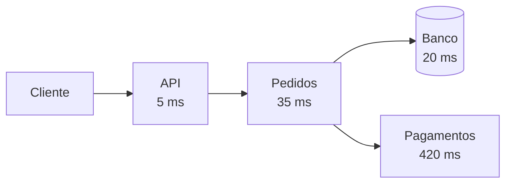
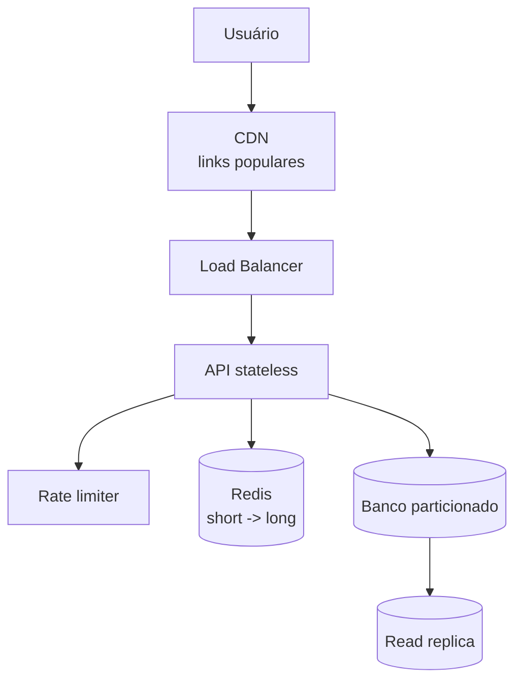

# Fundamentos - Observabilidade e Estudo de Caso

Quinta parte de [[Fundamentos|Fundamentos de System Design]]. Continuação de [[Fundamentos - Resiliência e Controle de Tráfego]].

---

## Observabilidade

Observabilidade é a capacidade de entender o que está acontecendo dentro do sistema a partir dos sinais que ele emite. Em produção, você não pode depender de "vou adicionar um log e subir de novo" para descobrir o básico.

Os três pilares mais conhecidos são logs, métricas e traces.

| Pilar | Responde | Exemplo |
|---|---|---|
| Logs | O que aconteceu em um evento específico? | `pedido 123 falhou ao capturar pagamento` |
| Métricas | Como o sistema está se comportando ao longo do tempo? | latência p95, taxa de erro, req/s |
| Traces | Por onde uma requisição passou? | API -> pedidos -> pagamento -> banco |



Nesse trace, o gargalo salta aos olhos: pagamentos. Sem trace distribuído, talvez cada serviço parecesse "normal" isoladamente.

---

## Métricas que importam

Métricas técnicas são úteis, mas métricas de experiência do usuário são melhores para alertas.

Boas métricas:

- Latência por endpoint, especialmente p95 e p99.
- Taxa de erro por rota e por dependência.
- Throughput.
- Saturação de CPU, memória, disco, conexões e filas.
- Taxa de cache hit/miss.
- Lag de replicação.
- Tamanho e idade de mensagens em fila.
- Tempo de processamento de jobs.

CPU em 90% pode ser normal em um worker. Latência p99 explodindo no checkout quase nunca é normal. Alerta bom acorda alguém quando existe impacto real ou risco próximo, não quando um gráfico ficou feio.

---

## Logs bons

Logs bons são estruturados, têm contexto e evitam dado sensível.

Inclua:

- `trace_id` ou `correlation_id`.
- Identificador de usuário ou tenant, quando seguro.
- Identificador de pedido, pagamento ou entidade de negócio.
- Nome da operação.
- Resultado.
- Tempo gasto.
- Erro com stack trace quando houver.

Evite:

- Senhas, tokens, documentos e cartões.
- Payload gigante sem necessidade.
- Log em excesso dentro de loops quentes.
- Mensagens vagas como "erro ao processar".

---

## OpenTelemetry

OpenTelemetry virou o caminho padrão para instrumentar logs, métricas e traces de forma portável.

Exemplo em .NET:

```csharp
builder.Services.AddOpenTelemetry()
    .WithTracing(tracing => tracing
        .AddAspNetCoreInstrumentation()
        .AddHttpClientInstrumentation()
        .AddSource("MinhaAplicacao")
        .AddOtlpExporter())
    .WithMetrics(metrics => metrics
        .AddAspNetCoreInstrumentation()
        .AddRuntimeInstrumentation()
        .AddOtlpExporter());
```

### Exemplo em C#: log estruturado com correlação

```csharp
public sealed class CriarPedidoHandler
{
    private readonly ILogger<CriarPedidoHandler> _logger;

    public CriarPedidoHandler(ILogger<CriarPedidoHandler> logger)
    {
        _logger = logger;
    }

    public async Task HandleAsync(CriarPedido command, CancellationToken ct)
    {
        using var scope = _logger.BeginScope(new Dictionary<string, object>
        {
            ["CorrelationId"] = command.CorrelationId,
            ["ClienteId"] = command.ClienteId
        });

        _logger.LogInformation("Criando pedido");

        // regra de negócio aqui

        _logger.LogInformation("Pedido criado com sucesso");
    }
}
```

O ganho não está no texto do log, e sim no contexto. Quando todos os serviços propagam `CorrelationId`, fica possível seguir a mesma operação em APIs, workers e integrações externas.

O objetivo não é "ter ferramenta". É conseguir responder perguntas durante um incidente:

- Qual endpoint ficou lento?
- Qual dependência falhou?
- O problema afeta todos os usuários ou só um tenant?
- Começou depois de qual deploy?
- O banco está lento ou a fila acumulou?
- O erro é novo ou recorrente?

---

## Estudo de caso: encurtador de URL

Vamos amarrar os fundamentos em um sistema clássico: um encurtador de URL.

### Requisitos

- Criar URLs curtas a partir de URLs longas.
- Redirecionar rapidamente quando alguém acessa o link curto.
- Leitura muito maior que escrita, por exemplo 100:1.
- Links populares podem receber picos.
- O sistema precisa continuar disponível, porque links podem estar espalhados em campanhas, redes sociais e e-mails.

### Desenho inicial



### Como os conceitos aparecem

**Escalabilidade.** A API deve ser stateless para rodar em várias instâncias atrás do load balancer.

**Cache.** Redirecionamento é leitura repetida. Um Redis na frente do banco reduz latência e carga. Para links muito populares, CDN pode evitar que a requisição chegue à origem.

**Banco.** A tabela principal guarda `short_code`, `long_url`, dono, datas, status e metadados. `short_code` precisa de índice único.

**Sharding.** Se o volume crescer muito, particionar por hash do `short_code` distribui melhor as leituras.

**Consistência.** Criar link precisa garantir que o código curto não colida. Redirecionar pode tolerar pequena propagação se o link acabou de ser criado, mas produto talvez exija leitura imediata do primário nesse primeiro momento.

**Rate limiting.** Criação de links deve limitar abuso por IP, usuário ou API key. Redirecionamento também pode precisar de proteção contra ataques.

**Failover.** Banco e cache precisam de estratégia de recuperação. Se o cache cair, o sistema deve continuar lendo do banco, mesmo mais lento.

**Observabilidade.** Métricas essenciais: latência de redirecionamento, taxa de cache hit, erros por shard, links criados por minuto, 404 por código inexistente, filas de analytics atrasadas.

### Geração de código curto

Uma estratégia comum é gerar um ID único e converter para base62.

```text
ID interno: 125789400
base62: bQ7xY2
URL final: https://sho.rt/bQ7xY2
```

O ID pode vir de uma sequence central, de blocos pré-alocados por instância ou de um serviço de geração de IDs. O importante é evitar que duas instâncias gerem o mesmo código ao mesmo tempo.

### Analytics

Contabilizar cliques não precisa bloquear o redirecionamento. O caminho crítico deve ser rápido:

```text
recebe short_code
busca long_url
responde redirect
publica evento de clique em fila
worker processa analytics depois
```

Isso separa a experiência do usuário do processamento analítico.

---

## Erros comuns

**Começar pelo componente da moda.** Kafka, Redis, Kubernetes e NoSQL podem ser ótimos. Mas se você não explicou o problema que eles resolvem, o desenho ainda está fraco.

**Escalar antes de medir.** Sharding prematuro deixa tudo mais difícil. Primeiro entenda gargalos, consultas e volume.

**Ignorar falhas parciais.** Em sistema distribuído, "meio fora do ar" é normal. Uma dependência pode estar lenta, uma réplica atrasada, uma zona instável.

**Confundir disponibilidade com ausência de erro.** Às vezes o sistema responde `200`, mas demora 20 segundos. Para o usuário, isso também é indisponibilidade.

**Observabilidade no fim.** Sem logs, métricas e traces, você desenha no escuro e opera no escuro.

---

## Checklist final

- [ ] O desenho começa pelos requisitos e não pelas ferramentas?
- [ ] O caminho crítico do usuário está claro?
- [ ] Cada componente resolve um problema explícito?
- [ ] Existem métricas para validar o desenho?
- [ ] O sistema degrada de forma controlada quando algo falha?
- [ ] O que é assíncrono ficou fora do caminho crítico?
- [ ] Os trade-offs de consistência estão nomeados?
- [ ] Existe plano de observabilidade desde o começo?

---

## Voltar

Voltar para [[Fundamentos]].
