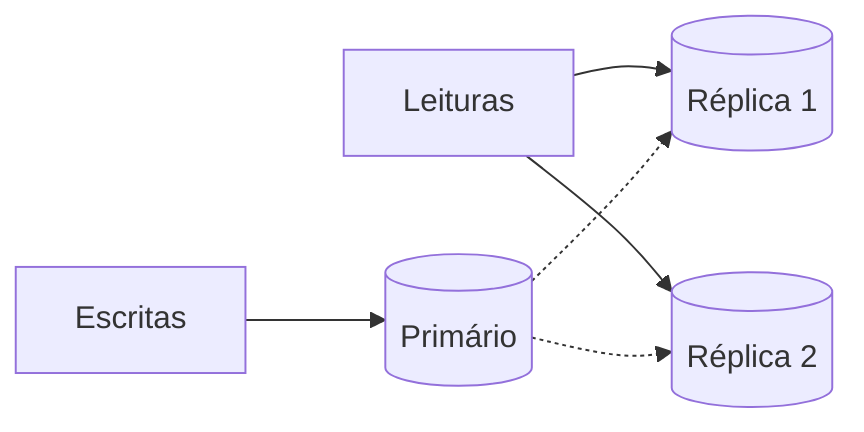
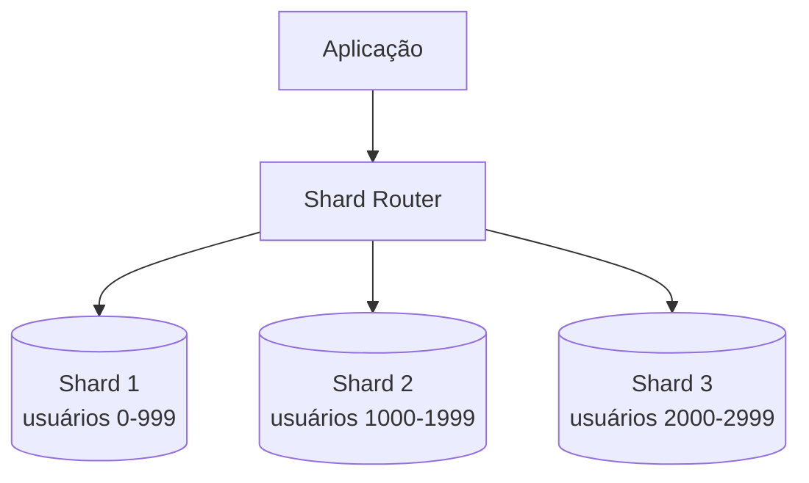
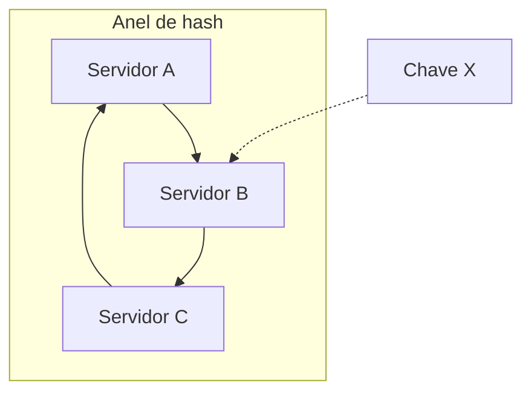

# Fundamentos - Replicação, Sharding e Consistent Hashing

Terceira parte de [[Fundamentos|Fundamentos de System Design]]. Continuação de [[Fundamentos - Cache, CDN e Banco de Dados]].

---

## Replicação

Replicação é manter cópias dos mesmos dados em mais de um nó. Ela aparece por dois motivos principais: disponibilidade e performance de leitura.

Se o banco principal cai, uma réplica pode ser promovida. Se a aplicação lê muito mais do que escreve, réplicas de leitura ajudam a tirar carga do primário.



### Replicação síncrona

A escrita só é confirmada quando uma ou mais réplicas também confirmam. Ganha consistência, perde latência. É útil quando perder uma escrita seria grave.

### Replicação assíncrona

O primário confirma a escrita e replica depois. É mais rápido e comum em read replicas, mas cria *replication lag*: por alguns milissegundos ou segundos, a réplica pode estar atrasada.

Esse atraso importa. Depois de alterar o e-mail do usuário, ler imediatamente de uma réplica atrasada pode mostrar o e-mail antigo. Em fluxos críticos, leia do primário ou use uma estratégia de leitura consistente.

---

## Topologias

### Primário-réplica

Um nó recebe escrita, réplicas recebem leitura. É mais simples de operar e é o modelo mais comum.

### Multi-master

Mais de um nó aceita escrita. Parece perfeito até dois nós alterarem o mesmo dado ao mesmo tempo. A partir daí, o sistema precisa resolver conflito. Estratégias comuns: última escrita vence, versão por timestamp, CRDTs ou regra de negócio específica.

Multi-master costuma ser uma escolha de necessidade, não de conveniência. Use quando latência regional, disponibilidade global ou escrita offline justificam a complexidade.

---

## Sharding

Replicação copia o mesmo dado. Sharding divide dados diferentes entre nós diferentes.



Sharding entra quando uma única máquina já não dá conta do volume, mesmo com índices, cache, réplicas e otimizações razoáveis. É poderoso, mas cobra caro: consultas entre shards ficam difíceis, transações distribuídas ficam caras e reequilibrar dados exige planejamento.

### Estratégias de particionamento

| Estratégia | Como funciona | Risco |
|---|---|---|
| Range | Cada shard recebe uma faixa de valores | Hot shard em faixas muito acessadas |
| Hash | Hash da chave decide o shard | Consultas por faixa ficam espalhadas |
| Geográfica | Dados ficam por região | Usuário que muda de região complica |
| Tenant | Cada cliente/empresa vai para um shard | Tenants grandes podem desequilibrar |

### Chave de particionamento

A escolha mais importante é a chave. Ela deve distribuir carga, preservar consultas importantes e evitar concentração.

Exemplos:

- Em sistema multi-tenant, `tenant_id` pode facilitar isolamento.
- Em encurtador de URL, `short_code` distribui bem os redirecionamentos.
- Em pedidos, `customer_id` ajuda consultas por cliente, mas pode criar cliente gigante.

Não existe chave perfeita. Existe chave coerente com o padrão de acesso mais importante.

### Exemplo em C#: roteador de shard por hash

> [!warning]
> Não use `string.GetHashCode()` para escolher shard. O .NET pode randomizar o hash entre execuções. Para roteamento persistente, use um hash estável.

```csharp
using System.Security.Cryptography;
using System.Text;

public sealed class ShardRouter
{
    private readonly IReadOnlyList<string> _connectionStrings;

    public ShardRouter(IReadOnlyList<string> connectionStrings)
    {
        if (connectionStrings.Count == 0)
        {
            throw new ArgumentException("At least one shard is required.");
        }

        _connectionStrings = connectionStrings;
    }

    public string GetConnectionString(string partitionKey)
    {
        var bytes = SHA256.HashData(Encoding.UTF8.GetBytes(partitionKey));
        var value = BitConverter.ToUInt64(bytes, 0);
        var index = (int)(value % (ulong)_connectionStrings.Count);

        return _connectionStrings[index];
    }
}
```

Esse exemplo é suficiente para entender a ideia, mas tem o problema clássico do `hash % N`: quando o número de shards muda, muitas chaves mudam de lugar. É por isso que [[Fundamentos - Replicação, Sharding e Consistent Hashing#Consistent hashing|consistent hashing]] aparece em sistemas que esperam crescer ou trocar nós com frequência.

---

## Hot shards

Hot shard acontece quando um shard recebe muito mais carga que os outros. Pode acontecer por range mal escolhido, cliente gigante, evento viral, região com muito tráfego ou chave sequencial.

Exemplo clássico: particionar por data de criação. O shard "hoje" recebe quase todas as escritas, enquanto shards antigos ficam frios.

Mitigações:

- Usar hash em vez de range para escrita intensa.
- Adicionar sufixo aleatório controlado em chaves muito quentes.
- Separar clientes gigantes em estratégia própria.
- Monitorar carga por shard, não só carga total.
- Planejar resharding antes de chegar no limite.

---

## Consistent hashing

O problema do sharding hash simples é o resharding. Se você usa `hash(chave) % N`, adicionar um shard muda `N` e remapeia grande parte das chaves.

Consistent hashing reduz esse impacto. A ideia é colocar servidores e chaves em um anel de hash. A chave pertence ao primeiro servidor encontrado ao andar no sentido horário.



Quando um servidor entra ou sai, só uma parte das chaves muda de lugar. Na prática, servidores costumam aparecer várias vezes no anel por meio de *virtual nodes*, para distribuir carga de forma mais uniforme.

### Onde aparece

- Clientes de Memcached.
- Clusters de cache distribuído.
- Sharding de banco.
- Balanceamento client-side.
- Sistemas de armazenamento distribuído.

---

## Exemplo mental: adicionando um shard

Sem consistent hashing:

```text
hash(user_id) % 3 -> shard atual
hash(user_id) % 4 -> quase tudo muda
```

Com consistent hashing:

```text
novo servidor entra no anel
apenas as chaves próximas a ele são remapeadas
o resto permanece onde estava
```

Isso não elimina migração, mas transforma uma explosão em um movimento controlável.

---

## Checklist de desenho

- [ ] O gargalo é leitura, escrita ou armazenamento?
- [ ] Read replicas resolvem antes de sharding?
- [ ] A aplicação tolera replication lag?
- [ ] Quais leituras precisam ir ao primário?
- [ ] Qual chave de particionamento preserva as consultas principais?
- [ ] Existe risco de hot shard?
- [ ] Como será feito resharding?
- [ ] O sistema precisa de transações entre shards?
- [ ] Consistent hashing faz sentido para reduzir remapeamento?

---

## Próxima nota

Veja [[Fundamentos - Resiliência e Controle de Tráfego]].
