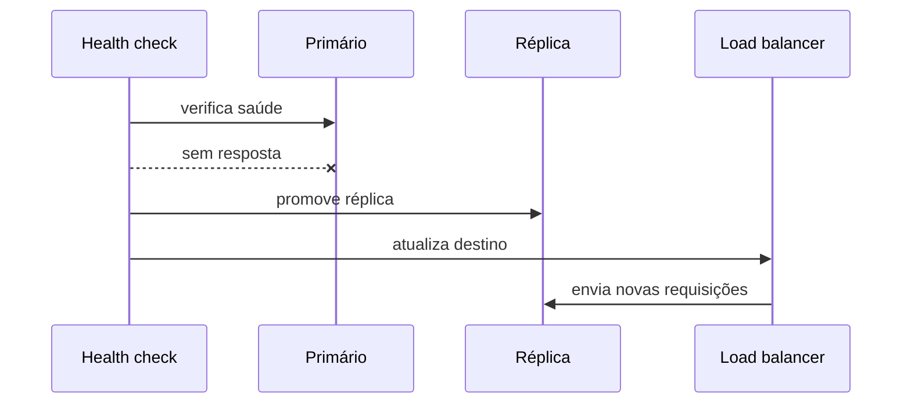
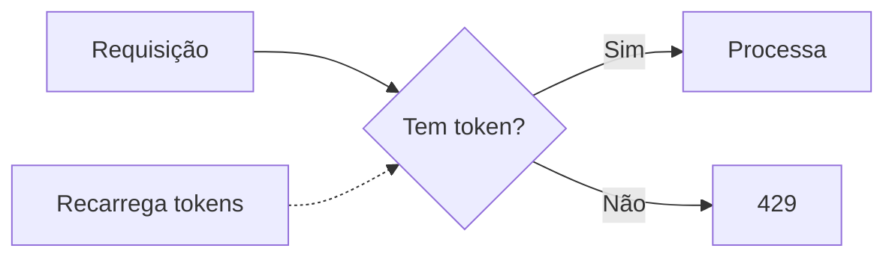
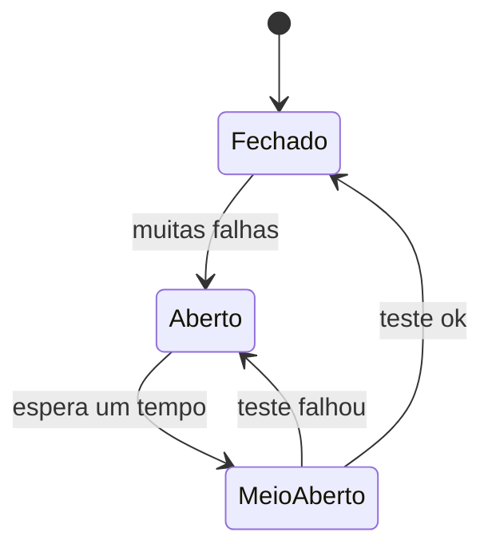
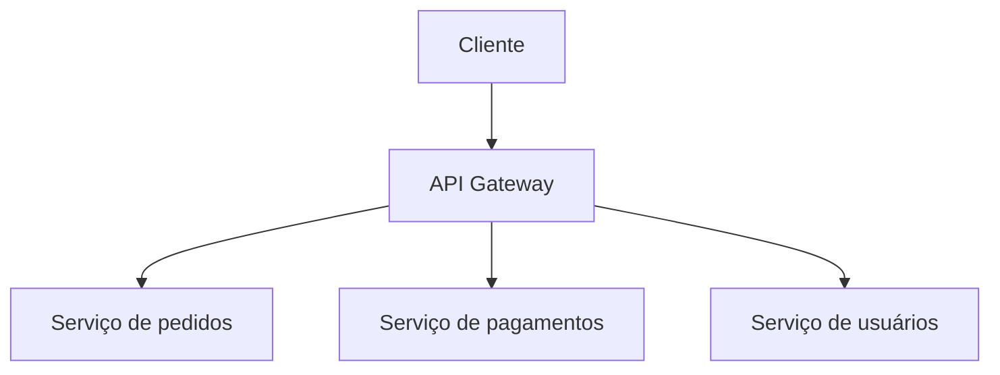

# Fundamentos - Resiliência e Controle de Tráfego

Quarta parte de [[Fundamentos|Fundamentos de System Design]]. Continuação de [[Fundamentos - Replicação, Sharding e Consistent Hashing]].

---

## Failover

Failover é o mecanismo que detecta falha em um componente e transfere sua responsabilidade para outro componente redundante.



Um failover bom precisa de quatro coisas:

- Health checks que testem capacidade real de atender.
- Critério de falha com tolerância a ruído.
- Promoção segura do substituto.
- Redirecionamento de tráfego.

Failover automático reduz tempo de incidente, mas precisa evitar *split-brain*, quando dois nós acreditam ser o principal. Failover manual é mais lento, mas pode ser mais seguro em sistemas sensíveis.

---

## Rate limiting

Rate limiting limita quantas requisições um cliente pode fazer em um intervalo. O cliente pode ser um IP, usuário, token, API key, tenant ou integração externa.

Serve para proteger o sistema contra abuso, erros de cliente, robôs, picos inesperados e consumo injusto de recurso. Quando o limite é excedido, a resposta comum é `429 Too Many Requests`.

### Algoritmos comuns

| Algoritmo | Como funciona | Melhor uso |
|---|---|---|
| Fixed window | Conta em janelas fixas | Simples e barato |
| Sliding window | Conta últimos N segundos | Mais justo |
| Token bucket | Tokens recarregam continuamente | Permite rajadas controladas |
| Leaky bucket | Saída em taxa constante | Suaviza tráfego |



Em ASP.NET Core moderno, muitas políticas podem ser configuradas com `Microsoft.AspNetCore.RateLimiting`. Em sistemas distribuídos, o estado do limite geralmente precisa ficar em Redis ou em uma camada de borda, como API Gateway.

### Exemplo em C#: rate limit por rota no ASP.NET Core

```csharp
using System.Threading.RateLimiting;

builder.Services.AddRateLimiter(options =>
{
    options.AddPolicy("criacao-links", context =>
        RateLimitPartition.GetTokenBucketLimiter(
            partitionKey: context.User.Identity?.Name
                ?? context.Connection.RemoteIpAddress?.ToString()
                ?? "anonymous",
            factory: _ => new TokenBucketRateLimiterOptions
            {
                TokenLimit = 20,
                TokensPerPeriod = 20,
                ReplenishmentPeriod = TimeSpan.FromMinutes(1),
                QueueLimit = 0,
                AutoReplenishment = true
            }));
});

app.UseRateLimiter();

app.MapPost("/links", CriarLink)
   .RequireRateLimiting("criacao-links");
```

> [!tip]
> Esse exemplo funciona bem em uma instância. Com várias instâncias, cada uma teria seu próprio contador. Para limite global, coloque o rate limit na borda ou use estado compartilhado, como Redis.

---

## Circuit breaker

Circuit breaker protege o sistema quando uma dependência externa começa a falhar. Sem ele, cada requisição continua chamando o serviço problemático, aguardando timeout, ocupando threads, conexões e memória.



Estados:

- **Fechado:** chamadas passam normalmente.
- **Aberto:** chamadas falham rápido, sem bater na dependência.
- **Meio-aberto:** o sistema testa se a dependência voltou.

Circuit breaker quase sempre vem junto de timeout, retry com backoff e fallback. Retry sem limite piora incidente. Timeout longo demais prende recursos. Fallback mal pensado esconde erro importante. O conjunto precisa ser desenhado.

Exemplo com Polly:

```csharp
var policy = Policy
    .Handle<HttpRequestException>()
    .CircuitBreakerAsync(
        exceptionsAllowedBeforeBreaking: 5,
        durationOfBreak: TimeSpan.FromSeconds(30));

var response = await policy.ExecuteAsync(
    () => httpClient.GetAsync("https://servico-externo/api/frete"));
```

> [!note]
> Circuit breaker não substitui timeout. Sem timeout, uma chamada pode ficar presa por tempo demais antes mesmo de contar como falha.

---

## API Gateway

API Gateway é um ponto de entrada para múltiplos serviços. Ele concentra preocupações transversais que seriam repetidas em cada serviço.



Responsabilidades comuns:

- Roteamento por path, host ou header.
- Autenticação e autorização na borda.
- Rate limiting.
- Terminação TLS.
- Agregação de respostas.
- Transformação de payload.
- Observabilidade e correlação de requisições.

API Gateway não é a mesma coisa que [[LoadBalancer|load balancer]]. O gateway decide qual serviço recebe a requisição. O load balancer distribui entre instâncias de um mesmo serviço. Em arquiteturas reais, eles frequentemente trabalham juntos.

No ecossistema .NET, YARP é uma opção comum para reverse proxy e gateway customizável.

---

## Connection pooling

Abrir conexão nova com banco para cada requisição é caro. Connection pooling mantém conexões abertas e as reutiliza.

Em ADO.NET, o pool geralmente vem habilitado por padrão. O ponto importante é abrir a conexão tarde, usar por pouco tempo e dar `Dispose` corretamente. O `Dispose` devolve a conexão ao pool, não necessariamente fecha o socket físico.

```csharp
public async Task<Cliente?> ObterPorIdAsync(int id)
{
    await using var connection = new SqlConnection(_connectionString);
    await connection.OpenAsync();

    return await connection.QuerySingleOrDefaultAsync<Cliente>(
        "SELECT * FROM Clientes WHERE Id = @Id",
        new { Id = id });
}
```

Pool pequeno demais cria fila esperando conexão. Pool grande demais pode derrubar o banco por excesso de conexões. O tamanho certo depende de latência, tempo médio de query, número de instâncias e limite do banco.

---

## WebSockets

WebSocket mantém uma conexão bidirecional aberta entre cliente e servidor. É útil quando o servidor precisa enviar informação sem esperar uma nova requisição do cliente: chat, dashboards ao vivo, jogos, colaboração em tempo real e notificações.

O trade-off é que agora a unidade de capacidade não é só requisição por segundo. Também importa o número de conexões simultâneas, memória por conexão, heartbeat, reconexão, balanceamento e afinidade.

Para eventos entre sistemas, quando não há necessidade de conexão aberta, [[Webhooks|webhooks]] costumam ser uma alternativa mais simples.

---

## Checklist de desenho

- [ ] O que acontece quando uma instância morre?
- [ ] O failover é automático ou manual?
- [ ] Existe risco de split-brain?
- [ ] O rate limit é por IP, usuário, token, tenant ou rota?
- [ ] O estado do rate limit funciona com múltiplas instâncias?
- [ ] Chamadas externas têm timeout?
- [ ] Retry tem backoff e limite?
- [ ] Circuit breaker protege dependências instáveis?
- [ ] API Gateway é necessário ou o load balancer já resolve?
- [ ] O pool de conexões está alinhado com o limite do banco?
- [ ] WebSocket é necessário ou webhook/polling resolve?

---

## Próxima nota

Veja [[Fundamentos - Observabilidade e Estudo de Caso]].
