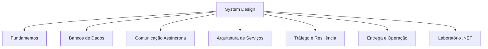

# System Design

Notas de estudo sobre design de sistemas distribuídos e arquitetura de backend.

> [!abstract] Como usar esta página
> Esta é a MOC principal da trilha. Comece por [[Fundamentos]] e depois navegue pelas áreas conforme o tipo de problema: dados, comunicação assíncrona, serviços, tráfego ou operação.

---

## Mapa da trilha

## Áreas

- [[Fundamentos]] - base de escala, disponibilidade, consistência, cache, dados, resiliência e observabilidade.
- [[Bancos de Dados]] - SQL, NoSQL, réplicas, sharding, índices e padrões de acesso.
- [[Comunicação Assíncrona]] - filas, eventos, webhooks, outbox/inbox e sagas.
- [[Arquitetura de Serviços]] - monólito modular, microsserviços, CQRS e autenticação distribuída.
- [[Tráfego e Resiliência]] - load balancing, rate limiting, circuit breaker, pooling e WebSockets.
- [[Entrega e Operação]] - deploy sem downtime, observabilidade e decisões arquiteturais.
- [[Laboratório .NET]] - exercícios práticos para implementar e validar decisões de system design no ecossistema .NET.

## Ordem sugerida de estudo

1. [[Fundamentos]]
2. [[SQL, NoSQL e Quando Usar]]
3. [[Filas e Mensageria]]
4. [[Outbox e Inbox Pattern]]
5. [[Sagas e Transações Distribuídas]]
6. [[Monólito Modular]]
7. [[Microsserviços]]
8. [[CQRS]]
9. [[Deploy sem Downtime]]
10. [[Autenticação e Autorização em Sistemas Distribuídos]]
11. [[Laboratório .NET]]

## Tópicos já aprofundados

- [[LoadBalancer]]
- [[Webhooks]]

## Prática

- [[Mini-projeto - Encurtador de URL em .NET]] - escala, cache, consistência e modelagem de dados.
- [[Mini-projeto - Webhook Handler de Pagamentos]] - idempotência, filas, retries e segurança.
- [[Estudo de caso - Checkout Distribuído com Sagas]] - transações distribuídas, eventos e compensação.

## Bibliografia conectada

- [[SQL vs NoSQL]]
- [[Read Replicas]]
- [[Comunicação Síncrona e Assíncrona]]
- [[Trade-off Arquitetural]]
- [[ADR - Architecture Decision Records]]
- [[C4 Model]]
