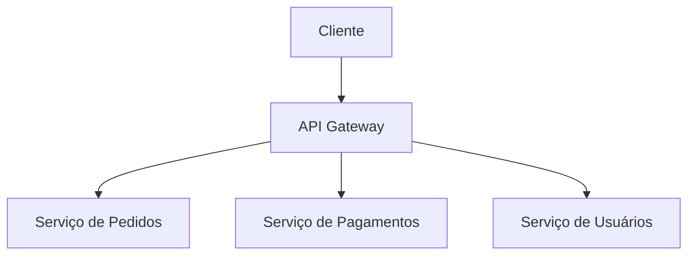
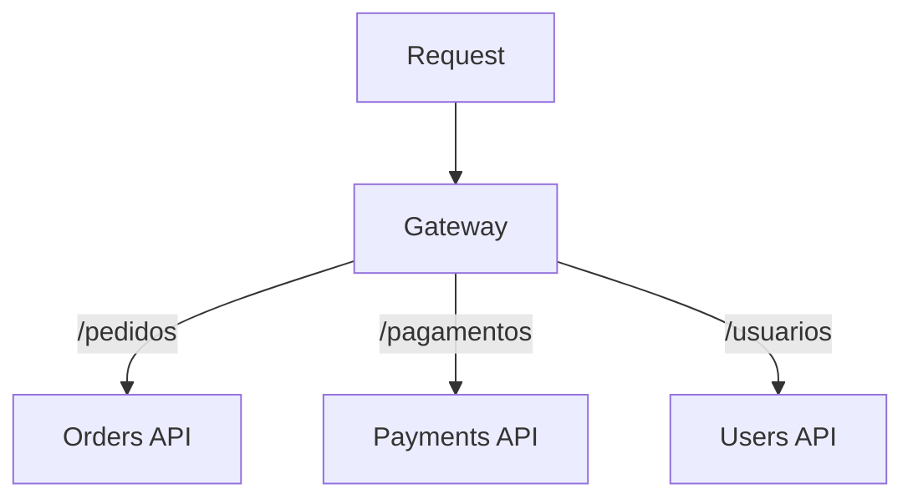
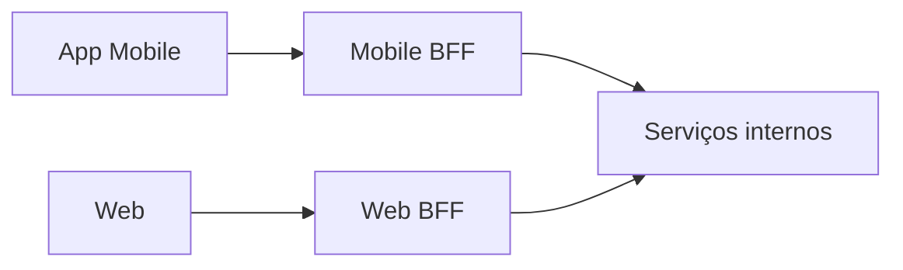
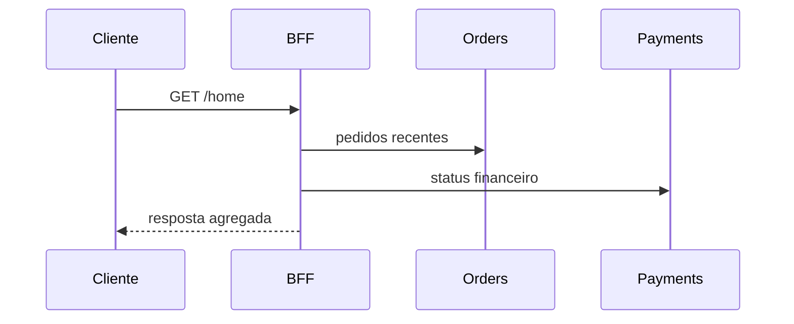

# API Gateway

> [!abstract] Em uma frase
> API Gateway é o ponto de entrada que concentra roteamento e preocupações transversais antes de a requisição chegar aos serviços internos.



## Responsabilidades comuns

- Roteamento por path, host, header ou versão.
- Autenticação inicial.
- Rate limiting.
- Terminação TLS.
- Agregação de respostas.
- Transformação de payload.
- Correlação de logs/traces.

## Roteamento avançado

Gateway pode rotear por:

- path: `/pedidos/*`;
- host: `api.exemplo.com`;
- header: `X-Version`;
- claim do token;
- percentual de tráfego;
- região/tenant.



## BFF: Backend for Frontend

Às vezes um único gateway genérico não resolve bem experiências diferentes. Um BFF adapta a API para um cliente específico.



Use quando mobile e web têm necessidades muito diferentes de payload, agregação e latência.

## Gateway vs Load Balancer

| Componente | Decide |
|---|---|
| Load balancer | Qual instância de um serviço recebe a requisição |
| API Gateway | Qual serviço/rota recebe a requisição e quais políticas aplicar |

Na prática, eles podem estar no mesmo produto, mas o papel conceitual é diferente.

## Exemplo em C#: YARP mínimo

```csharp
builder.Services.AddReverseProxy()
    .LoadFromMemory(
        routes:
        [
            new RouteConfig
            {
                RouteId = "orders",
                ClusterId = "orders-cluster",
                Match = new RouteMatch { Path = "/pedidos/{**catch-all}" }
            }
        ],
        clusters:
        [
            new ClusterConfig
            {
                ClusterId = "orders-cluster",
                Destinations = new Dictionary<string, DestinationConfig>
                {
                    ["orders-api"] = new() { Address = "https://orders.internal/" }
                }
            }
        ]);

app.MapReverseProxy();
```

## Agregação de resposta

Gateway pode agregar chamadas, mas isso precisa de cuidado.



Agregação melhora UX quando reduz round-trips, mas pode virar gargalo se o gateway começa a conter regra de negócio demais.

## Segurança na borda

O gateway é bom lugar para:

- validar token;
- bloquear payload grande;
- aplicar rate limit;
- rejeitar origem inválida;
- normalizar headers;
- adicionar correlation id.

Mas autorização fina do recurso ainda fica no serviço dono.

## Cuidados

- Não colocar regra de negócio demais no gateway.
- Não transformar gateway em ponto único de falha.
- Não mascarar erros internos com respostas genéricas demais.
- Não duplicar autorização que pertence ao serviço dono do recurso.

## Erros comuns

**Gateway deus.** Quando toda regra vai para o gateway, serviços viram CRUD anêmico e o gateway vira gargalo de mudança.

**Sem bypass interno controlado.** Workers e integrações internas podem precisar chamar serviços sem passar pelo gateway público, mas ainda com autenticação/autorização.

**Timeout único para tudo.** Rotas diferentes precisam de timeouts diferentes.

**Rate limit genérico demais.** Login, criação de pedido e leitura de catálogo têm perfis de risco diferentes.

## Checklist

- [ ] O gateway resolve um problema real de entrada?
- [ ] As políticas transversais estão claras?
- [ ] Serviços ainda validam autorização de negócio?
- [ ] Existe rate limiting por rota/cliente?
- [ ] O gateway é redundante?
- [ ] Logs preservam correlation id?

## Notas relacionadas

- [[LoadBalancer]]
- [[Autenticação e Autorização em Sistemas Distribuídos]]
- [[Fundamentos - Resiliência e Controle de Tráfego]]
