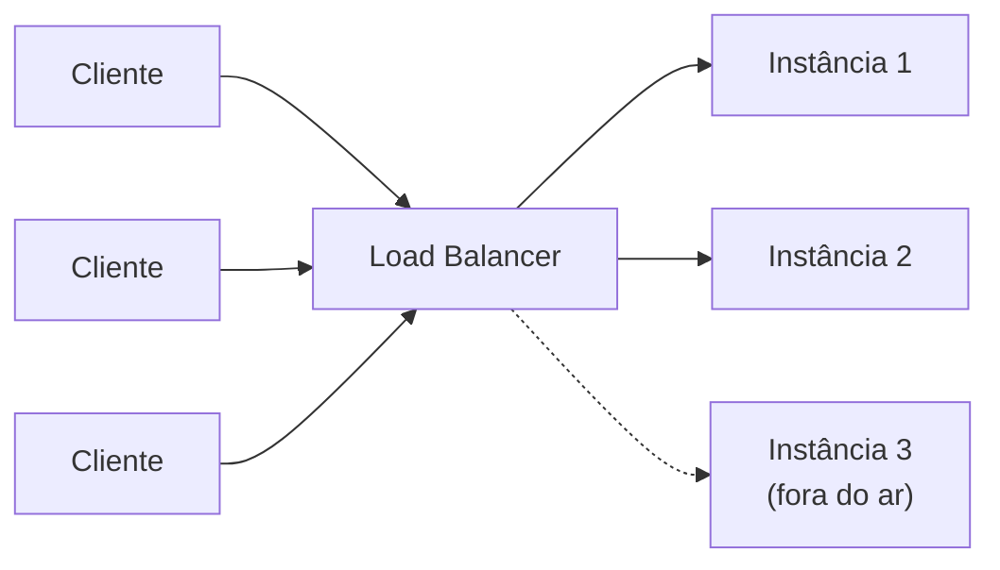
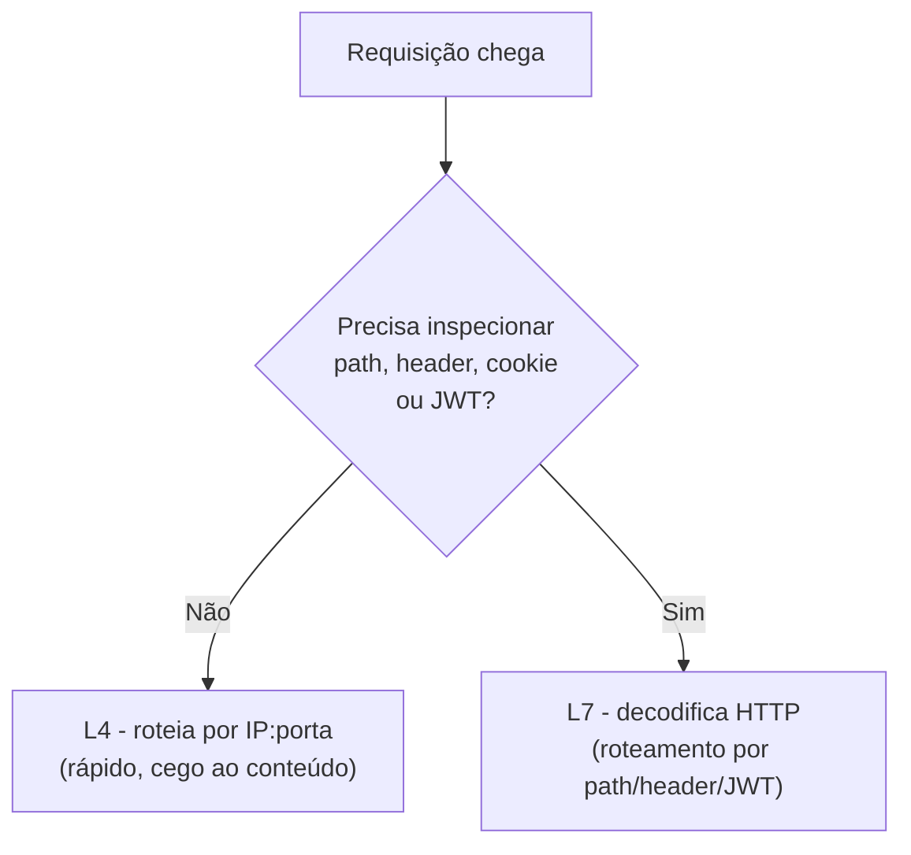

# Load Balancer

Componente que recebe as requisições de entrada e as distribui entre múltiplas instâncias (réplicas) de um serviço, em vez de todo o tráfego bater num único servidor.

Resolve dois problemas de uma vez: permite [[Fundamentos - Escalabilidade, Disponibilidade e Consistência#Escala horizontal|escalabilidade horizontal]] (adicionar mais máquinas pra lidar com mais carga) e elimina o servidor único como ponto de falha. Se uma instância cai, o balanceador para de enviar tráfego pra ela e direciona pras demais.



---

### Tipos:

**Hardware:** aparelho físico dedicado (ex.: F5 BIG-IP, Citrix Netscaler). Alta performance, mas caro e menos flexível. É o tipo menos usado hoje em dia, restrito principalmente a empresas com datacenter próprio e requisitos regulatórios específicos.

**Software:** programa rodando em servidores convencionais (ex.: NGINX, HAProxy, Envoy, Traefik). Mais barato, flexível e fácil de escalar/versionar junto com o resto da infraestrutura. É o padrão em ambientes cloud e Kubernetes.

**Gerenciado pela nuvem (managed):** oferecido como serviço pelo provedor cloud (ex.: AWS ELB/ALB/NLB, Google Cloud Load Balancing, Azure Load Balancer). Não exige que você opere a infraestrutura do balanceador, o provedor cuida de disponibilidade, patching e escala do próprio balanceador.

**DNS Load Balancing:** o DNS responde com IPs diferentes pra requisições diferentes (round robin em nível de DNS). Simples e barato, mas grosseiro: não sabe se um servidor está de fato saudável, e depende do cache de DNS dos clientes, o que atrasa a reação a falhas.

---

### Camadas:

Balanceadores operam em diferentes camadas do modelo OSI, e o que eles conseguem "ver" na requisição muda o que conseguem decidir.

**Camada 4 (L4 — Transporte, TCP/UDP):**
Decide o roteamento olhando só pra IP e porta, sem inspecionar o conteúdo da requisição. Não entende HTTP, não vê a URL, não vê headers.
- Vantagem: extremamente rápido e com baixíssimo overhead, porque não decodifica o protocolo de aplicação. É "cego" ao conteúdo, só repassa pacotes.
- Limitação: não consegue rotear com base em path (`/api/v1` vs `/api/v2`), header, cookie de sessão, etc.
- Exemplo de uso: balancear tráfego bruto de banco de dados ou qualquer protocolo não-HTTP. É a escolha natural pra **WebSockets**, **jogos multiplayer** e outras comunicações em tempo real, onde o overhead de inspecionar cada pacote no nível de aplicação atrapalharia a latência.

**Camada 7 (L7 — Aplicação, HTTP/HTTPS/gRPC):**
Entende o conteúdo da requisição: método HTTP, path, headers, cookies, corpo. Inclusive consegue inspecionar um **JWT** no header `Authorization` pra tomar decisões de roteamento com base em claims do token.
- Vantagem: permite roteamento inteligente. Por exemplo, mandar `/checkout` pra um cluster e `/catalogo` pra outro, fazer sticky sessions por cookie, terminar SSL/TLS no balanceador, fazer *A/B testing* e *canary releases*.
- Custo: mais overhead de processamento por requisição do que L4, já que precisa decodificar o protocolo.
- É o tipo mais comum em APIs web modernas, e é essencial em arquiteturas de **microsserviços**, onde o roteamento por path/header é o que permite várias equipes/serviços dividirem o mesmo domínio público (ex.: AWS ALB, NGINX, Envoy).



Regra prática: use L4 quando só precisa distribuir conexões cruas com máxima performance (ou quando o protocolo não é HTTP); use L7 quando precisa tomar decisões de roteamento baseadas no conteúdo da requisição HTTP.

**O mesmo software pode operar nas duas camadas.** No NGINX, por exemplo, um bloco `http { upstream ... }` configura balanceamento L7, enquanto um bloco `stream { upstream ... }` configura balanceamento L4 pra TCP/UDP puro:

```nginx
# L7 — HTTP, entende path/headers
http {
  upstream backend_api {
    server 10.0.0.1:8080;
    server 10.0.0.2:8080;
  }
}

# L4 — TCP/UDP cru, não entende o conteúdo
stream {
  upstream backend_tcp {
    server 10.0.0.1:5432;
    server 10.0.0.2:5432;
  }
}
```

---

### Algoritmos:

Definem **qual** instância recebe a próxima requisição.

- **Round Robin:** distribui as requisições em sequência circular entre os servidores (1, 2, 3, 1, 2, 3...). Simples, mas ignora se um servidor está mais sobrecarregado que outro.
- **Weighted Round Robin:** como o round robin, mas cada servidor recebe um "peso". Servidores mais potentes recebem proporcionalmente mais requisições.
- **Least Connections:** envia a próxima requisição pro servidor com **menos conexões ativas** no momento. Melhor que round robin quando as requisições têm duração muito variável (algumas rápidas, outras lentas), porque evita empilhar trabalho num servidor já ocupado.
- **Weighted Least Connections:** combina o critério de menos conexões com o peso/capacidade de cada servidor.
- **IP Hash:** calcula um hash do IP do cliente pra decidir sempre o mesmo servidor de destino. Garante que o mesmo cliente sempre caia na mesma instância, útil quando a aplicação guarda estado de sessão localmente (embora a prática recomendada seja externalizar esse estado).
- **Sticky Round Robin / Session Affinity:** variante do round robin em que, na primeira requisição de um cliente, o balanceador grava um cookie identificando a instância escolhida. Nas requisições seguintes, o cookie é lido e o cliente é sempre enviado pra mesma instância. Resolve o mesmo problema do IP Hash, manter o usuário "grudado" no mesmo servidor, só que de forma mais confiável: o IP Hash pode falhar quando vários clientes saem atrás do mesmo IP (NAT/proxy corporativo) ou quando o IP do cliente muda no meio da sessão (troca de rede wifi/móvel), enquanto o cookie de sessão não depende da rede. É a base técnica das "sticky sessions" citadas na camada L7, necessária sempre que a aplicação guarda estado em memória do servidor (ex.: sessão de usuário não externalizada num cache compartilhado).
- **Least Response Time:** envia pro servidor que está respondendo mais rápido no momento, combinando latência e número de conexões ativas. É um algoritmo mais sofisticado, e em vários balanceadores comerciais (ex.: NGINX Plus) fica disponível só na versão paga, enquanto as versões gratuitas/open-source oferecem só Round Robin e Least Connections.
- **Random / Random com pesos:** escolhe aleatoriamente (com ou sem peso). Simples, e estatisticamente se aproxima de um round robin em alto volume.

Todos os algoritmos dependem de **health checks** contínuos: o balanceador só deve enviar tráfego pra instâncias que respondem corretamente. Uma instância que falha no health check é temporariamente removida da rotação até voltar a responder, esse é o mecanismo que conecta o load balancer ao conceito de [[Fundamentos - Resiliência e Controle de Tráfego#Failover|failover]].

### Implementando os algoritmos (C#)

Na prática você não implementa um load balancer do zero (usa NGINX, um managed load balancer, etc.), mas entender o algoritmo por trás fica bem mais concreto escrevendo ele. Uma interface comum e duas implementações:

```csharp
public interface IServerPicker
{
    string Escolher(IReadOnlyList<string> servidoresSaudaveis);
}

// Round Robin: percorre a lista em sequência circular
public class RoundRobinPicker : IServerPicker
{
    private int _indiceAtual = -1;
    private readonly object _lock = new();

    public string Escolher(IReadOnlyList<string> servidoresSaudaveis)
    {
        lock (_lock)
        {
            _indiceAtual = (_indiceAtual + 1) % servidoresSaudaveis.Count;
            return servidoresSaudaveis[_indiceAtual];
        }
    }
}

// Least Connections: escolhe o servidor com menos conexões ativas no momento
public class LeastConnectionsPicker : IServerPicker
{
    private readonly ConcurrentDictionary<string, int> _conexoesAtivas = new();

    public string Escolher(IReadOnlyList<string> servidoresSaudaveis)
    {
        var escolhido = servidoresSaudaveis
            .OrderBy(servidor => _conexoesAtivas.GetValueOrDefault(servidor, 0))
            .First();

        _conexoesAtivas.AddOrUpdate(escolhido, 1, (_, atual) => atual + 1);
        return escolhido;
    }

    public void LiberarConexao(string servidor) =>
        _conexoesAtivas.AddOrUpdate(servidor, 0, (_, atual) => Math.Max(0, atual - 1));
}
```

A parte de **health check** que remove um servidor doente da lista de `servidoresSaudaveis` normalmente roda como um `BackgroundService` separado, batendo num endpoint tipo `/health` de cada instância periodicamente e atualizando a lista compartilhada:

```csharp
public class HealthCheckWorker : BackgroundService
{
    private readonly HttpClient _httpClient;
    private readonly ServidorPool _pool; // lista compartilhada de servidores saudáveis/doentes
    private readonly Dictionary<string, int> _falhasConsecutivas = new();

    protected override async Task ExecuteAsync(CancellationToken stoppingToken)
    {
        while (!stoppingToken.IsCancellationRequested)
        {
            foreach (var servidor in _pool.Todos())
            {
                var saudavel = await VerificarSaudeAsync(servidor);

                if (!saudavel)
                {
                    _falhasConsecutivas[servidor] = _falhasConsecutivas.GetValueOrDefault(servidor) + 1;

                    // só remove depois de 3 falhas seguidas, evita remover por uma falha isolada
                    if (_falhasConsecutivas[servidor] >= 3)
                    {
                        _pool.MarcarComoDoente(servidor);
                    }
                }
                else
                {
                    _falhasConsecutivas[servidor] = 0;
                    _pool.MarcarComoSaudavel(servidor);
                }
            }

            await Task.Delay(TimeSpan.FromSeconds(5), stoppingToken);
        }
    }

    private async Task<bool> VerificarSaudeAsync(string servidor)
    {
        try
        {
            var resposta = await _httpClient.GetAsync($"http://{servidor}/health",
                new CancellationTokenSource(TimeSpan.FromSeconds(2)).Token);
            return resposta.IsSuccessStatusCode;
        }
        catch
        {
            return false;
        }
    }
}
```

### Comparativo dos algoritmos

| Algoritmo | Considera carga atual? | Sessão fixa no mesmo servidor? | Melhor cenário |
|---|---|---|---|
| Round Robin | Não | Não | Requisições uniformes, servidores com capacidade igual |
| Weighted Round Robin | Não | Não | Servidores com capacidades diferentes |
| Least Connections | Sim | Não | Requisições com duração muito variável |
| IP Hash | Não | Sim (por IP) | Sessão em memória, sem NAT/proxy pesado no meio |
| Sticky Session (cookie) | Não | Sim (por cookie) | Sessão em memória, com clientes atrás de NAT/proxy |
| Least Response Time | Sim | Não | Máxima performance, geralmente recurso pago |

### Terminação de SSL/TLS

Balanceadores L7 costumam terminar a conexão HTTPS: o certificado fica instalado no balanceador, o tráfego entre cliente e balanceador é criptografado, e o tráfego entre o balanceador e as instâncias internas pode seguir em HTTP puro (dentro de uma rede privada confiável) ou re-criptografado (TLS ponta a ponta, mais comum quando exigido por compliance). A vantagem é centralizar a gestão de certificados num único lugar em vez de configurar HTTPS em cada instância.

### Erros comuns

**Não configurar health check, ou configurar um health check "mentiroso".** Um endpoint `/health` que só retorna `200 OK` sem checar nada (banco de dados acessível, dependências críticas no ar) não detecta metade dos problemas reais. O ideal é o health check verificar as dependências que, se falharem, tornam a instância incapaz de atender requisições de verdade.

**Sticky session sem necessidade real.** Fixar sessão no mesmo servidor impede a redistribuição de carga e complica deploys (uma instância "presa" com sessões ativas não pode ser removida sem derrubar usuários). Se o estado de sessão pode ser externalizado (Redis, banco), quase sempre vale mais a pena do que sticky session.

**Timeout do balanceador desalinhado com o timeout da aplicação.** Se o balanceador desiste de esperar a resposta antes da aplicação, o cliente recebe erro mesmo que a aplicação estivesse prestes a responder, e ainda por cima a aplicação continua processando um trabalho que ninguém mais vai ler.

**Um único load balancer sem redundância.** Colocar um load balancer na frente de várias instâncias resolve o ponto único de falha *dos servidores*, mas se existir só um load balancer, ele virou o novo ponto único de falha. Balanceadores gerenciados na nuvem já resolvem isso; balanceadores próprios (NGINX/HAProxy autogerenciados) precisam de redundância própria (ex.: um par ativo-passivo com IP flutuante).

---

## Checklist: configurando um load balancer

- [ ] Qual camada faz sentido: L4 (performance máxima) ou L7 (roteamento inteligente)?
- [ ] Qual algoritmo se encaixa no padrão de tráfego (uniforme, variável, precisa de afinidade de sessão)?
- [ ] O health check verifica dependências reais, não só "o processo está de pé"?
- [ ] Quantas falhas consecutivas até remover uma instância da rotação (evitar falso positivo)?
- [ ] O timeout do balanceador está alinhado com o timeout da aplicação?
- [ ] Sessão em memória foi eliminada, ou existe sticky session configurada de propósito?
- [ ] O próprio load balancer tem redundância, ou é um ponto único de falha?

---

## Notas relacionadas

- [[Fundamentos]]
- [[System Design]]

---

*Complementado com conceitos do vídeo "LOAD BALANCING NA PRÁTICA: Tudo que Você Precisa pra Escalar Sistemas na Vida Real!" (Renato Augusto), [youtube.com/watch?v=hhy6EDDjy-o](https://www.youtube.com/watch?v=hhy6EDDjy-o): tipos de balanceador (Citrix Netscaler, Traefik), exemplos de uso por camada (WebSockets/jogos em L4, JWT/microsserviços em L7), configuração `http`/`stream` no NGINX, e os algoritmos Sticky Round Robin (Session Affinity) e a observação sobre Least Response Time ser recurso pago em produtos comerciais.*
